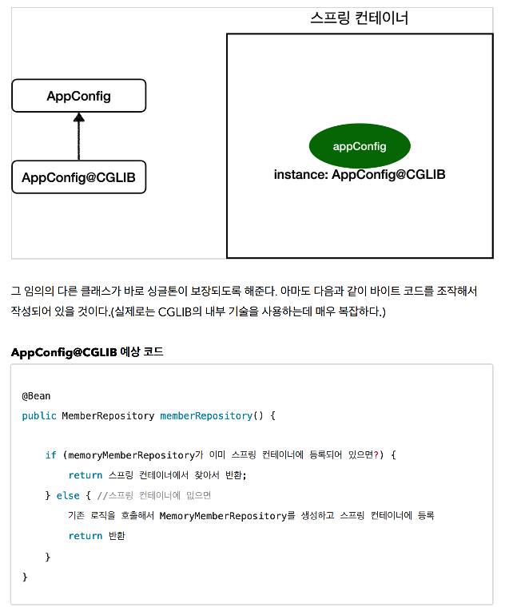

# 06. @Configuration과 바이트코드 조작의 마법

스프링 컨테이너는 싱글톤 레지스터이기 때문에 스프링 빈이 싱글톤이 되도록 보장해주어야 한다.

그런데 스프링이 자바 코드를 조작할 수 는 없다. (new는 새로운 객체를 만드는 코드인데 이것이 새로운 객체를 만들지 못하게 막을순 없다.)

그래서 스프링은 클래스의 바이트코드를 조작하는 라이브러리를 사용한다.


### 테스트

``` java
@Test
void configurationDeep() {
    ApplicationContext ac = new AnnotationConfigApplicationContext(AppConfig.class);

    AppConfig bean = ac.getBean(AppConfig.class);

    System.out.println("bean.getClass() = " + bean.getClass());
    // bean.getClass() = class hello.core.AppConfig$$EnhancerBySpringCGLIB$$4ff8daf5
}
```

* `AnnotationConfigApplicationContext` 에 파라미터로 넘긴 값은 스프링 빈으로 등록된다.
* 따라서 `AppConfig` 도 스프링 빈이다.
* 순수한 클래스라면 `hello.core.AppConfig` 와 같이 출력되야 하는데 이상한 값이 출력된다.


### CGLIB




### 정리

`@Configuration` 을 사용하지 않으면 `@Bean` 을 사용하더라도 싱글톤이 보장되지 않는다.
