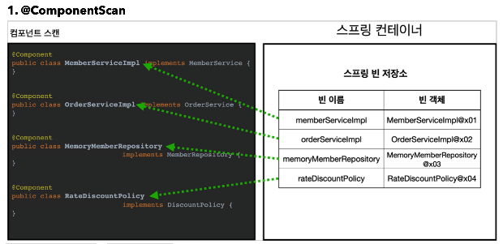
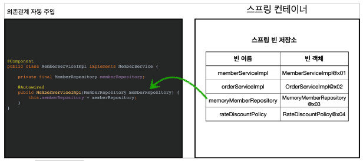

# 01. 컴포넌트 스캔과 의존관계 자동 주입 시작하기

### 이전까지

스프링 빈을 등록하기 위해서 자바 코드의 AppConfig 내에서 `@Bean` 을 사용했다.

하지만 스프링 빈의 개수가 많아진다면 관리의 어려움이 생긴다.

그래서 스프링은 설정 정보가 없어도 자동으로 스프링 빈을 등록하는 컴포넌트 스캔이라는 기능을 제공한다.

또한 `@Autowired` 라는 기능도 제공한다.


### AutoConfig

``` java
package hello.core;

import org.springframework.context.annotation.ComponentScan;
import org.springframework.context.annotation.Configuration;
import org.springframework.context.annotation.FilterType;

@Configuration
@ComponentScan(excludeFilters = @ComponentScan.Filter(type = FilterType.ANNOTATION, classes = Configuration.class))
public class AutoAppConfig {
}
```

* 컴포넌트 스캔을 사용하려면 `@ComponentScan` 을 설정 정보에 붙여준다.
* 기존에 만든 AppConfig도 자동 등록되기 때문에 `excludeFilters` 를 이용해서 컴포넌트 스캔 대상에서 제외한다.


### @Component

컴포넌트 스캔은 이름 그대로 `@Component` 애노테이션을 붙은 클래스를 스캔해서 스프링 빈으로 등록한다.

MemoryMemberRepository, RateDiscountPolicy, MemberServiceImpl, OrderServiceImpl에 @Component을 추가한다.

``` java
package hello.core.member;

import org.springframework.beans.factory.annotation.Autowired;
import org.springframework.stereotype.Component;

@Component
public class MemberServiceImpl implements MemberService {

    private final MemberRepository memberRepository;

    @Autowired
    public MemberServiceImpl(MemberRepository memberRepository) {
        this.memberRepository = memberRepository;
    }

    @Override
    public void join(Member member) {
        memberRepository.save(member);
    }

    @Override
    public Member findMember(Long memberId) {
        return memberRepository.findById(memberId);
    }
}
```

* MemberServiceImpl의 경우 의존관계 주입도 `@Autowired` 을 통해서 자동으로 주입한다.


### 테스트

``` java
package hello.core.autoAppConfig;

import hello.core.AutoAppConfig;
import hello.core.member.MemberService;
import org.junit.jupiter.api.Test;
import org.springframework.context.ApplicationContext;
import org.springframework.context.annotation.AnnotationConfigApplicationContext;

import static org.assertj.core.api.Assertions.assertThat;

public class AutoAppConfigTest {
    @Test
    void basicScan() {
        ApplicationContext ac = new AnnotationConfigApplicationContext(AutoAppConfig.class);
        MemberService memberService = ac.getBean(MemberService.class);
        assertThat(memberService).isInstanceOf(MemberService.class);
    }
}
```


### 컴포넌트 스캔과 의존관계 자동 주입



* @ComponentScan은 @Component가 붙은 모든 클래스를 스프링 빈으로 등록한다.
* 이 때 스프링 빈의 기본 이름은 클래스명을 사용하되 맨 앞글자만 소문자를 사용한다.
* 빈 이름을 직접 지정하고 싶으면 `@Component("memberService2")` 와 같이 지정할 수 있다.




* 생성자에 `@Autowired` 를 지정하면 스프링 컨테이너가 자동으로 해당 스프링 빈을 찾아서 주입한다.
* 기본 조회 전략은 타입이 같은 빈을 찾아서 주입한다.
