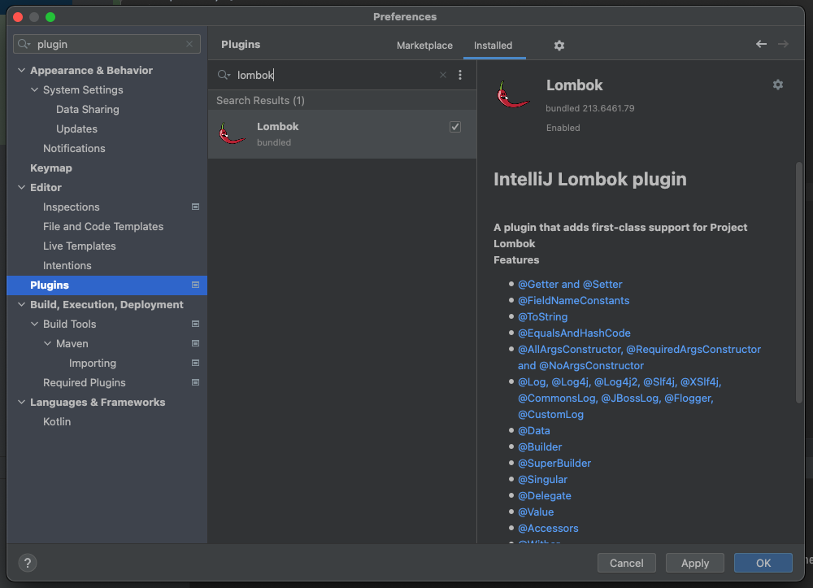
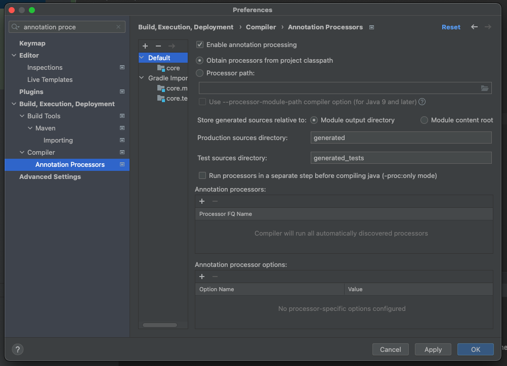

# 04. 롬복과 최신 트랜드

### lombok을 사용하기 위한 설정

build.gradle에 lombok 관련 설정을 추가한다.

``` gradle
//lombok 설정 추가 시작
configurations {
	compileOnly {
		extendsFrom annotationProcessor
	}
}
//lombok 설정 추가 끝

repositories {
	mavenCentral()
}

dependencies {
	implementation 'org.springframework.boot:spring-boot-starter'

	//lombok 라이브러리 추가 시작
	compileOnly 'org.projectlombok:lombok'
	annotationProcessor 'org.projectlombok:lombok'
	testCompileOnly 'org.projectlombok:lombok'
	testAnnotationProcessor 'org.projectlombok:lombok'
	//lombok 라이브러리 추가 끝

	testImplementation 'org.springframework.boot:spring-boot-starter-test'
}
```


lombok plugin을 설치한다. (이미 설치되있는 경우도 있다.)




`Enable annotation processing` 을 on한다.




### lombok 활용

현재의 코드는 아래와 같다.

(물론 생성자가 1개이므로 @Autowired는 생략가능하다.)

```java
@Component
public class OrderServiceImpl implements OrderService{

    private final MemberRepository memberRepository;
    private final DiscountPolicy discountPolicy;

    @Autowired
    public OrderServiceImpl(MemberRepository memberRepository, DiscountPolicy discountPolicy) {
        this.memberRepository = memberRepository;
        this.discountPolicy = discountPolicy;
    }
}
```


lombok을 활용하면 아래와 같다.

``` java
@Component
@RequiredArgsConstructor
public class OrderServiceImpl implements OrderService{
    private final MemberRepository memberRepository;
    private final DiscountPolicy discountPolicy;
}
```


최종결과 코드는 이전의 코드와 완전히 동일하다.

룸복이 자바의 애노테이션 프로세서라는 기능을 이용해서 컴파일 시점에 생성자 코드를 자동으로 생성해준다.
