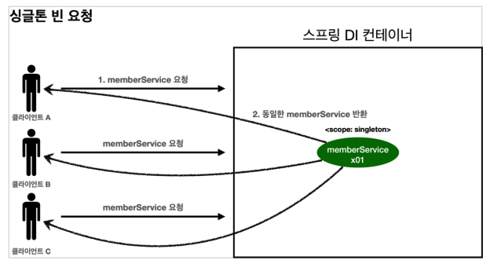
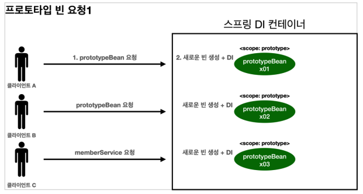

# 02. 프로토타입 스코프

### 싱글톤 스코프와 프로토타입 스코프

싱글톤 스코프의 빈을 조회하면 스프링 컨테이너는 항상 같은 인스턴스의 스프링 빈을 반환한다. 

반면에 프로토타입 스코프를 스프링 컨테이너에 조회하면 스프링 컨테이너는 항상 새로운 인스턴스를 생성해서 반환한다.





스프링 컨테이너는 생성한 프로토타입 빈을 클라이언트에 반환하고 관리하지 않는다.

이후에 스프링 컨테이너에 같은 요청이 오면 항상 새로운 프로토타입 빈을 생성해서 반환한다.


### 프로토타입 스코프와 @PreDestroy

클라이언트에 빈을 반환하고, 이후 스프링 컨테이너는 생성된 프로토타입 빈을 관리하지 않는다. 

프로토타입 빈을 관리할 책임은 프로토타입 빈을 받은 클라이언트에 있다. 

그래서 @PreDestroy 같은 종료 메서드가 호출되지 않는다.


``` java
package hello.core.scope;

import org.junit.jupiter.api.Test;
import org.springframework.context.annotation.AnnotationConfigApplicationContext;
import org.springframework.context.annotation.Scope;

import javax.annotation.PostConstruct;
import javax.annotation.PreDestroy;

import static org.assertj.core.api.Assertions.assertThat;

public class SingletonTest {

    @Test
    void singletonBeanFind() {
        AnnotationConfigApplicationContext ac = new AnnotationConfigApplicationContext(SingletonBean.class);
        SingletonBean bean1 = ac.getBean(SingletonBean.class);
        SingletonBean bean2 = ac.getBean(SingletonBean.class);

        assertThat(bean1).isSameAs(bean2);
      
        ac.close();
    }

    @Scope("singleton")
    static class SingletonBean {
        @PostConstruct
        public void init() {
            System.out.println("SingletonBean.init");
        }

        @PreDestroy
        public void destroy() {
            System.out.println("SingletonBean.destroy");
        }
    }
}

```
* 스프링 컨테이너 생성 시점에 초기화 메서드가 실행된다.
*  @PreDestroy가 실행된다.


``` java
package hello.core.scope;

import org.junit.jupiter.api.Test;
import org.springframework.context.annotation.AnnotationConfigApplicationContext;
import org.springframework.context.annotation.Scope;

import javax.annotation.PostConstruct;
import javax.annotation.PreDestroy;

import static org.assertj.core.api.Assertions.assertThat;

public class PrototypeTest {
    @Test
    void singletonBeanFind() {
        AnnotationConfigApplicationContext ac = new AnnotationConfigApplicationContext(PrototypeBean.class);
        PrototypeBean bean1 = ac.getBean(PrototypeBean.class);
        PrototypeBean bean2 = ac.getBean(PrototypeBean.class);

        assertThat(bean1).isNotSameAs(bean2);
    }

    @Scope("prototype")
    static class PrototypeBean {
        @PostConstruct
        public void init() {
            System.out.println("PrototypeBean.init");
        }

        @PreDestroy
        public void destroy() {
            System.out.println("PrototypeBean.destroy");
        }
    }
}

```

* 빈을 조회할 때 초기화 메서드가 실행된다.
* 프로토타입의 경우 @PreDestroy가 실행되지 않는다.
