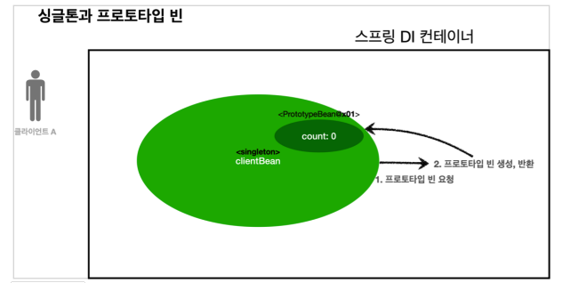
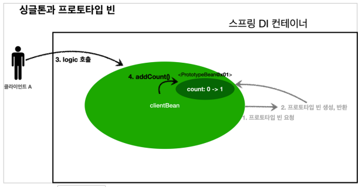
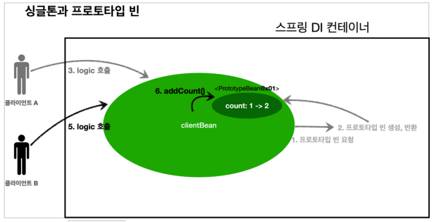

# 03. 프로토타입 스코프 - 싱글톤 빈과 함께 사용시 문제점

### 프로토타입 스코프 - 싱글톤 빈과 함께 사용시 문제점

스프링 컨테이너에 프토토타입 스코프의 빈을 요청하면 항상 새로운 객체 인스턴스를 생성해서 반환한다. 

ㅌㅊ 하지만 싱글톤 빈과 함께 사용할 때는 의도한 대로 잘 동작하지 않으므로 주의해야 한다.


### 싱글톤에서 프로토타입 빈 사용 예시



* clientBean은 싱글톤이므로 의존관계 자동 주입 시 스프링 컨테이너에 프로토타입 빈을 요청한다.
* 스프링 컨테이너는 프로토타입 빈을 생성해서 clientBean에게 반환한다. 이 때 count의 값은 0이다.
* clientBean은 프로토타입 빈의 참조값을 내부 필드에 보관한다.




* 클라이언트 A는 clientBean을 스프링 컨테이너에 요청해서 받는다. 싱글톤이므로 항상 같은 clientBean이 반환된다.
* logic을 호출하면 clientBean의 count 값이 1 증가한다. ( 0 -> 1)




* 클라이언트 B가 clientBean을 스프링 컨테이너에 요청해서 받는다. 싱글톤이므로 항상 같은 clientBean이 반환된다.
* logic을 호출하면 clientBean의 count 값이 1 증가한다. ( 1 -> 2)


프로토타입 빈은 요청이 올 때마다 다시 생성되지 않고 clientBean 생성 시 주입된 프로토타입 빈을 계속해서 사용한다.

이는 프로토타입 빈의 목적에 맞지않다.


### 테스트 코드

``` java
package hello.core.scope;

import org.junit.jupiter.api.Test;
import org.springframework.beans.factory.annotation.Autowired;
import org.springframework.context.annotation.AnnotationConfigApplicationContext;

import javax.annotation.PostConstruct;
import javax.annotation.PreDestroy;

import static org.assertj.core.api.Assertions.assertThat;

public class SingletonWithPrototypeTest1 {

    @Test
    void singletonClientUsePrototype() {
        AnnotationConfigApplicationContext ac = new AnnotationConfigApplicationContext(ClientBean.class, PrototypeBean.class);

        ClientBean clientBean1 = ac.getBean(ClientBean.class);
        int count1 = clientBean1.logic();
        assertThat(count1).isEqualTo(1);

        ClientBean clientBean2 = ac.getBean(ClientBean.class);
        int count2 = clientBean2.logic();
        assertThat(count2).isEqualTo(2);
    }

    static class ClientBean {
        private final PrototypeBean prototypeBean;

        @Autowired
        public ClientBean(PrototypeBean prototypeBean) {
            this.prototypeBean = prototypeBean;
        }

        public int logic() {
            prototypeBean.addCount();
            int count = prototypeBean.getCount();
            return count;
        }
    }

    static class PrototypeBean {
        private int count = 0;

        public void addCount() {
            count++;
        }

        public int getCount() {
            return count;
        }

        @PostConstruct
        public void init() {
            System.out.println("PrototypeBean.init" + this);
        }

        @PreDestroy
        public void destroy() {
            System.out.println("PrototypeBean.destroy");
        }
    }
}

```

스프링은 일반적으로 싱글톤 빈을 사용하므로, 싱글톤 빈이 프로토타입 빈을 사용하게 된다. 

그런데 싱글톤 빈은 생성 시점에만 의존관계 주입을 받기 때문에, 프로토타입 빈이 새로 생성되기는 하지만, 싱글톤 빈과 함께 계속 유지되는 것이 문제다.

