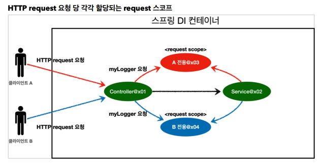

# 05. 웹 스코프

### 웹 스코프 특징

* 웹 스코프는 웹 환경에서만 동작한다.
* 웹 스코프는 프로토타입과 다르게 스프링이 해당 스코프의 종료시점까지 관리한다. 따라서 종료 메서드가 호출된다.

### 웹 스코프 종류

* request : HTTP 요청 하나가 들어오고 나갈 때 까지 유지되는 스코프
* session : HTTP Session과 동일한 생명주기를 가지는 스코프
* application : 서블릿 컨텍스트와 동일한 생명주기를 가지는 스코프
* websocket : 웹 소캣과 동일한 생명주기를 가지는 스코프

