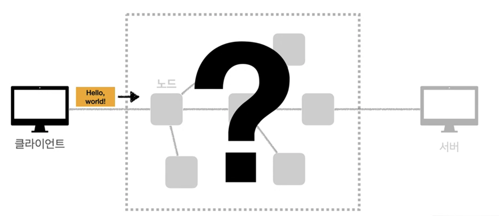
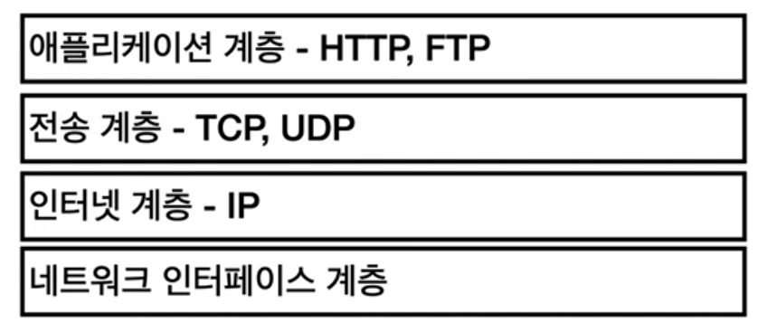
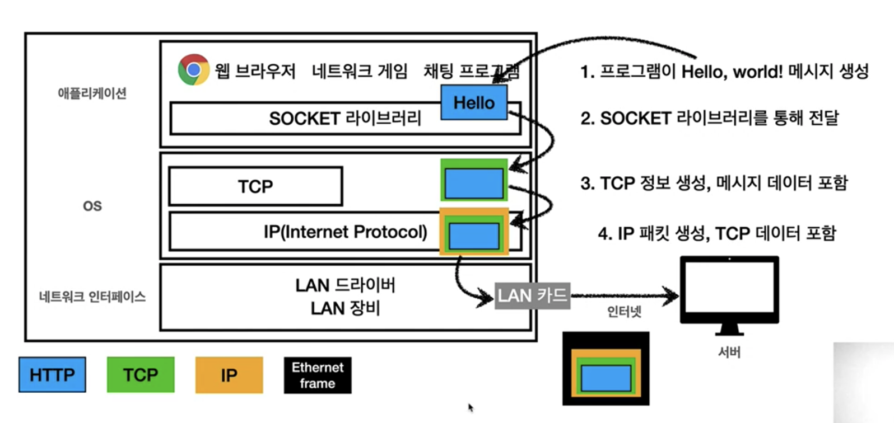
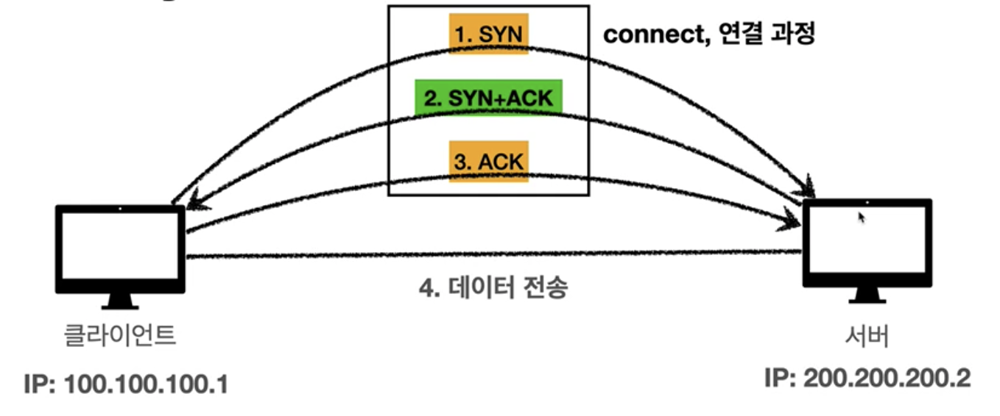
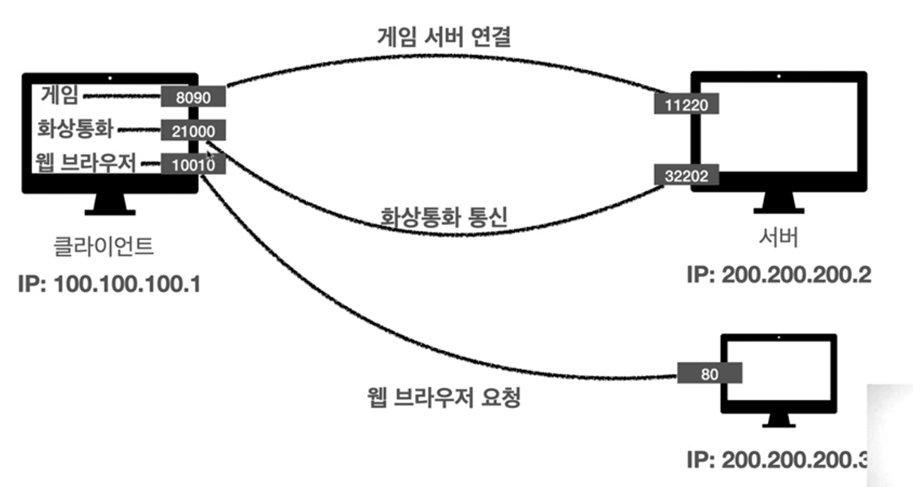
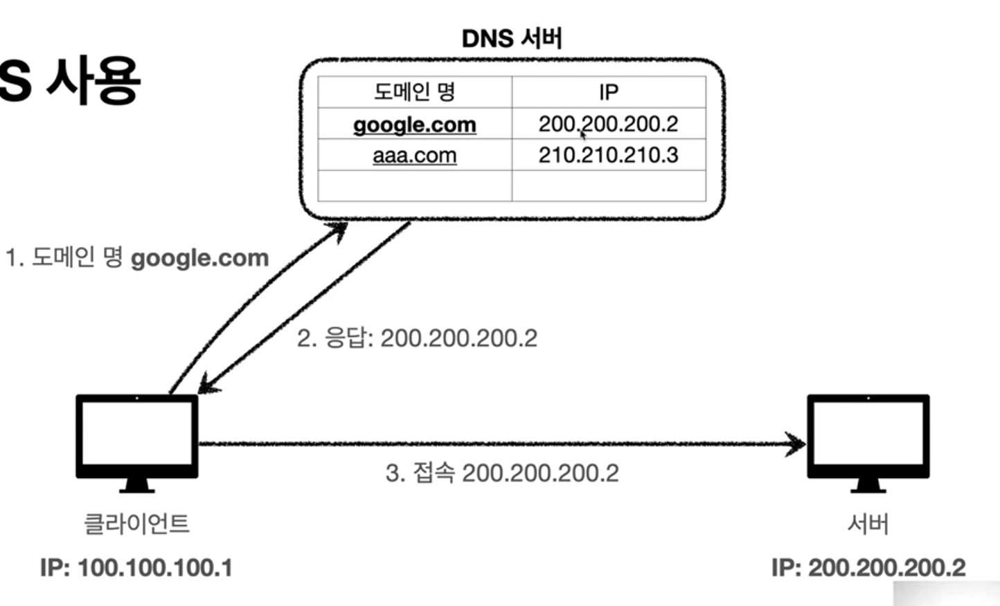

# 인터넷 네트워크

## 인터넷 통신

클라이언트와 서버는 인터넷으로 통신을 한다.

## IP(인터넷 프로토콜)

* 지정된 IP 주소에 데이터 전달
* 패킷이라는 통신 단위로 데이터 전달

### IP 패킷 정보

IP 패킷에는 출발지의 IP, 목적지의 IP, 데이터 등이 담긴다.

### IP 프로토콜의 한계

* 비연결성 : 패킷을 받을 대상이 없거나 서비스 불능 상태여도 패킷 전송
* 비신뢰성 : 중간에 패킷이 사라지거나 순서대로 안오는 상황에 대한 대처가 필요하다.
* 프로그램 구분 : 같은 IP를 사용하는 서버에서 통신하는 애플리케이션이 둘 이상이면?

## TCP UDP

### 인터넷 프로토콜 스택의 4계층

### 채팅을 보낼 때의 예시

### 패킷 정보

IP 패킷에는 출발지의 IP, 목적지의 IP, 데이터 등이 담긴다.

TCP 패킷에는 출발지 PORT, 목적지 PORT, 전송 제어, 순서, 검증 정보 등이 담긴다.

### TCP 특징

TCP는 Transmission Control Protocol의 약자로 전송 제어 프로토콜이다.

* 연결지향 - TCP 3 way handshake
* 데이터 전달 보증
* 순서  보장
* 신뢰할 수 있는 프로토콜
* 현재는 대부분 TCP 사용

### TCP 3 way handshake

### UDP 특징

UDP는 User Datagram Protocol의 약자로 사용자 데이터그램 프로토콜이다.

* 하얀 도화지에 비유
* 연결지향 - TCP 3 way handshake X
* 데이터 전달 보증 X
* 순서 보장 X
* 데이터 전달 및 순서가 보장되지 않지만, 단순하고 빠름
* 정리
  * IP와 거의 같다 + PORT + 체크섬 정도만 추가
  * 애플리에키션에서 추가 작업 필요

## PORT

하나의 IP에서 여러 애플리케이션을 실행 할 수 있다.(게임, 화상통화 등)

이 때 여러 패킷이 날라올텐데 각 애플리케이션을 구분하는 역할을  PORT가 한다.

0~65535까지 할당 가능하지만,

0~1023은 잘 알려진 포트로 사용하지 않는 것이 좋다.

* FTP : 20, 21
* TELNET : 23
* HTTP : 80
* HTTPS : 443 

## DNS

IP는 기억하기 어렵고 변경될 수 있다.

따라서 DNS, Domain Name System이 있다.

도메인 명을 IP주소로 변환하는 역할을 한다.

