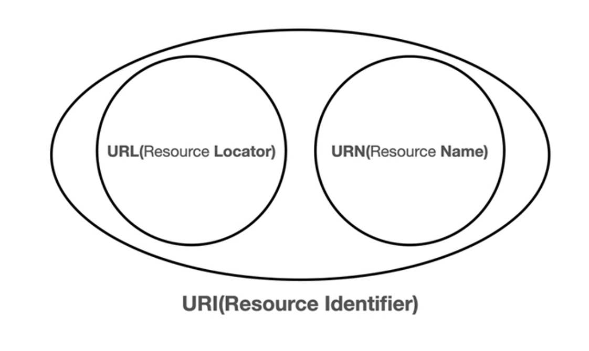

# 02. URI와 웹브라우저 요청 흐름

## URI

URI는 Uniform Resource Identifier의 약자로 리소스 식별자이다.

* Uniform : 리소스 식별하는 통일된 방식
* Resource : 자원, URI로 식별할 수 있는 모든 것
* Identifier : 다른 항목과 구분하는데 필요한 정보

비슷하게 URI, URL, URN이 있다.

### URL 전체 문법

`scheme://[userinfo@]host[:port][/path][?query][#fragment]`

### scheme

주로 프로토콜 사용

ex) http, https, ftp

### userinfo

URL에 사용자정보를 포함해서 인증

거의 사용하지 않음

### host

호스트명

도메인 명 또는 IP 주소를 직접 사용가능

ex) www.google.com

### PORT

포트

일반적으로 생략가능하며, 생략 시 http는 80, https는 443

ex) 433

### path

리소스 경로

ex) /home/file1.jpg, /members, /members/100

### query

key=value 형태로 ?로 시작하고 &로 추가가능

ex) ?keyA=valueA&keyB=valueB

### fragment

html 내부 북마크 등에 사용

서버에 전송하는 정보는 아님

ex) #getting-started-introducing-spring-boot

## 웹 브라우저 요청 흐름

1. DNS를 조회하여 IP 주소를 획득한다.

   

2. HTTP 요청 메시지를 생성한다.

   

3. HTTP 메시지를 전송한다.

   

4. 수신측에서 패킷을 확인하고 HTTP 응답 메시지를 만든다.

   

5. 송신측에서 응답 메시지를 받고 렌더링한다.