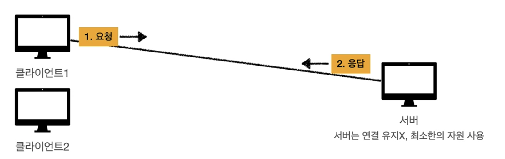
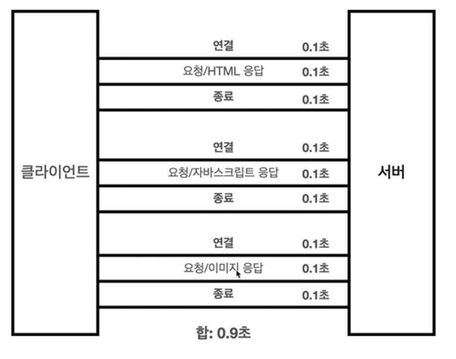
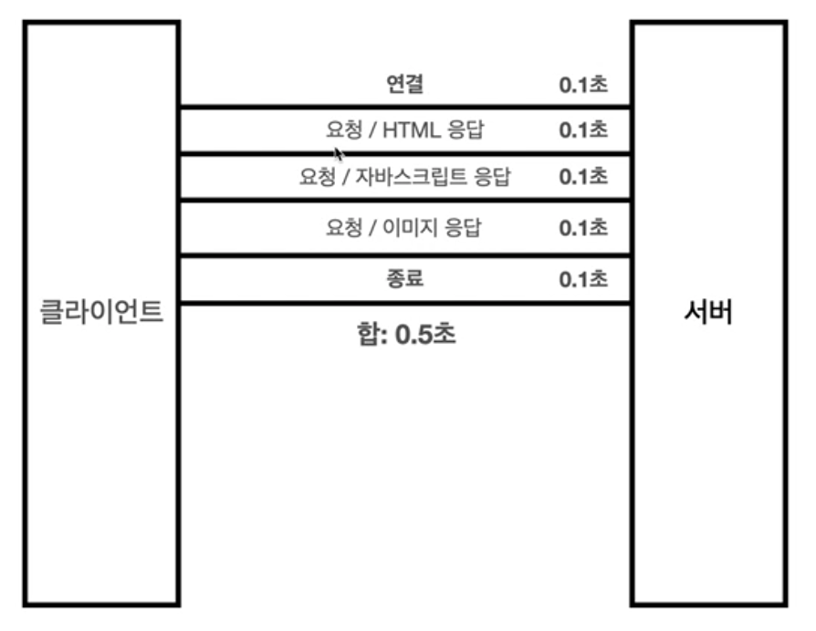
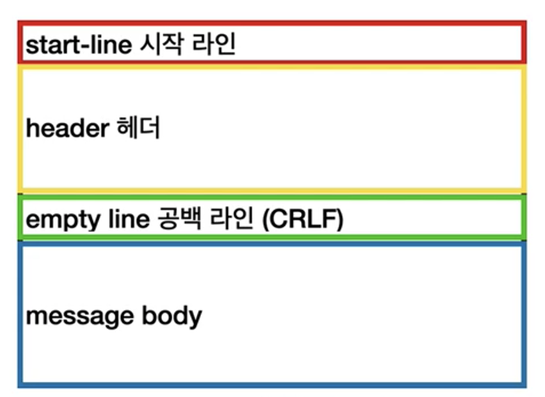

# HTTP 기본

## 모든 것이 HTTP

HTTP : HyperText Transfer Protocol

기존에는 HyperText(링크를 통해 연결되는 html 등)을 위한 프로토콜이었으나 지금은 HTTP 메시지에 모든 것을 전송한다.

### 

### HTTP 역사

* HTTP/0.9 1991년 : GET 메서드만 지원, HTTP 헤더X
* HTTP/1.0 1996년 : 메서드, 헤더 추가
* HTTP/1.1 1997년 : 가장 많이 사용, 우리에게 가장 중요한 버전
* HTTP/2 2015년 : 성능 개선
* HTTP/3 : TCP 대신에 UDP 사용, 성능 개선


### HTTP 특징

* 클라이언트 서버 구조
* 무상태 프로토콜, 비연결성
* HTTP 메시지
* 단순함, 확장 가능


## 클라이언트 서버 구조

클라이언트가 요청을 하고 서버가 응답하는 형태

이렇게 구조를 나누었기 때문에 독립적으로 개발이 가능해졌으며, 서버는 비즈니스 로직에 집중, 클라이언트는 사용성에 집중할 수 있다.


## Stateful, Stateless

### 무상태 프로토콜, Stateless

서버가 클라이언트의 상태를 보존하지 않는다.

* 장점 : 서버 확장성 높음(scale out)
* 단점 : 클라이언트가 추가 데이터 전송


### Stateless 한계

* 모든 것을 무상태로 설계 할 수 있는 경우도 있고 없는 경우도 있다. 
  * 예를 들어 로그인의 경우, 상태유지가 필요하다.
  * 일반적으로 브라우저 쿠키와 서버 세션 등을 사용해서 상태를 유지한다.
  * 상태 유지는 최소한만 사용해야한다.
* 서버가 상태를 보존하기 않기 때문에 요청 시 많은 데이터가 전송된다.


## 비 연결성, connectionless

### 비 연결성

* HTTP는 기본이 연결을 유지하지 않는 모델
* 수천명이 서비스를 사용해도 실제 서버에서 동시에 처리하는 요청은 수십개 이하로 매우 작다.
* 비 연결성을 통해 서버 자원을 효율적으로 사용할 수 있다.




### 비 연결성의 단점

* TCP/IP 연결을 새로 맺어야 함 - 3 way handshake 시간 추가


### Persistent Connections

HTTP 지속 연결을 통해 위와 같은 단점을 해결한다.

HTTP 2, 3 에서는  이에 대한 최적화가 더 잘 이루어진다.






## HTTP 메시지

### HTTP 메시지 구조




### 시작 라인 - 요청 메시지

method request-target HTTP-version

``` http
GET /search?q=hello&hl=ko HTTP/1.1
```


### 시작 라인 - 응답 메시지

HTTP-version status-code reason-phrase

``` http
HTTP/1.1 200 OK
```


### HTTP 헤더

* HTTP 전송에 필요한 모든 부가정보
* ex) 메시지 바디의 내용, 메시지 바디의 크기, 압축, 인증, 요청 클라이언트 정보, 서버 애플리케이션 정보, 캐시 관리 정보 ...
* 표준 헤더도 많고 사용자가 임의로 헤더를 정의할 수 있다.


field-name은 대소문자 구분 없음

```http
Host: www.google.com
```

```http
Content-Type: text/html;charset=UTF-8
Content-Length: 3423
```


### HTTP 메시지 바디

* 실제 전송할 데이터로 byte로 표현 할 수 있는 모든 데이터가 가능하다.