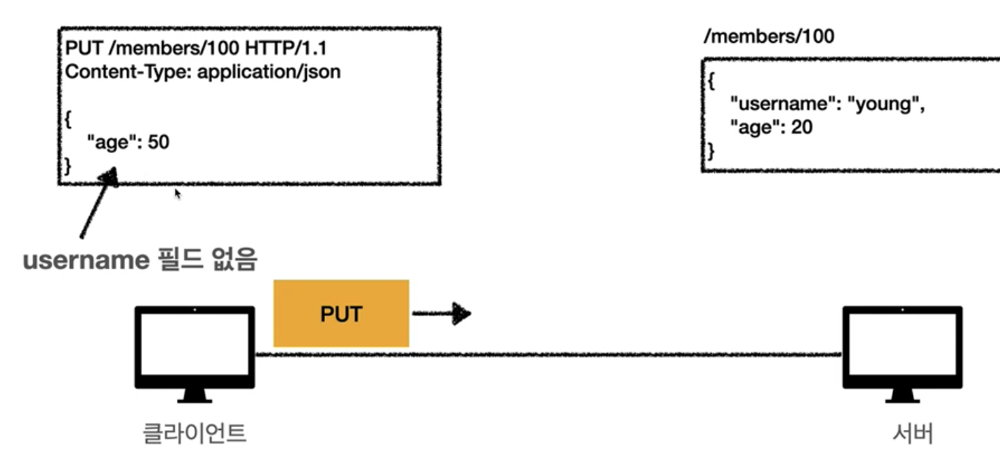
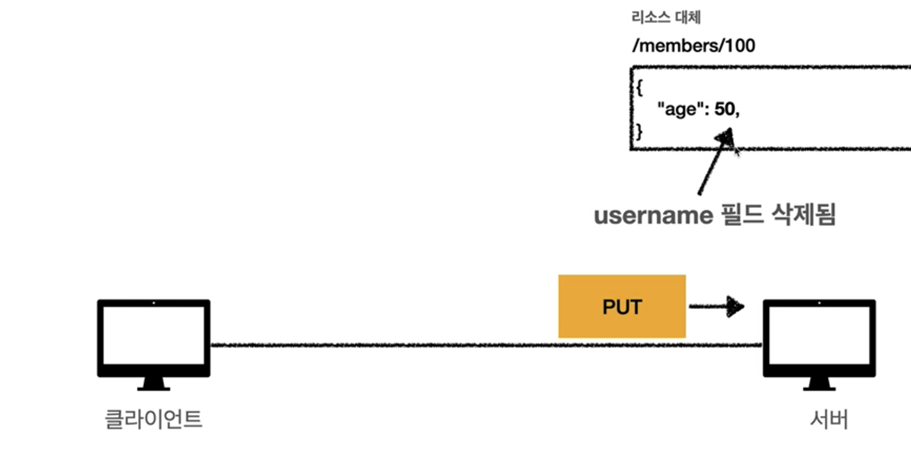
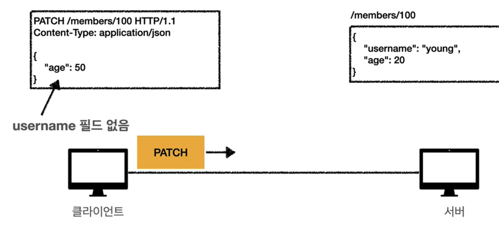
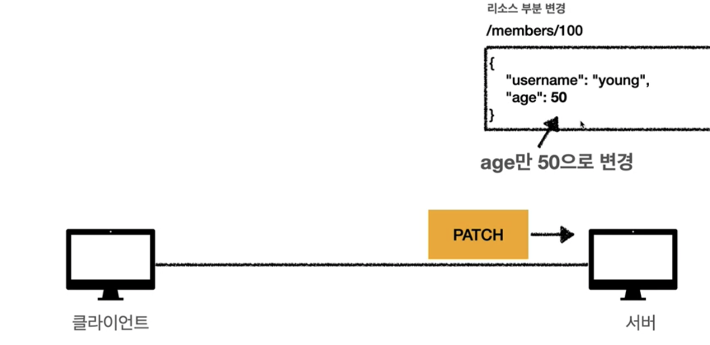

# 04. HTTP 메서드

## HTTP API를 만들어보자

### 요구사항

* 회원 목록 조회
* 회원 조회
* 회원 등록
* 회원 수정
* 회원 삭제

가장 중요한 것은 리소스 식별

* 회원 목록 조회 : /members
* 회원 조회 : /members/{id}
* 회원 등록 : /members/{id}
* 회원 수정 : /members/{id}
* 회원 삭제 : /members/{id}

> 계층 구조상 상위를 컬렉션으로 보고 복수단어 사용 권장

URI는 리소스만 식별하고 행위는 분리한다. 

행위는 HTTP 메서드로 구별한다.

## HTTP 메서드 - GET, POST

### HTTP 메서드 종류

* GET : 리소스 조회
* POST : 요청 데이터 처리, 주로 등록에 사용
* PUT : 리소스를 대체, 해당 리소스가 없으면 생성
* PATCH : 리소스 부분 변경
* DELETE : 리소스 삭제
* HEAD : GET과 동일하지만 메시지 부분을 제외하고, 상태 줄과 헤더만 반환
* OPTIONS : 대상 리소스에 대한 통신 가능 옵션(메서드)을 설명
* CONNECT : 대상 자원으로 식별되는 서버에 대한 터널을 설정
* TRACE : 대상 리소스에 대한 경로를 따라 메시지 루프백 테스트를 수행

### GET

* 리소스 조회
* 서버에 전달하고 싶은 데이터는 query
* 메시지 바디를 사용해서 데이터를 전달 할 수 있지만 지원하지 않는 곳이 많아서 권장하지 않음

### POST

1. 새 리소스 생성 : 서버가 아직 식별하지 않은 새 리소스 생성

2. 요청 데이터 처리

   * 단순히 데이터를 생성하거나, 변경하는 것을 넘어서 프로세스를 처리해야 하는 경우
   * ex) `주문 결제 완료 -> 배달 시작 -> 배달 완료` 와 같이 단순히 값 변경을 넘어 프로세스의 상태가 변경되는 경우
   * POST /orders/{orderId}/start-delivery

3. 다른 메서드로 처리하기 애매한 경우

   * JSON으로 조회 데이터를 넘거야 하는데 GET 메서드를 사용하기 어려운 경우
   * 애매하면 POST

   

## HTTP 메서드 - PUT, PATCH, DELETE

### PUT

* 리소스를 대체
  * 리소스가 있으면 대체, 없으면 생성
* 클라이언트가 리소스를 식별(POST와 차이점)
  * ex) `PUT /members/100` VS `POST /members/`

PUT은 기존 리소스를 완전히 대체한다.

### PATCH

* 리소스 부분 변경

### DELETE

* 리소스 제거

## HTTP 메서드의 속성

### HTTP 메서드 속성

* 안전(safe Methods)
* 멱등(Idempotent Methods)
* 캐시가능(Cacheable Methods)

### 안전

* 호출해도 리소스를 변경하지 않는다.

### 멱등

* f(f(x)) = f(x)
* 한 번 호출하든 N번 호출하든 결과가 똑같다.
* 활용
  * 자동 복구 메커니즘
  * 서버가 TIMEOUT 등으로 정상 응답을 못주었을 때 클라이언트가 같은 요청을 다시 해도 되는가

### 캐시가능

* GET, HEAD, POST, PATCH 캐시가능
* 실제로는 GET, HEAD 정도만 캐시로 사용
* POST, PATCH는 본문 내용까지 캐시 키로 고려해야 하는데 구현이 쉽지 않음