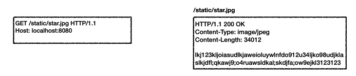
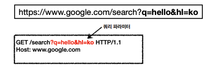
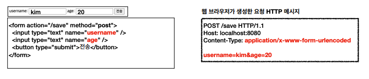
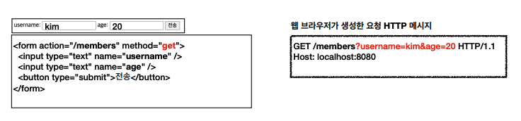
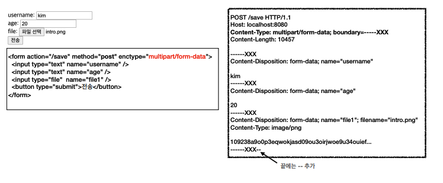
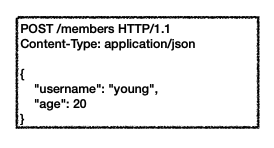
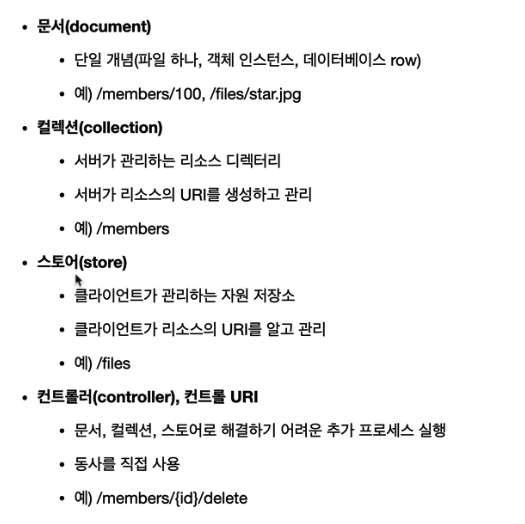

# 05. HTTP 메서드 활용

## 클라이언트에서 서버로 데이터 전송

### 데이터 전달 방식은 크게 2가지

* 쿼리 파라미터를 통한 데이터 전송
  * GET
  * 주로 정렬 필터
* 메시지 바디를 통한 데이터 전송
  * POST, PUT, PATCH
  * 회원가입, 상품 주문, 리소스 등록, 리소스 변경

### 클라이언트에서 서버로 데이터 전송하는 4가지 상황

* 정적 데이터 조회
* 동적 데이터 조회
* HTML Form을 통한 데이터 전송
* HTTP API를 통한 데이터 전송

### 정적 데이터 조회

* 이미지, 정적 텍스트 문서
* 조회는 GET 사용
* 쿼리 파라미터 미사용

### 동적 데이터 조회

* 주로 검색, 게시판 목록에서 정렬 필터(검색어)
* 조회 조건을 줄여주는 필터, 조회 결과를 정렬하는 정렬 조건에 주로 사용
* 조회는 GET

### HTML Form을 통한 데이터 전송

#### POST 전송

request body에 데이터가 담긴다.

Content-Type으로 `application/x-www-form-urlencoded` 가 사용된다.

#### GET 전송

query parameter에 데이터가 담긴다.

#### multipart/form-data

파일 업로드 같은 바이너리 데이터 전송 시 사용한다.

다른 종류의 여러 파일과 폼의 내용 함께 전송 가능하다.

### HTTP API 데이터 전송

Content-Type으로 `application/json` 을 주로 사용한다.

## HTTP API 설계 예시

### 회원 관리 시스템 - POST 기반

* 회원 목록 /members -> GET 
* 회원 등록 /members -> POST
* 회원 조회 /members/{id} -> GET
* 회원 수정 /members/{id} -> PATCH, PUT, POST
* 회원 삭제 /members/{id} -> DELETE

### 회원 관리 시스템 - POST 기반 특징

* 클라이언트는 등록될 리소스의 URI를 모른다.
  * 회원 등록 /members -> POST 
  * POST /members
* 서버가 새로 등록된 리소스 URI를 생성해준다.
  * HTTP/1.1 201 Created 
    Location: /members/100
* 컬렉션(Collection)
  * 서버가 관리하는 리소스 디렉토리
  * 서버가 리소스의 URI를 생성하고 관리
  * 여기서 컬렉션은 /members

### 파일 관리 시스템 - PUT 기반

* 파일 목록 /files -> GET 
* 파일 조회 /files/{filename} -> GET
* 파일 등록 /files/{filename} -> PUT
* 파일 삭제 /files/{filename} -> DELETE
* 파일 대량 등록 /files -> POST

### 파일 관리 시스템 - PUT 기반 특징

* 클라이언트가 리소스 URI를 알고 있어야 한다.
  * 파일 등록 /files/{filename} -> PUT
  * PUT /files/star.jpg
* 클라이언트가 직접 리소스의 URI를 지정한다.
* 스토어(Store)
  * 클라이언트가 관리하는 리소스 저장소
  * 클라이언트가 리소스의 URI를 알고 관리
  * 여기서 스토어는 /files

### 참고하면 좋은 URI 설계 개념

https://restfulapi.net/resource-naming/

