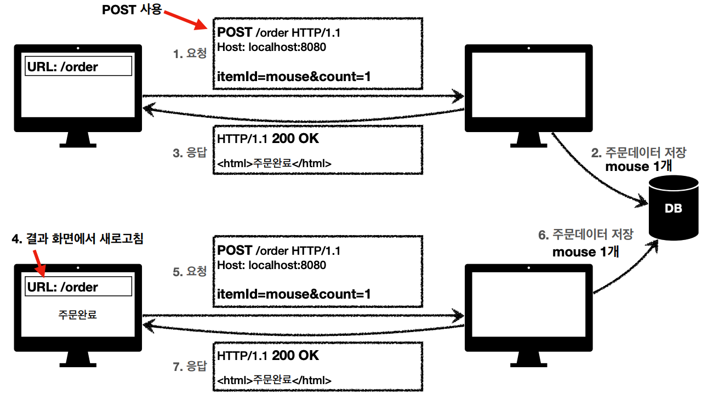

# HTTP 상태코드

## HTTP 상태코드 소개

### HTTP 상태코드

* 1xx (Informational): 요청이 수신되어 처리중 
* 2xx (Successful): 요청 정상 처리
* 3xx (Redirection): 요청을 완료하려면 추가 행동이 필요
* 4xx (Client Error): 클라이언트 오류, 잘못된 문법등으로 서버가 요청을 수행할 수 없음
* 5xx (Server Error): 서버 오류, 서버가 정상 요청을 처리하지 못함

### 1xx (Informational)

* 요청이 수신되어 처리중
* 거의 사용하지 않으므로 생략

## 2xx - 성공

### 2xx(Successful)

* 200 OK
* 201 Created
* 202 Accepted
* 204 No Content

### 200 OK

* 요청 성공

### 201 Created

* 요청 성공해서 새로운 리소스가 생성됨
* 생성된 리소스는 응답의 Location 헤더 필드로 식별

### 202 Accepted

* 요청이 접수되었으나 처리가 완료되지 않았음
* 배치 처리 같은 곳에서 사용 ex) 요청 접수 후 1시간 뒤에 배치 프로세스가 요청을 처리함

### 204 No Content

* 서버가 요청을 성공적으로 수행했지만, 응답 페이로드 본문에 보낼 데이터가 없음
* ex) 웹 문서 편집기에서 save 버튼
  * save 버튼의 결과로 아무 내용이 없어도 된다.
  * save 버튼을 눌러도 같은 화면을 유지해야 한다.

## 3xx - 리다이렉션1

### 3xx (Redirection)

요청을 완료하기 위해 유저 에이전트의 추가 조치 필요

* 300 Multiple Choices
* 301 Moved Permanently
* 302 Found
* 303 See Other
* 304 Not Modified
* 307 Temporary Redirect
* 308 Permanent Redirect

### 리다이렉션 이해

웹 브라우저는 3xx 응답의 결과에 Location 헤더가 있으면, Location 위치로 자동 이동한다.

이를 리다이렉트라고 한다.

리다이렉션에는 3가지 종류가 있다.

* 영구 리다이렉션
  * 특정 리소스의 URI가 영구적으로 이동
* 일시 리다이렉션
  * 일시적인 변경
  * 주문 완료 후 주문 내역 화면으로 이동
  * PRG : Post/Redirect/Get
* 특수 리다이렉션
  * 결과 대신 캐시를 사용

### 영구 리다이렉션 301, 308

* 리소스의 URI가 영구적으로 이동
* 원래의 URI를 사용 X, 검색 엔진 등에서도 변경 인지
* 301 Moved Permanently
  * 리다이렉트시 요청 메서드가 GET으로 변하고, 본문이 제거될 수 있음(MAY)
* 308 Permanent Redirect
  * 301과 기능은 같음
  * 리다이렉트시 요청 메서드와 본문 유지(처음 POST를 보내면 리다이렉트도 POST 유지)

### 일시적인 리다이렉션 302, 307, 303

* 리소스의 URI가 일시적으로 변경
* 따라서 검색 엔진 등에서 URI을 변경하면 안됨.
* 302 Found
  * 리다이렉트시 요청 메서드가 GET으로 변하고, 본문이 제거될 수 있음(MAY) 
* 307 Temporary Redirect
  * 302와 기능은 같음
  * 리다이렉트시 요청 메서드와 본문 유지(요청 메서드를 변경하면 안된다. MUST NOT)
* 303 See Other
  * 302와 기능은 같음
  * 리다이렉트시 요청 메서드가 GET으로 변경

## 3xx - 리다이렉션2

### PRG: Post/Redirect/Get

주문을 예시로 생각해보자.

POST로 주문 후에 웹 브라우저를 새로고침하면?

* PRG 사용 전 

* PRG 사용 후

새로고침해도 GET으로 결과 화면만 조회하기 때문에 중복 주문이 발생하지 않는다.

### 기타 리다이렉션

* 300 Multiple Choices : 사용하지 않음
* 304 Not Modified
  * 캐시를 목적으로 사용
  * 클라이언트에게 리소스가 수정되지 않았음을 알려준다. 따라서 클라이언트는 로컬PC에 저장된 캐시를 재사용한다.
  * 응답에 메시지 바디를 포함하면 안된다.

## 4xx - 클라이언트 오류, 5xx - 서버 오류

### 4xx (Client Error)

* 클라이언트의 요청에 잘못된 문법등으로 서버가 요청을 수행할 수 없음 
* 오류의 원인이 클라이언트에 있음
* 중요! 클라이언트가 이미 잘못된 요청, 데이터를 보내고 있기 때문에, 똑같은 재시도가 실패함

### 400 Bad Request

* 클라이언트가 잘못된 요청을 해서 서버가 요청을 처리할 수 없음
* 요청 구문, 메시지 등등 오류
* 클라이언트는 요청 내용을 다시 검토하고, 보내야함
* 예) 요청 파라미터가 잘못되거나, API 스펙이 맞지 않을 때

### 401 Unauthorized 

* 클라이언트가 해당 리소스에 대한 인증이 필요함
* 인증(Authentication) 되지 않음
* 401 오류 발생시 응답에 WWW-Authenticate 헤더와 함께 인증 방법을 설명
* 참고
  * 인증(Authentication): 본인이 누구인지 확인, (로그인)
  * 인가(Authorization): 권한부여 (ADMIN 권한처럼 특정 리소스에 접근할 수 있는 권한, 인증이 있어야 인가가 있음)
  * 오류 메시지가 Unauthorized 이지만 인증 되지 않음 (이름이 아쉬움)

### 403 Forbidden 

* 서버가 요청을 이해했지만 승인을 거부함
* 주로 인증 자격 증명은 있지만, 접근 권한이 불충분한 경우
* 예) 어드민 등급이 아닌 사용자가 로그인은 했지만, 어드민 등급의 리소스에 접근하는 경우

### 404 Not Found 

* 요청 리소스를 찾을 수 없음
* 또는 클라이언트가 권한이 부족한 리소스에 접근할 때 해당 리소스를 숨기고 싶을 때

### 5xx (Server Error)

* 서버 문제로 오류 발생
* 서버에 문제가 있기 때문에 재시도 하면 성공할 수도 있음(복구가 되거나 등등)

### 500 Internal Server Error

* 서버 내부 문제로 오류 발생
* 애매하면 500 오류

### 503 Service Unavailable

* 서버가 일시적인 과부하 또는 예정된 작업으로 잠시 요청을 처리할 수 없음
* Retry-After 헤더 필드로 얼마뒤에 복구되는지 보낼 수도 있음