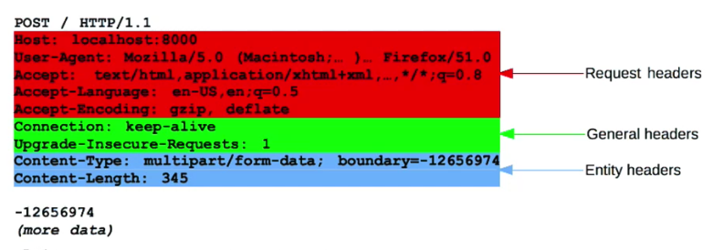
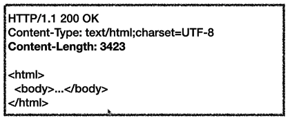
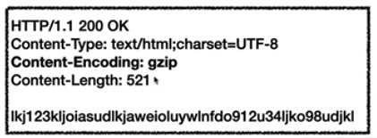
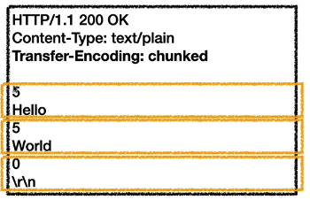
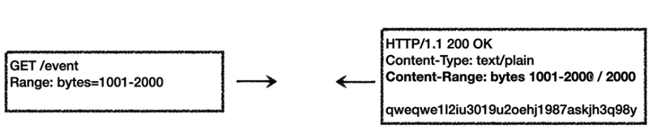
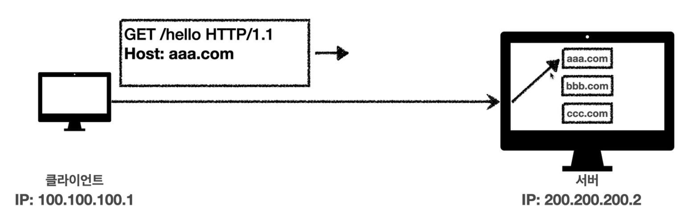

# 07. HTTP 헤더1 - 일반 헤더

## HTTP 헤더 개요

### HTTP 헤더 용도

* HTTP 전송에 필요한 모든 부가정보 
  * ex) 메시지 바디의 내용, 메시지 바디의 크기, 압축, 인증, 요청 클라이언트, 서버 정보 등
* 표준 헤더가 너무 많음
* 필요시 임의 헤더  추가 기능

### HTTP 헤더 분류 - RFC2616(과거)

* General 헤더 : 메시지 전체에 적용되는 정보 ex) Connection: close
* Request 헤더 : 요청 정보 ex) User-Agent: Mozila/5.0
* Response 헤더: 응답 정보 ex) Server: Apache
* Entity 헤더 : 엔티티 바디 정보 ex) Content-Type: text/html

### RFC7230~7235

2014년 RFC7230~7235가 등장하면서 기존 RFC2616는 폐기된다.

이에 따라 용어도 바뀌게 된다.

* 엔티티(Entity) -> 표현(Representation)
* Representation = representation Metadata + Representation Data
* 표현 = 표현 메타데이터 + 표현 데이터

## 표현

### 표현

표현 헤더는 전송, 응답 둘 다 사용한다.

* Content-Type : 표현 데이터의 형식
* Content-Encoding : 표현 데이터의 압축 방식
* Content-Language : 표현 데이터의 자연 언어
* Content-Length : 표현 데이터의 길이

### Content-Type

* 표현 데이터의 형식 설명
* ex) text/html; charset=utf-8, application/json, image/png

### Content-Encoding

* 표현 데이터 인코딩
* 표현 데이터를 압축하기 위해 사용
* 데이터를 전달하는 곳에서 압축 후 인코딩 헤더 추가
* 데이터를 읽는쪽에서 인코딩 헤더의 정보로 압축 해제
* ex) gzip, deflate, identity

### Content-Language

* 표현 데이터의 자연 언어를 표현
* ex) ko, en, en-US

### Content-Length

* 표현 데이터의 길이
* 바이트 단위
* Tranfer-Encoding(전송 코딩)을 사용하면 Content-Length를 사용하면 안됨

## 콘텐츠 협상

### 협상(콘텐츠 네고시에이션)

협상 헤더는 요청 시에만 사용한다.

클라이언트가 선호하는 표현을 요청한다.

* Accept : 클라이언트가 선호하는 미디어 타입 전달
* Accept-Charset : 클라이언트가 선호하는 문자 인코딩
* Accept-Encoding : 클라이언트가 선호하는 압축 인코딩
* Accept-Language : 클라이언트가 선호하는 자연 언어

### 협상과 우선순위

* Quality Values(q) 값을 사용한다.
* q는 0~1 사이의 값을 가진다.
* ex) Accept-Language: ko-KR,ko;q=0.9,en-US;q=0.8,en;q=0.7

### 협상과 우선순위 2

* 구체적인 것이 우선한다.
* ex) Accept: text/*, text/plain, text/plain;format=flowed, `*/*`
  * text/plain;format=flowed
  * text/plain
  * text/*
  *  `*/*`

## 전송 방식

### 전송 방식

* 단순 전송
* 압축 전송
* 분할 전송
* 범위 전송

### 단순 전송

### 압축 전송

압축한 방식을 명시해야 한다.

### 분할 전송

Transfer-Encoding: chunked 를 사용하여 분할하여 보낸다.

### 범위 전송

## 일반 정보

### 일반 정보

* From : 유저 에이전트의 이메일 정보
* Referer : 이전 웹 페이지의 주소
* User-Agent : 유저 에이전트 애플리케이션 정보
* Server : 요청을 처리하는 오리진 서버의 소프트웨어 정보
* Date : 메시지가 생성된 날짜

### From

* 유저 에이전트의 이메일 정보
* 일반적으로 잘 사용되지 않음
* 검색 엔진 같은 곳에서, 주로 사용
* 요청에서 사용

### Referer

* 현재 요청된 페이지의 이전 웹 페이지 주소
* A->B로 이동하는 경우 B를 요청할 때 Referer: A를 포함해서 요청
* Referer를 사용해서 유입 경로 분석 가능
* 요청에서 사용
* referer는 단어 referrer의 오타

### User-Agent

* 클라이언트의 애플리케이션 정보
* 통계 정보
* 어떤 종류의 브라우저에서 장애가 발생하는지 파악 가능
* 요청에서 사용

### Server

* 요청을 처리하는 ORIGIN 서버의 소프트웨어 정보
* ex) Server : Apache/2.2.22 (Debian)
* server: nginx
* 응답에서 사용

### Date

* 메세지가 발생한 날짜와 시간
* 응답에서 사용

## 특별한 정보

### 특별한 정보

* Host: 요청한 호스트 정보(도메인)
* Location: 페이지 리다이렉션
* Allow: 허용 가능한 HTTP 메서드
* Retry-After: 유저 에이전트가 다음 요청을 하기까지 기다려야 하는 시간

### Host

* 요청한 호스트 정보(도메인)
* 요청에서 사용
* 필수
* 하나의 서버가 여러 도메인을 처리해야 할 때
* 하나의 IP 주소에 여러 도메인이 적용되어 있을 때

### Location

* 페이지 리다이렉션
* 웹 브라우저는 3xx 읍답의 결과에 Location 헤더가 있으면, Location 위치로 자동 이동 (리다이렉트)
* 응답코드 3xx에서 설명

### Allow

* 허용 가능한 HTTP 메서드
* 405에서 응답에 포함해야함
* ex) Allow: GET, HEAD, PUT

### Retry-After

* 유저 에이전트가 다음 요청을 하기까지 기다려야 하는 시간
* 503(Service Unavailable) : 서비스가 언제까지 불능인지 알려줄 수 있음
* Retry-After: Fri, 31 Dec 1999 23:59:59 GMT (날짜 표기)
* Retry-After: 120 (초단위 표기)

## 인증

### 인증

* Authorization: 클라이언트 인증 정보를 서버에 전달
* WWW-Authenticate: 리소스 접근시 필요한 인증 방법 정의

### Authorization

* 클라이언트 인증 정보를 서버에 전달
* ex) Authorization: Basic xxxxxxxxxxxxxx

### WWW-Authenticate

* 리소스 접근시 필요한 인증 방법 정의
* 401 Unauthorized 응답과 함께 사용
* ex) WWW-Authenticate: Newauth realm="apps", type=1, title="Login to \"apps\"", Basic realm="simple"

## 쿠키

### 쿠키

* Set-Cookie: 서버에서 클라이언트로 쿠키 전달(응답)
* Cookie: 클라이언트가 서버에서 받은 쿠키를 저장하고, HTTP 요청시 서버로 전달

* 사용처
  * 사용자 로그인 세션 관리
  * 광고 정보 트랙킹
* 쿠키 정보는 항상 서버에 전송됨
  * 네트워크 추가 트래픽 추가 유발
  * 최소한의 정보만 사용(세션 id, 인증 토큰)
  * 서버에 전송하지 않고, 웹 브라우저 내부에 데이터를 저장하고 싶으면 웹 스토리지 참고
* 보안에 민감한 데이터는 저장하면 안됨

### 쿠키 - 생명주기

* Set-Cookie : expires={만료일}
* Set-Cookie: max-age={지속시간(s)}
* 세션쿠키 : 만료 날짜를 생략하면 브라우저 종료시 까지만 유지
* 영속쿠키 : 만료 날짜를 입력하면 해당 날짜까지 유지

### 쿠키 - 도메인

* ex) domain=example.org
* domain을 명시하는 경우
  * 명시한 도메인 + 서브 도메인 포함
  * ex) dev.example.org도 쿠키 접근
* domain을 생략하는 경우
  * example.org에서만 쿠키 접근
  * dev.example.org는 쿠키 미접근

### 쿠키 - 경로

* ex) path=/home
* 이 경로를 포함한 하위 경로 페이지만 쿠키 접근

### 쿠키 - 보안

* Secure
  * 쿠키는 http, https를 구분하지 않고 전송하는데 Secure를 적용하면 https인 경우에만 전송
* HttpOnly
  * XSS 공격 방지
  * 자바스크립트에서 접근 불가
  * HTTP 전송에만 사용
* SameSite
  * XSRF 공격 방지
  * 요청 도메인과 쿠키에 설정된 도메인이 같은 경우만 쿠키 전송