# 08. HTTP 헤더2 - 캐시와 조건부 요청

## 캐시 기본 동작

### 캐시가 없을 때

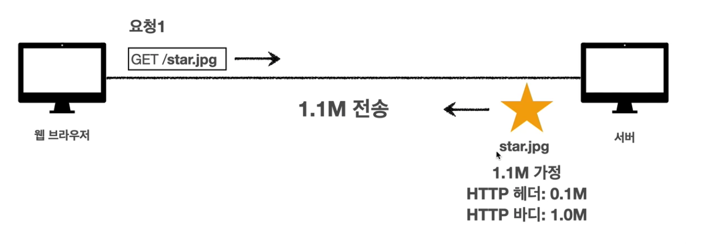

* 데이터가 변경되지 않아도 계속 네트워크를 통해서 데이터를 다운로드 받아야한다.

### 캐시 적용

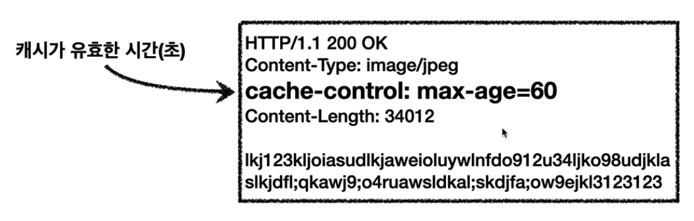

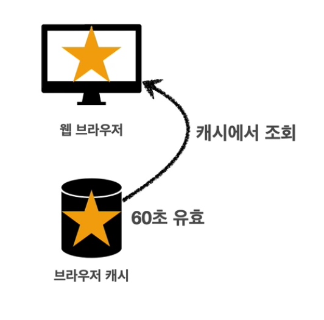

60초가 지난 이후에는 다시 서버에 요청을 하고 브라우저 캐시에 캐시를 하게 된다.

## 검증 헤더와 조건부 요청 1

### 캐시 시간 초과

캐시 유효 시간이 초과해서 서버에 다시 요청하면 다음 두 가지 상황이 나타난다.

* 서버에서 기존 데이터를 변경함
* 서버에서 기존 데이터를 변경하지 않음

`서버에서 기존 데이터를 변경하지 않음` 라면 캐시를 재사용할 수 있다.

서버에서 기존 데이터를 변경하지 않았음을 판단하기 위해 검증 헤더를 사용한다.

### 검증 헤더 사용 flow

#### 첫번째 요청 시

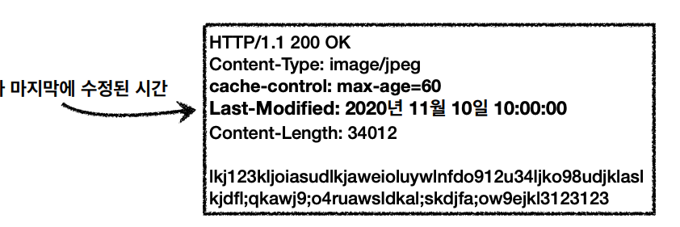

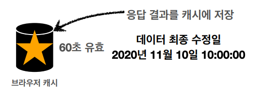

#### 두번째 요청 시 캐시 시간 초과

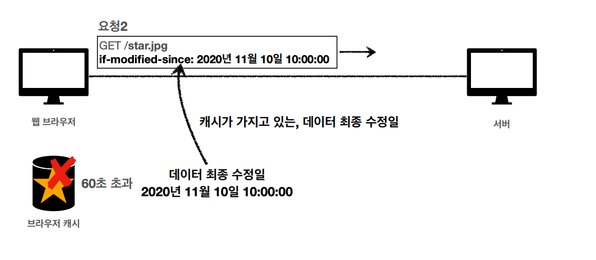

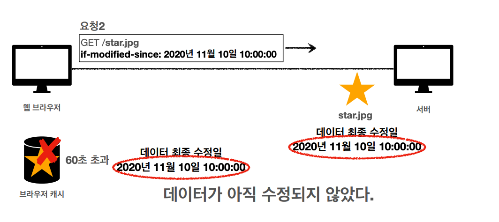

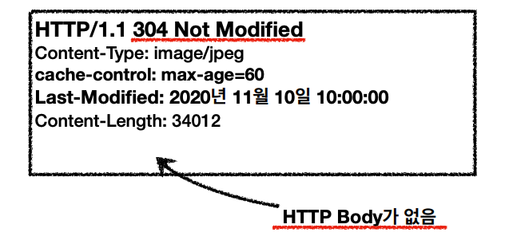

* 데이터 미변경 예시
  * 캐시: 2020년 11월 10일 10:00:00 vs 서버: 2020년 11월 10일 10:00:00
  * 304 Not Modified, 헤더 데이터만 전송(BODY 미포함)
  * 전송 용량 0.1M (헤더 0.1M, 바디 1.0M)
* 데이터 변경 예시
  * 캐시: 2020년 11월 10일 10:00:00 vs 서버: 2020년 11월 10일 11:00:00
  * 200 OK, 모든 데이터 전송(BODY 포함)
  * 전송 용량 1.1M (헤더 0.1M, 바디 1.0M)

## 검증 헤더와 조건부 요청 2

### Last-Modified, If-Modified-Since 단점

* 1초 미만 단위로 캐시 조정이 불가능하다.
* 데이터를 수정해서 날짜가 다르지만, 같은 데이터를 수정해서 데이터 결과가 똑같은 경우 효과가 없다.

### ETag, If-None-Match

* ETag : Entity Tag
* 캐시용 데이터에 임의의 고유한 버전 이름을 달아둠
  * ex) ETag: "v1.0"
* 데이터가 변경되면 ETag 값을 바꿈

### ETag 예시

클라이언트의 요청에 ETag를 포함하여 응답한다.

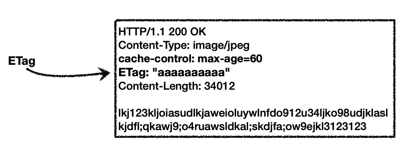

클라이언트는 응답 결과를 캐시에 저장한다.

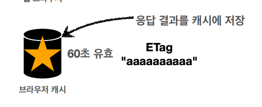

60초가 지나 캐시에서 데이터를 꺼낼 수 없다면 `If-None-Match` 에  ETag를 담아 전송한다.

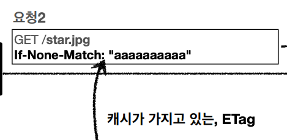

ETag 값이 변하지 않았다면 304로 응답한다.

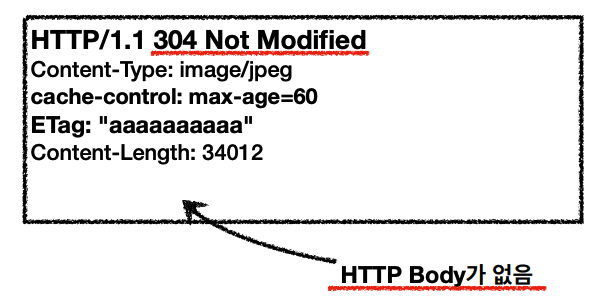

### ETag, If-None-Match 정리

* 캐시 제어 로직을 서버에서 완전히 관리한다.
* 클라이언트는 단순히 이 값을 서버에 제공한다.

## 캐시와 조건부 요청 헤더

### 캐시 제어 헤더

* Cache-Control: 캐시 제어
* Pragma: 캐시 제어(하위 호환)
* Expires: 캐시 유효 기간(하위 호환)

### Cache-Control

* 캐시 지시어

* Cache-Control: max-age 
  * 캐시 유효 시간, 초 단위
* Cache-Control: no-cache
  * 데이터는 캐시해도 되지만 항상 origin 서버에 검증하고 사용
* Cache-Control: no-store
  * 데이터에 민감한 정보가 있으므로 저장하면 안됨

### Pragma

* 캐시 제어(하위 호환)
* Pragma: no-cache
* HTTP 1.0 하위 호환

### Expires

* 캐시 만료일 지정(하위 호환)
* expires: Mon, 01 Jan 1990 00:00:00 GMT
* Cache-Control: max-age 사용을 권장하고 Cache-Control: max-age와 함께 사용될 시 Expires는 무시된다.

## 프록시 캐시

### 프록시 캐시

origin 서버에 요청이 오래 걸리므로 물리적으로 가까운 곳에 프록시 캐시 서버를 둠으로서 네트워크 속도를 개선한다.

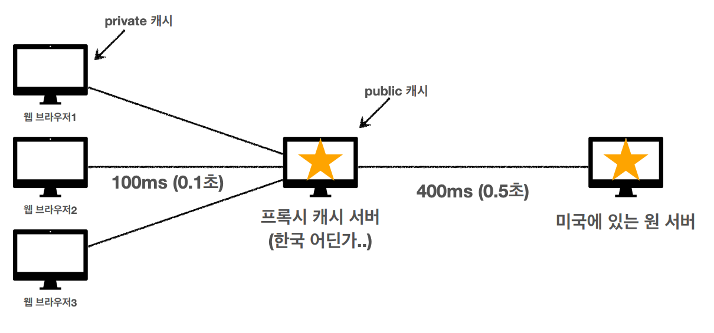

### Cache-Control

* Cache-Control: public 
  * 응답이 public 캐시에 저장되어도 됨
* Cache-Control: private
  * 응답이 해당 사용자만을 귀한 것임, private 캐시에 저장해야 함(기본값)
* Cache-Control: s-maxage
  * 프록시 캐시에만 적용되는 max-age
* Age: 60(HTTP 헤더)
  * origin 서버에서 응답 후 프록시 캐시 내에 머문 시간

## 캐시 무효화

### Cache-Control

* 확실한 캐시 무효화 응답
* Cache-Control: no-cache
  * 데이터는 캐시해도 되지만, 항상 원 서버에 검증하고 사용
* Cache-Control: no-store
  * 데이터에 민감한 정보가 있으므로 저장하면 안됨
* Cache-Control: must-revalidate
  * 캐시 만료 후 최초 조회시 원 서버에 검증
* Pragma: no-cache

### no-cache vs must-revalidate

#### no-cache

origin 서버에 접근할 수 없을 경우 error or 200 OK

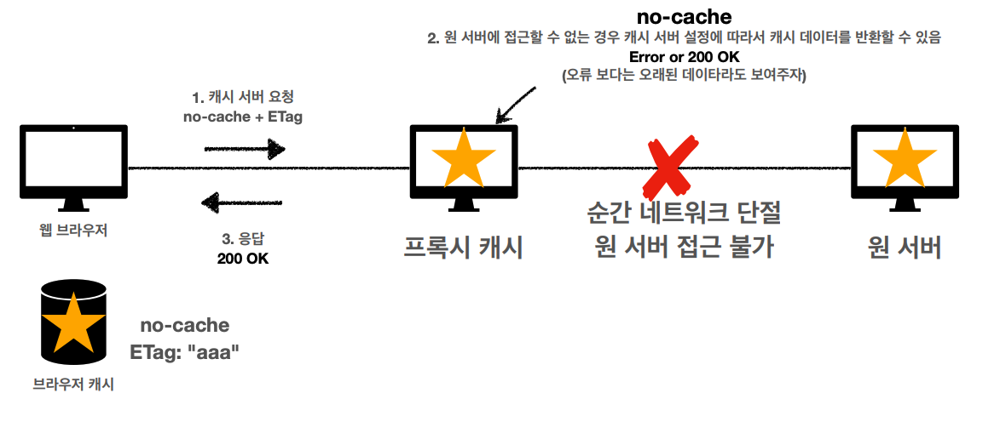

#### must-revalidate

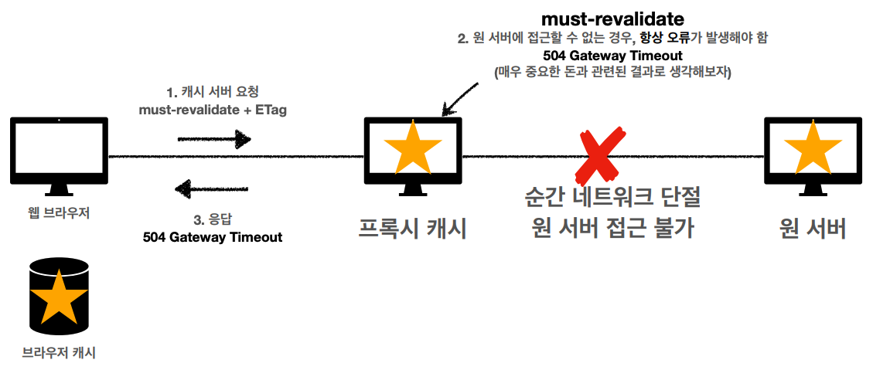