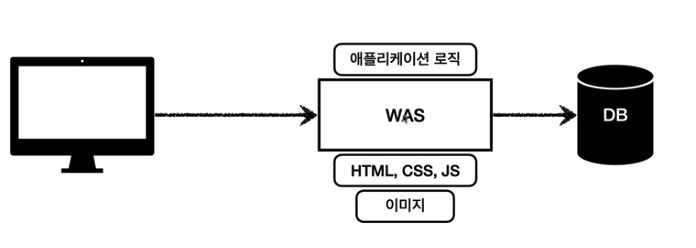
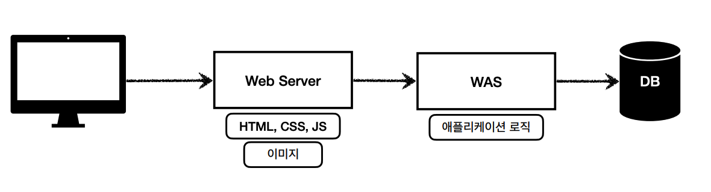
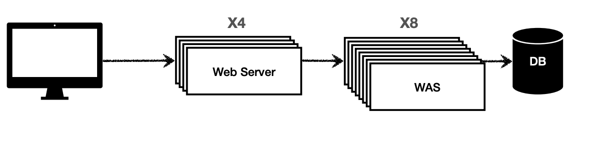
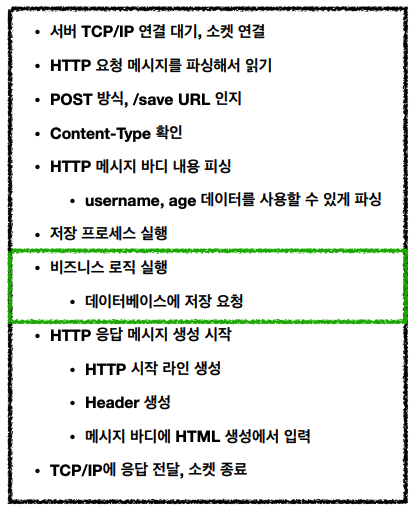
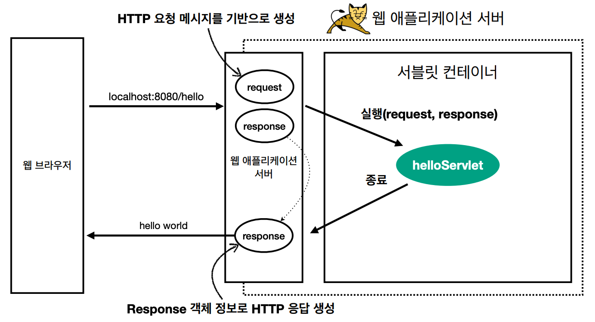
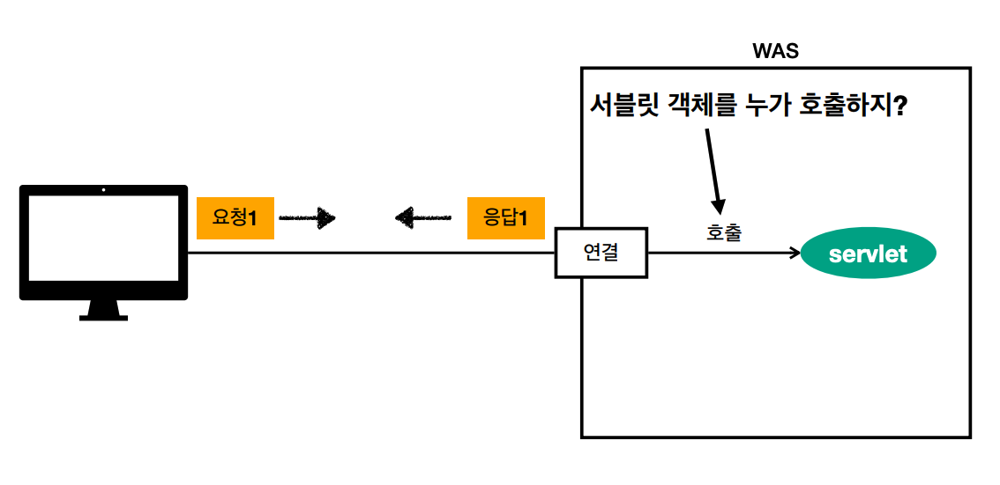
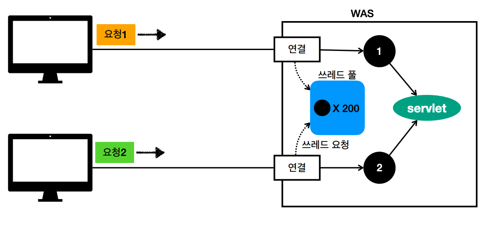
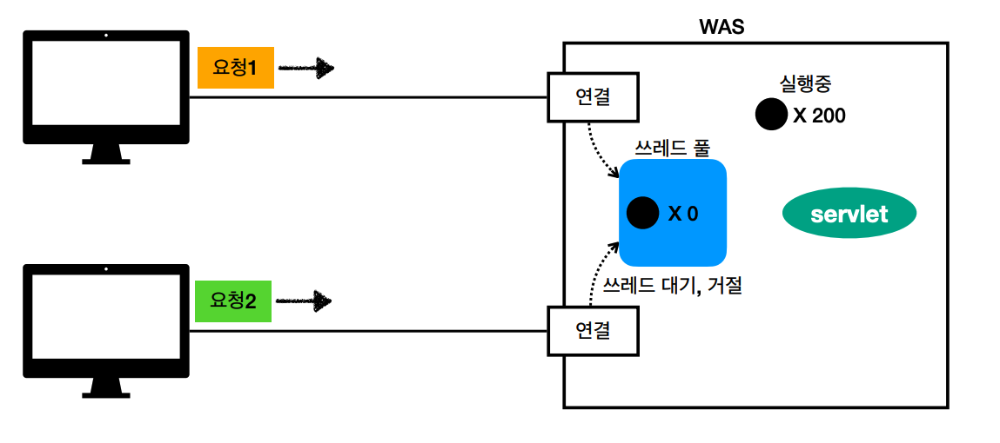

# 01. 웹 애플리케이션 이해

## 웹 서버, 웹 애플리케이션 서버

### 웹 서버

* HTTP 기반으로 동작
* 정적 리소스 제공, 기타 부가기능
* 정적 파일 HTML, CSS, JS, 이미지, 영상
* ex) NGINX, APACHE

### 웹 애플리케이션 서버(WAS)

* HTTP 기반 동작
* 웹 서버 기능 포함(정적 리소스 제공 가능)
* 프로그램 코드를 실행해서 애플리케이션 로직 수행
  * 동적 HTML, HTTP API
  * 서블릿, JSP, 스프링 MVC
* ex) Tomcat Jetty, Undertow

### 웹 서버 vs 웹 애플리케이션 서버

* 웹 서버는 정적 리소스(파일), WAS는 애플리케이션 로직
* 서로의 역할을 수행할 수 있기 때문에 경계도 모호함

### 웹 시스템 구성 - WAS, DB

* WAS는 정적 리소스, 애플리케이션 로직 모두 제공할 수 있기 때문에 WAS와 DB만으로 시스템 구성이 가능하다.
* WAS가 너무 많은 역할을 담당하면 서버 과부하 우려가 있다. WAS 장애시 오류 화면도 노출 불가능한다.

### 웹 시스템 구성 - WEB, WAS, DB

* 정적 리소스는 웹서버가 처리
* 웹 서버는 애플리케이션 로직같은 동적인 처리가 필요하면 WAS에 요청을 위임

* 이를 통해 효율적인 리소스 관리가 가능하다.
  * 정적 리소스가 많이 사용되면 Web 서버 증설
  * 애플리케이션 리소스가 많이 사용되면 WAS 증설

## 서블릿

### 서버에서 처리해야하는 업무

웹 애플리케이션 서버를 직접 구현한다고 하면 비즈니스 로직을 작성하는 것 외에도 해야할 일이 많다.

서블릿을 지원하는 WAS를 사용한다면 비즈니스 로직을 작성하는 것에 모든 것을 처리해준다.

### 서블릿

* HTTP 요청시 WAS는 req, res 객체를 새로 만들어서 서블릿 객체를 호출한다.

### 서블릿 컨테이너

* tomcat처럼 서블릿을 지원하는 WAS를 서블릿 컨테이너라고 한다.
* 서블릿 컨테이너는 서블릿 객체를 생성, 초기화, 호출, 종료하는 생명주기를 관리한다.
* 서블릿 객체는 싱글톤으로 관리한다.
* JSP도 서블릿으로 변환 되어서 사용된다.

## 동시 요청 - 멀티 쓰레드

### 쓰레드

여기서 서블릿 객체를 호출하는 주체가 쓰레드이다.

* 애플리케이션 코드를 하나하나 순차적으로 실행하는 것은 쓰레드이다.
* 쓰레드는 한 번에 하나의 코드 라인만 수행하고 동시 처리가 필요하면 쓰레드를 추가로 생성한다.

### 요청마다 쓰레드 생성

사용자의 요청이 올 때마다 쓰레드를 생성한다고 가정하자.

#### 장점 

* 동시 요청을 처리할 수 있다.
* 리소스(CPU, 메모리)가 허용할 때 까지 처리가능하다.
* 하나의 쓰레드가 지연되어도, 나머지 쓰레드는 정상 동작한다.

#### 단점

* 쓰레드는 생성 비용이 매우 비싸다. 이는 응답속도 저하로 연결 될 수 있다.
* 쓰레드는 컨텍스트 스위칭 비용이 발생한다.
* 쓰레드 생성에 제한이 없어 고객 요청이 너무 많이 오면 CPU, 메모리 임계점을 넘어서 서버가 죽을 수 있다.

### 쓰레드 풀

* 필요한 쓰레드를 쓰레드 풀에 보관하고 관리한다.
* 쓰레드 풀에 생성 가능한 쓰레드의 최대치를 관리한다. 톰캣은 최대 200개 기본 설정

#### 장점

* 쓰레드가 미리 생성되어 있으므로 쓰레드를 생성하고 종료하는 비용(CPU)가 절약되고 응답 시간이 빠르다.
* 생성 가능한 쓰레드의 최대치가 있으므로 너무 많은 요청이 들어와도 기존 요청을 안전하게 처리할 수 있다.

### 쓰레드 풀 - 실무 팁

* WAS의 주요 튜닝 포인트는 최대 쓰레드 수이다.
  * 이 값을 너무 낮게 설정하면 동시 요청이 많으면 서버 리소스는 여유롭지만 클라이언트는 금방 응답 지연된다.
  * 이 값을 너무 높게 설정하면 동시 요청이 많으면 CPU, 메모리 리소스 임계점 초과로 서버가 다운된다.

* 쓰레드 풀의 적정 숫자는 상황에 따라 다르다.
  * 로직의 복잡도, CPU, 메모리, IO 리소스 상황에 따라 모두 다르다.
  * 성능 테스트를 통해 적정 숫자를 찾아야 한다.

### WAS의 멀티 쓰레드 지원

* 멀티 쓰레드에 대한 부분은 WAS가 처리하기 때문에 개발자가 멀티 쓰레드 관련 코드를 신경쓰지 않아도 된다.
* 멀티 쓰레드 환경이므로 싱글톤 객체는 주의해서 사용해야한다.

## 자바 백앤드 웹 기술 역사

### 자바 웹 기술 역사

* 서블릿 - 1997 
  * HTML 생성이 어려움
* JSP - 1999
  * HTML 생성은 편리하지만 비즈니스 로직까지 너무 많은 역할 담당
* 서블릿, JSP 조합 MVC 패턴 사용
  * 모델, 뷰, 컨트롤러로 역할을 나누어 개발 

* MVC 프레임워크 춘추 전국 시대 - 2000년 초 ~ 2010년 초
  * MVC 패턴 자동화, 복잡합 웹 기술을 편리하게 사용할 수 있는 다양한 기능 지원
  * 스트럿츠, 웹워크, 스프링 MVC

### 현재 사용 기술

* 애노테이션 기반의 스프링 MVC 등장
  * @Controller
  * MVC 프레웜워크의 춘추 전국 시대 마무리
* 스프링 부트의 등장
  * 스프링 부트는 서버를 내장
  * 과거에는 서버에 WAS를 직접 설치하고, 소스는 War 파일을 만들어서 설치한 WAS에 배포
  * 스프링 부트는 빌드 결과(Jar)에 WAS 서버 포함 -> 빌드 배포 단순화

### 최신 기술 - 스프링 웹 기술의 분화

* Web Servlet - Spring MVC
* Web Reactive - Spring WebFlux

### Spring WebFlux

* 특징
  * 비동기 넌 블러킹 처리
  * 최소 쓰레드로 최대 성능 - 쓰레드 컨텍스트 스위칭 비용 효율화
  * 함수형 스타일로 개발 - 동시처리 코드 효율화
  * 서블릿 기술  사용 X
* 단점
  * 기술 난이도 높음
  * 아직은 RDB 지원 부족
  * 일반 MVC의 쓰레드 모델도 충분히 빠르다.
  * 실무에서 아직 많이 사용하지 않음

### 자바 뷰 템플릿 역사

* JSP
  * 속도 느림, 기능 부족
* 프리마커, 벨로시티
  * 속도 문제 해결, 다양한 기능
* 타임리프
  * 내추럴 템플릿: HTML의 모양을 유지하면서 뷰 템플릿 적용 가능
  * 스프링 MVC와 강력한 기능 통합
  * 최선의 선택 ( 단 성능은 프라미커와 벨로시티가 더 빠름 )

