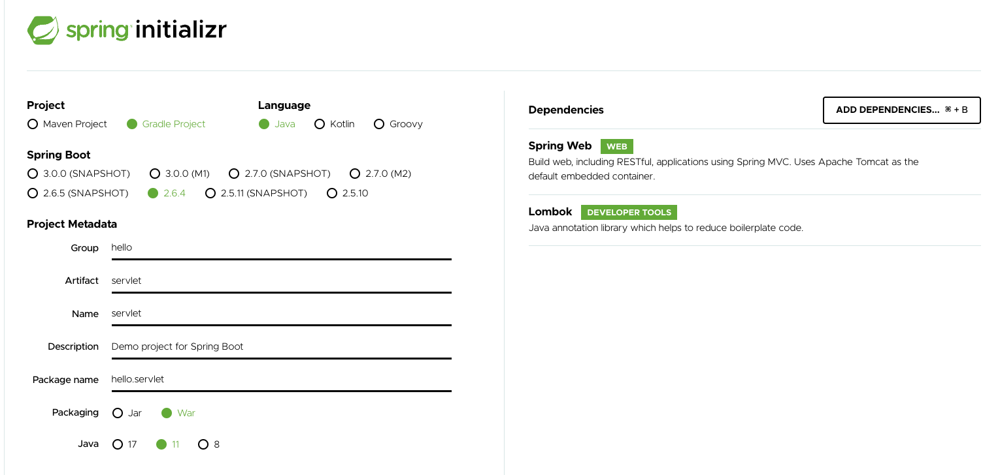
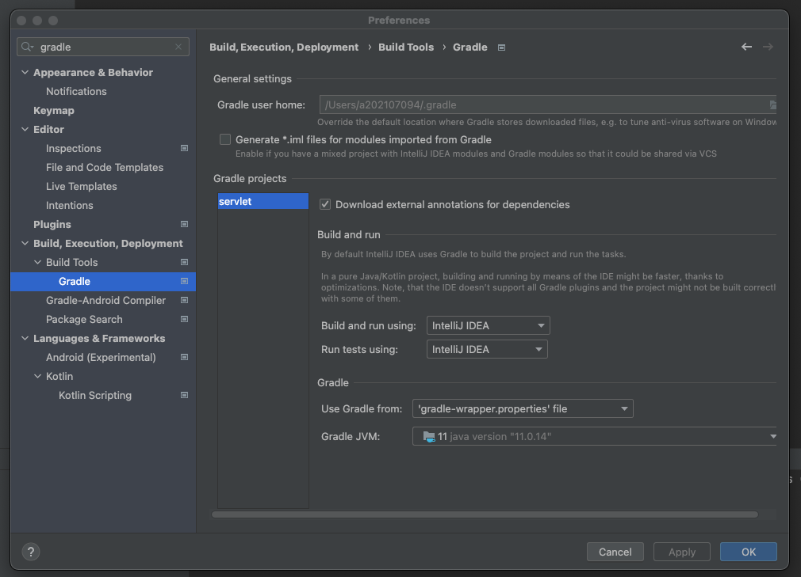
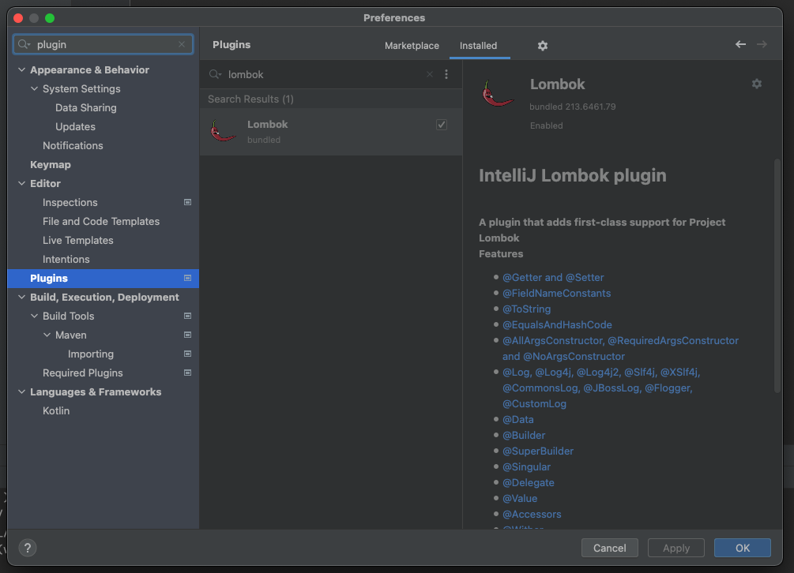
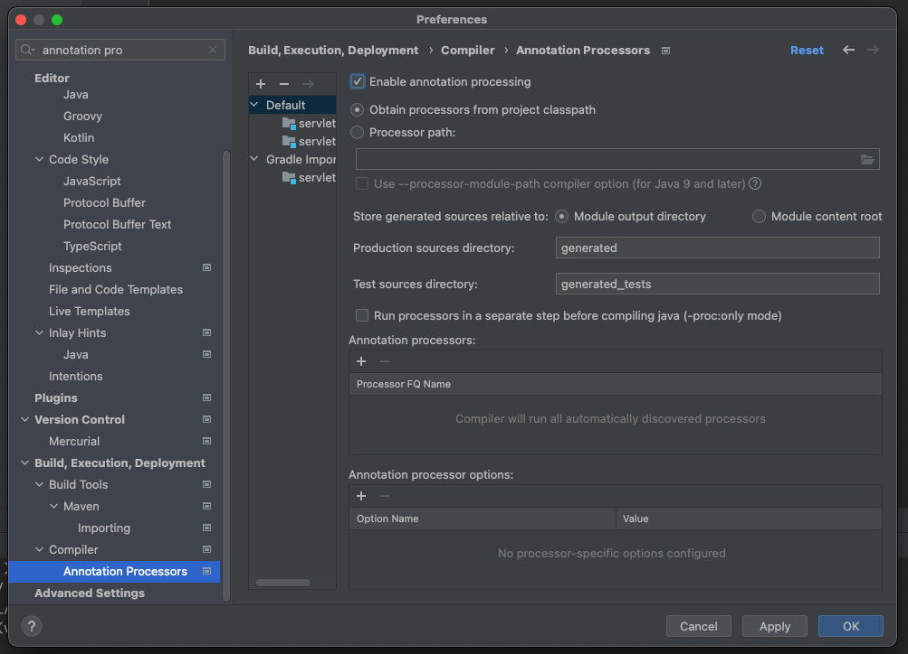

# 02. 서블릿

## 프로젝트 생성

### 프로젝트 생성

스프링 프로젝트를 생성한다.

Packaging은 JSP를 실행하기 위해 Jar가 아닌 War를 선택한다.




### 프로젝트 설정

IntelliJ Gradle 대신에 자바를 직접 실행하도록 설정을 변경한다.

Gradle보다 자바로 바로 실행하면 실행속도가 더 빠르다.




롬복 적용하고 잘 동작하는지 확인한다.






### postman 설치

postman을 설치한다.


## Hello 서블릿

### 스프링 부트 서블릿 환경 구성

스프링 부트는 `@ServletComponentScan` 을 통해 서블릿을 직접 등록해서 사용할 수 있도록 한다.

``` java
package hello.servlet;

import org.springframework.boot.SpringApplication;
import org.springframework.boot.autoconfigure.SpringBootApplication;
import org.springframework.boot.web.servlet.ServletComponentScan;

@ServletComponentScan
@SpringBootApplication
public class ServletApplication {

	public static void main(String[] args) {
		SpringApplication.run(ServletApplication.class, args);
	}

}
```


### 서블릿 등록하기

``` java
package hello.servlet.basic;

import javax.servlet.ServletException;
import javax.servlet.annotation.WebServlet;
import javax.servlet.http.HttpServlet;
import javax.servlet.http.HttpServletRequest;
import javax.servlet.http.HttpServletResponse;
import java.io.IOException;

@WebServlet(name= "helloServlet", urlPatterns = "/hello")
public class HelloServlet extends HttpServlet {
    @Override
    protected void service(HttpServletRequest request, HttpServletResponse response) throws ServletException, IOException {
        System.out.println("HelloServlet.service");
        System.out.println("request = " + request);
        System.out.println("response = " + response);

        String username = request.getParameter("username");
        System.out.println("username = " + username);

        response.setContentType("text/plain");
        response.setCharacterEncoding("utf-8");
        response.getWriter().write("hello " + username);
    }
}
```

* `@WebServlet` 서블릿 애노테이션
  * name : 서블릿 이름
  * urlPatterns : URL 매핑


### HTTP 요청메세지 로그로 확인하기

아래 설정을 통해 요청 메세지를 출력할 수 있다.

resources/application.properties

```
logging.level.org.apache.coyote.http11=debug
```


```
Host: localhost:8080
Connection: keep-alive
Cache-Control: max-age=0
sec-ch-ua: "(Not(A:Brand";v="8", "Chromium";v="98", "Google Chrome";v="98"
sec-ch-ua-mobile: ?0
sec-ch-ua-platform: "macOS"
Upgrade-Insecure-Requests: 1
User-Agent: Mozilla/5.0 (Macintosh; Intel Mac OS X 10_15_7) AppleWebKit/537.36 (KHTML, like Gecko) Chrome/98.0.4758.109 Safari/537.36
Accept: text/html,application/xhtml+xml,application/xml;q=0.9,image/avif,image/webp,image/apng,*/*;q=0.8,application/signed-exchange;v=b3;q=0.9
Sec-Fetch-Site: none
Sec-Fetch-Mode: navigate
Sec-Fetch-User: ?1
Sec-Fetch-Dest: document
Accept-Encoding: gzip, deflate, br
Accept-Language: ko-KR,ko;q=0.9,en-US;q=0.8,en;q=0.7
```


### welcome 페이지 추가

webapp 경로에 index.html을 두면 루트로 접근할 수 있다.

main/webapp/index.html

``` html
<!DOCTYPE html>
<html>
<head>
    <meta charset="UTF-8">
    <title>Title</title>
</head>
<body>
<ul>
    <li><a href="basic.html">서블릿 basic</a></li>
</ul>
</body>
</html>
```


main/webapp/basic.html

``` html
<!DOCTYPE html>
<html>
<head>
    <meta charset="UTF-8">
    <title>Title</title>
</head>
<body>
<ul>
    <li>hello 서블릿
        <ul>
            <li><a href="/hello?username=servlet">hello 서블릿 호출</a></li>
        </ul>
    </li>
    <li>HttpServletRequest
        <ul>
            <li><a href="/request-header">기본 사용법, Header 조회</a></li>
            <li>HTTP 요청 메시지 바디 조회
                <ul>
                    <li><a href="/request-param?username=hello&age=20">GET -
                        쿼리 파라미터</a></li>
                    <li><a href="/basic/hello-form.html">POST - HTML Form</a></
                    li>
                    <li>HTTP API - MessageBody -> Postman 테스트</li>
                </ul>
            </li>
        </ul>
    </li>
    <li>HttpServletResponse
        <ul>
            <li><a href="/response-header">기본 사용법, Header 조회</a></li>
            <li>HTTP 응답 메시지 바디 조회
                <ul>
                    <li><a href="/response-html">HTML 응답</a></li>
                    <li><a href="/response-json">HTTP API JSON 응답</a></li>
                </ul>
            </li>
        </ul>
    </li>
</ul>
</body>
</html>
```


## HttpServletRequest - 개요

### HttpServletRequest의 역할

HTTP 요청 메시지를 개발자가 직접 파싱해서 사용해도 되지만, 매우 불편할 것이다. 

서블릿은 개발자가 HTTP 요청 메시지를 편리하게 사용할 수 있도록 개발자 대신에 HTTP 요청 메시지를 파싱한다. 

그리고 그 결과를 HttpServletRequest 객체에 담아서 제공한다.


### HttpServletRequest의 부가적인 역할

* 임시 저장소 기능
  * HTTP 요청이 시작부터 끝날 때 까지 유지되는 임시 저장소 기능
  * 저장 : request.setAttribute(name, value)
  * 조회 : request.getAttribute(name)
* 세션 관리 기능
  * request.getSession(create: true)


## HttpServletRequest - 기본 사용법

HttpServletRequest가 제공하는 기본 기능들을 알아봅시다.

``` java
package hello.servlet.basic.request;

import javax.servlet.ServletException;
import javax.servlet.annotation.WebServlet;
import javax.servlet.http.Cookie;
import javax.servlet.http.HttpServlet;
import javax.servlet.http.HttpServletRequest;
import javax.servlet.http.HttpServletResponse;
import java.io.IOException;

@WebServlet(name = "requestHeaderServlet", urlPatterns = "/request-header")
public class RequestHeaderServlet extends HttpServlet {
    @Override
    protected void service(HttpServletRequest request, HttpServletResponse response) throws ServletException, IOException {
        printStartLine(request);
        printHeaders(request);
        printHeaderUtils(request);
        printEtc(request);
        response.getWriter().write("ok");
    }

    private void printStartLine(HttpServletRequest request) {
        System.out.println("--- REQUEST-LINE - start ---");
        System.out.println("request.getMethod() = " + request.getMethod()); //GET
        System.out.println("request.getProtocal() = " + request.getProtocol()); //HTTP/1.1
        System.out.println("request.getScheme() = " + request.getScheme()); //http

        // http://localhost:8080/request-header
        System.out.println("request.getRequestURL() = " + request.getRequestURL());
        // /request-test
        System.out.println("request.getRequestURI() = " + request.getRequestURI());
        //username=hi
        System.out.println("request.getQueryString() = " + request.getQueryString());
        System.out.println("request.isSecure() = " + request.isSecure()); //https 사용 유무
        System.out.println("--- REQUEST-LINE - end ---");
        System.out.println();
    }

    //Header 모든 정보
    private void printHeaders(HttpServletRequest request) {
        System.out.println("--- Headers - start ---");
        /*
         Enumeration<String> headerNames = request.getHeaderNames();
         while (headerNames.hasMoreElements()) {
         String headerName = headerNames.nextElement();
         System.out.println(headerName + ": " + request.getHeader(headerName));
         }
        */
        request.getHeaderNames().asIterator()
                .forEachRemaining(headerName -> System.out.println(headerName + ": " + request.getHeader(headerName)));
        System.out.println("--- Headers - end ---");
        System.out.println();
    }

    //Header 편리한 조회
    private void printHeaderUtils(HttpServletRequest request) {
        System.out.println("--- Header 편의 조회 start ---");
        System.out.println("[Host 편의 조회]");
        System.out.println("request.getServerName() = " + request.getServerName()); //Host 헤더
        System.out.println("request.getServerPort() = " + request.getServerPort()); //Host 헤더
        System.out.println();
        System.out.println("[Accept-Language 편의 조회]");
        request.getLocales().asIterator()
                .forEachRemaining(locale -> System.out.println("locale = " + locale));
        System.out.println("request.getLocale() = " + request.getLocale());
        System.out.println();
        System.out.println("[cookie 편의 조회]");
        if (request.getCookies() != null) {
            for (Cookie cookie : request.getCookies()) {
                System.out.println(cookie.getName() + ": " + cookie.getValue());
            }
        }
        System.out.println();
        System.out.println("[Content 편의 조회]");
        System.out.println("request.getContentType() = " + request.getContentType());
        System.out.println("request.getContentLength() = " + request.getContentLength());
        System.out.println("request.getCharacterEncoding() = " + request.getCharacterEncoding());
        System.out.println("--- Header 편의 조회 end ---");
        System.out.println();
    }

    //기타 정보
    private void printEtc(HttpServletRequest request) {
        System.out.println("--- 기타 조회 start ---");
        System.out.println("[Remote 정보]");
        System.out.println("request.getRemoteHost() = " + request.getRemoteHost());
        System.out.println("request.getRemoteAddr() = " + request.getRemoteAddr());
        System.out.println("request.getRemotePort() = " + request.getRemotePort());
        System.out.println();
        System.out.println("[Local 정보]");
        System.out.println("request.getLocalName() = " + request.getLocalName());
        System.out.println("request.getLocalAddr() = " + request.getLocalAddr());
        System.out.println("request.getLocalPort() = " + request.getLocalPort());
        System.out.println("--- 기타 조회 end ---");
        System.out.println();
    }
}

```


``` 
--- REQUEST-LINE - start ---
request.getMethod() = GET
request.getProtocal() = HTTP/1.1
request.getScheme() = http
request.getRequestURL() = http://localhost:8080/request-header
request.getRequestURI() = /request-header
request.getQueryString() = null
request.isSecure() = false
--- REQUEST-LINE - end ---

--- Headers - start ---
host: localhost:8080
connection: keep-alive
sec-ch-ua: "(Not(A:Brand";v="8", "Chromium";v="98", "Google Chrome";v="98"
sec-ch-ua-mobile: ?0
sec-ch-ua-platform: "macOS"
upgrade-insecure-requests: 1
user-agent: Mozilla/5.0 (Macintosh; Intel Mac OS X 10_15_7) AppleWebKit/537.36 (KHTML, like Gecko) Chrome/98.0.4758.109 Safari/537.36
accept: text/html,application/xhtml+xml,application/xml;q=0.9,image/avif,image/webp,image/apng,*/*;q=0.8,application/signed-exchange;v=b3;q=0.9
sec-fetch-site: same-origin
sec-fetch-mode: navigate
sec-fetch-user: ?1
sec-fetch-dest: document
referer: http://localhost:8080/basic.html
accept-encoding: gzip, deflate, br
accept-language: ko-KR,ko;q=0.9,en-US;q=0.8,en;q=0.7
--- Headers - end ---

--- Header 편의 조회 start ---
[Host 편의 조회]
request.getServerName() = localhost
request.getServerPort() = 8080

[Accept-Language 편의 조회]
locale = ko_KR
locale = ko
locale = en_US
locale = en
request.getLocale() = ko_KR

[cookie 편의 조회]

[Content 편의 조회]
request.getContentType() = null
request.getContentLength() = -1
request.getCharacterEncoding() = UTF-8
--- Header 편의 조회 end ---

--- 기타 조회 start ---
[Remote 정보]
request.getRemoteHost() = 0:0:0:0:0:0:0:1
request.getRemoteAddr() = 0:0:0:0:0:0:0:1
request.getRemotePort() = 55192

[Local 정보]
request.getLocalName() = localhost
request.getLocalAddr() = 0:0:0:0:0:0:0:1
request.getLocalPort() = 8080
--- 기타 조회 end ---

```


## HTTP 요청 데이터 - 개요

HTTP 요청 메세지를 통해 클라이언트에서 서버로 데이터를 전달하는 방법은 아래 3가지이다.

* GET - 쿼리 파라미터 
  * /url?username=hello&age=20 
  * 메시지 바디 없이, URL의 쿼리 파라미터에 데이터를 포함해서 전달 
  * ex) 검색, 필터, 페이징등에서 많이 사용하는 방식 
* POST - HTML Form 
  * content-type: application/x-www-form-urlencoded 
  * 메시지 바디에 쿼리 파리미터 형식으로 전달 username=hello&age=20 
  * ex) 회원 가입, 상품 주문, HTML Form 사용 
* HTTP message body에 데이터를 직접 담아서 요청 
  * HTTP API에서 주로 사용, JSON, XML, TEXT 
  * 데이터 형식은 주로 JSON 사용 
  * POST, PUT, PATCH


## HTTP 요청 데이터 -  GET 쿼리 파라미터

hello/servlet/basic/request/RequestParamServlet.java

``` java
package hello.servlet.basic.request;

import javax.servlet.ServletException;
import javax.servlet.annotation.WebServlet;
import javax.servlet.http.HttpServlet;
import javax.servlet.http.HttpServletRequest;
import javax.servlet.http.HttpServletResponse;
import java.io.IOException;

@WebServlet(name = "requestParamServlet", urlPatterns = "/request-param")
public class RequestParamServlet extends HttpServlet {
    @Override
    protected void service(HttpServletRequest request, HttpServletResponse response) throws ServletException, IOException {
        System.out.println("[전체 파라미터 조회] - start");

        request.getParameterNames().asIterator()
                .forEachRemaining(paramName -> System.out.println(paramName + "=" + request.getParameter(paramName)));
        System.out.println("[전체 파라미터 조회] - end");
        System.out.println();

        System.out.println("[단일 파라미터 조회]");
        String username = request.getParameter("username");
        System.out.println("username = " + username);

        String age = request.getParameter("age");
        System.out.println("age = " + age);
        System.out.println();

        System.out.println("[이름이 같은 복수 파라미터 조회]");
        String[] usernames = request.getParameterValues("username");
        for (String name : usernames) {
            System.out.println("username=" + name);
        }

        response.getWriter().write("ok");
    }
}
```


### 복수 파라미터에서 단일 파라미터 조회

`username=hello&username=kim` 과 같이 파라미터 이름은 하나인데, 값이 중복이면 어떻게 될까? 

request.getParameter() 는 하나의 파라미터 이름에 대해서 단 하나의 값만 있을 때 사용해야 한다. 

지금처럼 중복일 때는 request.getParameterValues() 를 사용해야 한다. 

참고로 이렇게 중복일 때 request.getParameter() 를 사용하면 request.getParameterValues() 의 첫 번째 값을 반환한다.


## HTTP 요청 데이터 - POST HTML Form

### HTML Form 전송

* content-type : `application/x-www-form-urlencoded` 
* 메세지 바디에 쿼리 파라미터 형식으로 데이터를 전달한다.
  * ex) username=hello&age=20


webapp/basic/hello-form.html

``` html
<!DOCTYPE html>
<html>
<head>
  <meta charset="UTF-8">
  <title>Title</title>
</head>
<body>
<form action="/request-param" method="post">
  username: <input type="text" name="username" />
  age: <input type="text" name="age" />
  <button type="submit">전송</button>
</form>
</body>
</html>
```


클라이언트 입장에서는 기존 GET 방식과 차이가 있지만 서버 입장에서는 둘의 형식이 동일하므로 `request.getParameter()` 로 편리하게 구분없이 조회할 수 있다.


### content-type

content-type은 HTTP 메세지 바디의 데이터 형식을 지정한다.

GET URL 쿼리 파라미터 형식은 메세지 바디를 사용하지 않기 때문에 content-type이 없다.

POST HTML Form 형식으로 데이터를 전달하면 HTTP 메시지 바디에 해당 데이터를 포함해서 보내기 때문에 바디에 포함된 데이터가 어떤 형식인지 content-type을 꼭 지정해야 한다.


## HTTP 요청 데이터 - API 메세지 바디 - 단순 텍스트

Http message body에 데이터를 직접 담아서 요청을 하자.

``` java
package hello.servlet.basic.request;

import org.springframework.util.StreamUtils;

import javax.servlet.ServletException;
import javax.servlet.ServletInputStream;
import javax.servlet.annotation.WebServlet;
import javax.servlet.http.HttpServlet;
import javax.servlet.http.HttpServletRequest;
import javax.servlet.http.HttpServletResponse;
import java.io.IOException;
import java.nio.charset.StandardCharsets;

@WebServlet(name = "requestBodyStringServlet", urlPatterns = "/request-body-string")
public class RequestBodyStringServlet extends HttpServlet {
    @Override
    protected void service(HttpServletRequest request, HttpServletResponse response) throws ServletException, IOException {
        ServletInputStream inputStream = request.getInputStream();
        String messageBody = StreamUtils.copyToString(inputStream, StandardCharsets.UTF_8);

        System.out.println("messageBody = " + messageBody);

        response.getWriter().write("ok");
    }
}
```

* HTTP 메세지 바디의 데이터를 InputStream을 사용해서 직접 읽을 수 있다.

* inputStream은 byte 코드를 반환한다. byte 코드를 우리가 읽을 수 있는 문자로 보려면 문자표(Charset)를 지정해주어야 한다. 여기서는 UTF-8로 지정한다.


## HTTP 요청 데이터 - API 메세지 바디 - JSON

### JSON 형식 파싱 추가

``` java
package hello.servlet.basic;

import lombok.Getter;
import lombok.Setter;

@Getter @Setter
public class HelloData {
    private String username;
    private int age;
}
```

* JSON 결과를 파싱해서 사용할 수 있는 자바 객체로 변환하려면 Jackson, Gson같은  JSON 변환 라이브러리를 추가해서 사용해야한다.
* 스프링 부트로 Spring MVC를 선택하면 기본으로 Jackson 라이브러리(ObjectMapper)를 함께 제공한다.


### RequestBodyJsonServlet

``` java
package hello.servlet.basic.request;

import com.fasterxml.jackson.databind.ObjectMapper;
import hello.servlet.basic.HelloData;
import org.springframework.util.StreamUtils;

import javax.servlet.ServletException;
import javax.servlet.ServletInputStream;
import javax.servlet.annotation.WebServlet;
import javax.servlet.http.HttpServlet;
import javax.servlet.http.HttpServletRequest;
import javax.servlet.http.HttpServletResponse;
import java.io.IOException;
import java.nio.charset.StandardCharsets;

@WebServlet(name = "requestBodyJsonServlet", urlPatterns = "/request-body-json")
public class RequestBodyJsonServlet extends HttpServlet {
    private ObjectMapper objectMapper = new ObjectMapper();

    @Override
    protected void service(HttpServletRequest request, HttpServletResponse response) throws ServletException, IOException {
        ServletInputStream inputStream = request.getInputStream();
        String messageBody = StreamUtils.copyToString(inputStream, StandardCharsets.UTF_8);

        System.out.println("messageBody = " + messageBody);

        HelloData helloData = objectMapper.readValue(messageBody, HelloData.class);
        System.out.println("helloData.getUsername() = " + helloData.getUsername());
        System.out.println("helloData.getAge() = " + helloData.getAge());

        response.getWriter().write("ok");
    }
}
```


### 요청하기

* POST http://localhost:8080/request-body-json 
* content-type: application/json 
* message body: {"username": "hello", "age": 20}


## HttpServletResponse - 기본 사용법

### HttpServletResponse 역할

* HTTP 응답코드 지정
* 헤더 생성
* 바디 생성
* Content-Type
* 쿠키
* Redirect


### HttpServletResponse 기본 사용법

``` java
package hello.servlet.basic.response;

import javax.servlet.ServletException;
import javax.servlet.annotation.WebServlet;
import javax.servlet.http.Cookie;
import javax.servlet.http.HttpServlet;
import javax.servlet.http.HttpServletRequest;
import javax.servlet.http.HttpServletResponse;
import java.io.IOException;

@WebServlet(name = "responseHeaderServlet", urlPatterns = "/response-header")
public class ResponseHeaderServlet extends HttpServlet {
    @Override
    protected void service(HttpServletRequest request, HttpServletResponse response) throws ServletException, IOException {
        response.setStatus(HttpServletResponse.SC_OK);

        response.setHeader("Cotent-Type", "text/plain;charset=utf-8");

        content(response);
        cookie(response);
        redirect(response);

        response.getWriter().println("ok");
    }

    private void redirect(HttpServletResponse response) throws IOException {
        //Status Code 302
        //Location: /basic/hello-form.html
        //response.setStatus(HttpServletResponse.SC_FOUND); //302
        //response.setHeader("Location", "/basic/hello-form.html");
        response.sendRedirect("/basic/hello-form.html");
    }

    private void cookie(HttpServletResponse response) {
        //Set-Cookie: myCookie=good; Max-Age=600;
        //response.setHeader("Set-Cookie", "myCookie=good; Max-Age=600");
        Cookie cookie = new Cookie("myCookie", "good");
        cookie.setMaxAge(600); //600초
        response.addCookie(cookie);
    }

    private void content(HttpServletResponse response) {
        //Content-Type: text/plain;charset=utf-8
        //Content-Length: 2
        //response.setHeader("Content-Type", "text/plain;charset=utf-8");
        response.setContentType("text/plain");
        response.setCharacterEncoding("utf-8");
        //response.setContentLength(2); //(생략시 자동 생성)
    }    
}
```

* setHeader를 통해 필요한 헤더를 설정할 수 있다.
* redirect, cookie, content 등 자주 쓰는 헤더는 별도의 메서드로 쉽게 설정할 수 있다.


## HTTP 응답 데이터 - 단순 텍스트,  HTML

### 단순 텍스트

단순 텍스트는 그 동안 사용했던 것과 같다.

``` java
writer.println("ok");
```


### HTML

``` java
package hello.servlet.basic.response;

import javax.servlet.ServletException;
import javax.servlet.annotation.WebServlet;
import javax.servlet.http.HttpServlet;
import javax.servlet.http.HttpServletRequest;
import javax.servlet.http.HttpServletResponse;
import java.io.IOException;
import java.io.PrintWriter;

@WebServlet(name = "responseHtmlServlet", urlPatterns = "/response-html")
public class ResponseHtmlServlet extends HttpServlet {
    @Override
    protected void service(HttpServletRequest request, HttpServletResponse response) throws ServletException, IOException {
        response.setContentType("text/html");
        response.setCharacterEncoding("utf-8");

        PrintWriter writer = response.getWriter();
        writer.println("<html>");
        writer.println("<body>");
        writer.println(" <div>안녕?</div>");
        writer.println("</body>");
        writer.println("</html>");
    }
}

```


## HTTP 응답 데이터 - API JSON

```  java
package hello.servlet.basic.response;

import com.fasterxml.jackson.databind.ObjectMapper;
import hello.servlet.basic.HelloData;

import javax.servlet.ServletException;
import javax.servlet.annotation.WebServlet;
import javax.servlet.http.HttpServlet;
import javax.servlet.http.HttpServletRequest;
import javax.servlet.http.HttpServletResponse;
import java.io.IOException;

@WebServlet(name = "responseJsonServlet", urlPatterns = "/response-json")
public class ResponseJsonServlet extends HttpServlet {

    private ObjectMapper objectMapper = new ObjectMapper();

    @Override
    protected void service(HttpServletRequest request, HttpServletResponse response) throws ServletException, IOException {
        response.setContentType("application/json");
        response.setCharacterEncoding("utf-8");

        HelloData data = new HelloData();
        data.setUsername("minsung");
        data.setAge(27);

        String result = objectMapper.writeValueAsString(data);

        response.getWriter().write(result);
    }
}
```

