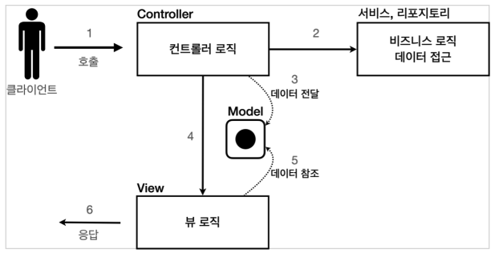

# 03. 서블릿, JSP, MVC 패턴

## 회원 관리 웹 애플리케이션 요구사항

### 회원 도메인 모델

``` java
package hello.servlet.domain;

public class Member {
    private Long id;
    private String username;
    private int age;

    public Member() {
    }

    public Member(String username, int age) {
        this.username = username;
        this.age = age;
    }
}
```


### 회원 저장소

``` java
package hello.servlet.domain.member;

import java.util.ArrayList;
import java.util.HashMap;
import java.util.List;
import java.util.Map;

public class MemberRepository {
    private static Map<Long, Member> store = new HashMap<>();
    private static long sequence = 0L;

    private static final MemberRepository instance = new MemberRepository();

    public static MemberRepository getInstance() {
        return instance;
    }

    private MemberRepository() {
    }

    public Member save(Member member) {
        member.setId(++);
        store.put(member.getId(), member);
        return member;
    }

    public Member findById(Long id) {
        return store.get(id);
    }

    public List<Member> findAll() {
        return new ArrayList<>(store.values());
    }

    public void clearStore() {
        store.clear();
    }
}

```

* 싱글톤 패턴
* 스프링을 사용하면 스프링 빈으로 등록하면 되지만, 지금은 최대한 스프링 없이 순수 서블릿만을 사용할 것이기 때문에 직접 싱글톤을 사용했다.


### 테스트 코드

``` java
package hello.servlet.domain.member;

import org.junit.jupiter.api.AfterEach;
import org.junit.jupiter.api.Test;

import java.util.List;

import static org.assertj.core.api.Assertions.assertThat;

class MemberRepositoryTest {

    MemberRepository memberRepository = MemberRepository.getInstance();

    @AfterEach
    void afterEach() {
        memberRepository.clearStore();
    }

    @Test
    void save() {
        // given
        Member member = new Member("hello", 20);
        
        // when
        Member savedMember = memberRepository.save(member);

        // then
        Member findMember = memberRepository.findById(savedMember.getId());
        assertThat(findMember).isEqualTo(savedMember);
    }

    @Test
    void findAll() {
        //given
        Member member1 = new Member("member1", 20);
        Member member2 = new Member("member2", 30);
        memberRepository.save(member1);
        memberRepository.save(member2);

        //when
        List<Member> result = memberRepository.findAll();

        //then
        assertThat(result.size()).isEqualTo(2);
        assertThat(result).contains(member1, member2);
    }
}
```


## 서블릿으로 회원 관리 웹 애플리케이션 만들기

### MemberFormServlet - 회원 등록 폼

``` java
package hello.servlet.web.servlet;

import hello.servlet.domain.member.MemberRepository;

import javax.servlet.ServletException;
import javax.servlet.annotation.WebServlet;
import javax.servlet.http.HttpServlet;
import javax.servlet.http.HttpServletRequest;
import javax.servlet.http.HttpServletResponse;
import java.io.IOException;
import java.io.PrintWriter;

@WebServlet(name = "memberFormServlet", urlPatterns = "/servlet/members/new-form")
public class MemberFormServlet extends HttpServlet {
    private MemberRepository memberRepository = MemberRepository.getInstance();

    @Override
    protected void service(HttpServletRequest request, HttpServletResponse response) throws ServletException, IOException {
        response.setContentType("text/html");
        response.setCharacterEncoding("utf-8");

        PrintWriter w = response.getWriter();
        w.write("<!DOCTYPE html>\n" +
                        "<html>\n" +
                        "<head>\n" +
                        " <meta charset=\"UTF-8\">\n" +
                " <title>Title</title>\n" +
                        "</head>\n" +
                        "<body>\n" +
                        "<form action=\"/servlet/members/save\" method=\"post\">\n" +
                        " username: <input type=\"text\" name=\"username\" />\n" +
                        " age: <input type=\"text\" name=\"age\" />\n" +
                        " <button type=\"submit\">전송</button>\n" +
                        "</form>\n" +
                        "</body>\n" +
                        "</html>\n");
    }
}
```


### MemberSaveServlet - 회원 저장

``` java
package hello.servlet.web.servlet;

import hello.servlet.domain.member.Member;
import hello.servlet.domain.member.MemberRepository;

import javax.servlet.ServletException;
import javax.servlet.annotation.WebServlet;
import javax.servlet.http.HttpServlet;
import javax.servlet.http.HttpServletRequest;
import javax.servlet.http.HttpServletResponse;
import java.io.IOException;
import java.io.PrintWriter;

@WebServlet(name = "memberSaveServlet", urlPatterns = "/servlet/members/save")
public class MemberSaveServlet extends HttpServlet {
    private MemberRepository memberRepository = MemberRepository.getInstance();

    @Override
    protected void service(HttpServletRequest request, HttpServletResponse response) throws ServletException, IOException {
        String username = request.getParameter("username");
        int age = Integer.parseInt(request.getParameter("age"));

        Member member = new Member(username, age);
        memberRepository.save(member);

        response.setContentType("text/html");
        response.setCharacterEncoding("utf-8");
        PrintWriter w = response.getWriter();
        w.write("<html>\n" +
                "<head>\n" +
                " <meta charset=\"UTF-8\">\n" +
                "</head>\n" +
                "<body>\n" +
                "성공\n" +
                "<ul>\n" +
                " <li>id="+member.getId()+"</li>\n" +
                " <li>username="+member.getUsername()+"</li>\n" +
                " <li>age="+member.getAge()+"</li>\n" +
                "</ul>\n" +
                "<a href=\"/index.html\">메인</a>\n" +
                "</body>\n" +
                "</html>");
    }
}
```


### MemberListServlet - 회원 목록

``` java
package hello.servlet.web.servlet;

import hello.servlet.domain.member.Member;
import hello.servlet.domain.member.MemberRepository;

import javax.servlet.ServletException;
import javax.servlet.annotation.WebServlet;
import javax.servlet.http.HttpServlet;
import javax.servlet.http.HttpServletRequest;
import javax.servlet.http.HttpServletResponse;
import java.io.IOException;
import java.io.PrintWriter;
import java.util.List;

@WebServlet(name = "memberListServlet", urlPatterns = "/servlet/members")
public class MemberListServlet extends HttpServlet {
    private MemberRepository memberRepository = MemberRepository.getInstance();

    @Override
    protected void service(HttpServletRequest request, HttpServletResponse response) throws ServletException, IOException {
        response.setContentType("text/html");
        response.setCharacterEncoding("utf-8");
        List<Member> members = memberRepository.findAll();
        PrintWriter w = response.getWriter();
        w.write("<html>");
        w.write("<head>");
        w.write(" <meta charset=\"UTF-8\">");
        w.write(" <title>Title</title>");
        w.write("</head>");
        w.write("<body>");
        w.write("<a href=\"/index.html\">메인</a>");
        w.write("<table>");
        w.write(" <thead>");
        w.write(" <th>id</th>");
        w.write(" <th>username</th>");
        w.write(" <th>age</th>");
        w.write(" </thead>");
        w.write(" <tbody>");
        for (Member member : members) {
            w.write(" <tr>");
            w.write(" <td>" + member.getId() + "</td>");
            w.write(" <td>" + member.getUsername() + "</td>");
            w.write(" <td>" + member.getAge() + "</td>");
            w.write(" </tr>");
        }
        w.write(" </tbody>");
        w.write("</table>");
        w.write("</body>");
        w.write("</html>");

    }
}
```


### 템플릿 엔진

서블릿과 자바 코드만으로 HTML을 만들면 복잡하고 비효율적이다.

자바 코드로 HTML을 만들어 내는 것 보다 차라리 HTML 문서에 동적으로 변경해야 하는 부분만 자바 코드를 넣을 수 있다면 더 편리할 것이다. 이것이 바로 템플릿 엔진이 나온 이유이다.


## JSP로 회원 관리 웹 애플리케이션 만들기

### JSP 라이브러리 추가

``` 
implementation 'org.apache.tomcat.embed:tomcat-embed-jasper'
implementation 'javax.servlet:jstl'
```


### 회원 등록 폼  JSP

``` jsp
<%@ page contentType="text/html;charset=UTF-8" language="java" %>
<html>
<head>
    <title>Title</title>
</head>
<body>
<form action="/jsp/members/save.jsp" method="post">
    username: <input type="text" name="username" />
    age: <input type="text" name="age" />
    <button type="submit">전송</button>
</form>
</body>
</html>
```


### 회원 저장  JSP

``` jsp
<%@ page import="hello.servlet.domain.member.MemberRepository" %>
<%@ page import="hello.servlet.domain.member.Member" %>
<%@ page contentType="text/html;charset=UTF-8" language="java" %>
<%
  // request, response 사용 가능
  MemberRepository memberRepository = MemberRepository.getInstance();
  System.out.println("save.jsp");
  String username = request.getParameter("username");
  int age = Integer.parseInt(request.getParameter("age"));
  Member member = new Member(username, age);
  System.out.println("member = " + member);
  memberRepository.save(member);
%>
<html>
<head>
  <meta charset="UTF-8">
</head>
<body>
성공
<ul>
  <li>id=<%=member.getId()%></li>
  <li>username=<%=member.getUsername()%></li>
  <li>age=<%=member.getAge()%></li>
</ul>
<a href="/index.html">메인</a>
</body>
</html>
```


### 회원 목록 JSP

``` jsp
<%@ page import="java.util.List" %>
<%@ page import="hello.servlet.domain.member.MemberRepository" %>
<%@ page import="hello.servlet.domain.member.Member" %>
<%@ page contentType="text/html;charset=UTF-8" language="java" %>
<%
  MemberRepository memberRepository = MemberRepository.getInstance();
  List<Member> members = memberRepository.findAll();
%>
<html>
<head>
  <meta charset="UTF-8">
  <title>Title</title>
</head>
<body>
<a href="/index.html">메인</a>
<table>
  <thead>
  <th>id</th>
  <th>username</th>
  <th>age</th>
  </thead>
  <tbody>
  <%
    for (Member member : members) {
      out.write(" <tr>");
      out.write(" <td>" + member.getId() + "</td>");
      out.write(" <td>" + member.getUsername() + "</td>");
      out.write(" <td>" + member.getAge() + "</td>");
      out.write(" </tr>");
    }
  %>
  </tbody>
</table>
</body>
</html>
```


### 서블릿과  JSP의 한계

서블릿으로 개발할 때는 뷰(View)화면을 위한 HTML을 만드는 작업이 자바 코드에 섞여서 지저분하고 복잡했다.

JSP도 코드의 일부는 비즈니스 로직이, 일부는 결과를 HTML로 보여주는 view 영역이 들어가있다.

코드라인이 길어질수록 유지보수성이 떨어진다.


## MVC 패턴 - 개요

### MVC 패턴을 사용해야 하는 이유

* 너무 많은 역할 : 하나의 서블릿이나 JSP만으로 비즈니스 로직과 뷰 렌더링까지 모두 처리하게 되면, 너무 많은 역할을 하게되고, 결과적으로 유지보수가 어려워진다. 
* 변경의 라이프 사이클 : UI 를 일부 수정하는 일과 비즈니스 로직을 수정하는 일은 각각 다르게 발생할 가능성이 매우 높고 대부분 서로에게 영향을 주지 않는다. 이렇게 변경의 라이프 사이클이 다른 부분을 하나의 코드로 관리하는 것은 유지보수하기 좋지 않다.
* 기능 특화 : 특히 JSP 같은 뷰 템플릿은 화면을 렌더링 하는데 최적화 되어 있기 때문에 이 부분의 업무만 담당하는 것이 가장 효과적이다.


### MVC

* model : 뷰에 출력할 데이터를 담아둔다. 뷰가 필요한 데이터를 모두 모델에 담아서 전달해주는 덕분에 뷰는 비즈니스 로직이나 데이터 접근을 몰라도 되고, 화면을 렌더링 하는 일에 집중할 수 있다.
* view : 모델에 담겨있는 데이터를 사용해서 화면을 그리는 일에 집중한다. 여기서는 HTML을 생성하는 부분을 말한다
* controller : HTTP 요청을 받아서 파라미터를 검증하고, 비즈니스 로직을 실행한다. 그리고 뷰에 전달할 결과 데이터를 조회해서 모델에 담는다.




## MVC 패턴 - 적용

### MVC 패턴 적용

* model : HttpServletRequest
* view : jsp
* controller : servlet


### 회원 등록

``` java
package hello.servlet.web.servletmvc;
import hello.servlet.domain.member.Member;
import hello.servlet.domain.member.MemberRepository;
import javax.servlet.RequestDispatcher;
import javax.servlet.ServletException;
import javax.servlet.annotation.WebServlet;
import javax.servlet.http.HttpServlet;
import javax.servlet.http.HttpServletRequest;
import javax.servlet.http.HttpServletResponse;
import java.io.IOException;
import java.util.List;

@WebServlet(name = "mvcMemberListServlet", urlPatterns = "/servlet-mvc/members")
public class MvcMemberListServlet extends HttpServlet {
    private MemberRepository memberRepository = MemberRepository.getInstance();

    @Override
    protected void service(HttpServletRequest request, HttpServletResponse response) throws ServletException, IOException {
        System.out.println("MvcMemberListServlet.service");
        List<Member> members = memberRepository.findAll();
        request.setAttribute("members", members);

        String viewPath = "/WEB-INF/views/members.jsp";
        RequestDispatcher dispatcher = request.getRequestDispatcher(viewPath);
        dispatcher.forward(request, response);
    }
}
```

``` jsp
<%@ page contentType="text/html;charset=UTF-8" language="java" %>
<html>
<head>
    <meta charset="UTF-8">
    <title>Title</title>
</head>
<body>
<!-- 상대경로 사용, [현재 URL이 속한 계층 경로 + /save] -->
<form action="save" method="post">
    username: <input type="text" name="username" />
    age: <input type="text" name="age" />
    <button type="submit">전송</button>
</form>
</body>
</html>
```

* `dispatcher.forward()` : 다른 서블릿이나 JSP로 이동할 수 있는 기능이다. 서버 내부에서 다시 호출이 발생한다.
* /WEB-INF : 이 경로안에 JSP가 있으면 외부에서 직접 JSP를 호출할 수 없다. 우리가 기대하는 것은 항상 컨트롤러를 통해서 JSP를 호출하는 것이다.


### 회원 저장

```  java
package hello.servlet.web.servletmvc;
import hello.servlet.domain.member.Member;
import hello.servlet.domain.member.MemberRepository;
import javax.servlet.RequestDispatcher;
import javax.servlet.ServletException;
import javax.servlet.annotation.WebServlet;
import javax.servlet.http.HttpServlet;
import javax.servlet.http.HttpServletRequest;
import javax.servlet.http.HttpServletResponse;
import java.io.IOException;
@WebServlet(name = "mvcMemberSaveServlet", urlPatterns = "/servlet-mvc/members/save")
public class MvcMemberSaveServlet extends HttpServlet {
    private MemberRepository memberRepository = MemberRepository.getInstance();

    @Override
    protected void service(HttpServletRequest request, HttpServletResponse response) throws ServletException, IOException {
         String username = request.getParameter("username");
         int age = Integer.parseInt(request.getParameter("age"));

         Member member = new Member(username, age);
         System.out.println("member = " + member);
         memberRepository.save(member);

         //Model에 데이터를 보관한다.
         request.setAttribute("member", member);
         String viewPath = "/WEB-INF/views/save-result.jsp";
         RequestDispatcher dispatcher = request.getRequestDispatcher(viewPath);
         dispatcher.forward(request, response);
    }
}
```

``` jsp
<%@ page contentType="text/html;charset=UTF-8" language="java" %>
<html>
<head>
    <meta charset="UTF-8">
</head>
<body>
성공
<ul>
    <li>id=${member.id}</li>
    <li>username=${member.username}</li>
    <li>age=${member.age}</li>
</ul>
<a href="/index.html">메인</a>
</body>
</html>
```


### 회원 목록

```  java
package hello.servlet.web.servletmvc;
import hello.servlet.domain.member.Member;
import hello.servlet.domain.member.MemberRepository;
import javax.servlet.RequestDispatcher;
import javax.servlet.ServletException;
import javax.servlet.annotation.WebServlet;
import javax.servlet.http.HttpServlet;
import javax.servlet.http.HttpServletRequest;
import javax.servlet.http.HttpServletResponse;
import java.io.IOException;
import java.util.List;

@WebServlet(name = "mvcMemberListServlet", urlPatterns = "/servlet-mvc/members")
public class MvcMemberListServlet extends HttpServlet {
    private MemberRepository memberRepository = MemberRepository.getInstance();

    @Override
    protected void service(HttpServletRequest request, HttpServletResponse response) throws ServletException, IOException {
        System.out.println("MvcMemberListServlet.service");
        List<Member> members = memberRepository.findAll();
        request.setAttribute("members", members);

        String viewPath = "/WEB-INF/views/members.jsp";
        RequestDispatcher dispatcher = request.getRequestDispatcher(viewPath);
        dispatcher.forward(request, response);
    }
}
```

``` jsp
<%@ page contentType="text/html;charset=UTF-8" language="java" %>
<%@ taglib prefix="c" uri="http://java.sun.com/jsp/jstl/core"%>
<html>
<head>
  <meta charset="UTF-8">
  <title>Title</title>
</head>
<body>
<a href="/index.html">메인</a>
<table>
  <thead>
  <th>id</th>
  <th>username</th>
  <th>age</th>
  </thead>
  <tbody>
  <c:forEach var="item" items="${members}">
    <tr>
      <td>${item.id}</td>
      <td>${item.username}</td>
      <td>${item.age}</td>
    </tr>
  </c:forEach>
  </tbody>
</table>
</body>
</html>
```


## MVC 패턴 - 한계

### MVC 패턴의 장점

* MVC 패턴을 적용한 덕분에 컨트롤러의 역할과 뷰를 렌더링 하는 역할을 명확하게 구분할 수 있다


### MVC 패턴의 한계

하지만 아직 컨트롤러는 중복과 불필요한 코드가 많다.


#### 중복

* forward 중복

```  java
RequestDispatcher dispatcher = request.getRequestDispatcher(viewPath);
dispatcher.forward(request, response);
```


* viewPath 중복

```
String viewPath = "/WEB-INF/views/new-form.jsp";
```


#### 불필요한 코드

``` java
HttpServletRequest request, HttpServletResponse response
```


#### 공통 처리가 어렵다

기능이 복잡해질 수 록 컨트롤러에서 공통으로 처리해야 하는 부분이 점점 더 많이 증가할 것이다. 단순히 공통 기능을 메서드로 뽑으면 될 것 같지만, 결과적으로 해당 메서드를 항상 호출해야 하고, 실수로 호출하지 않으면 문제가 될 것이다. 그리고 호출하는 것 자체도 중복이다.