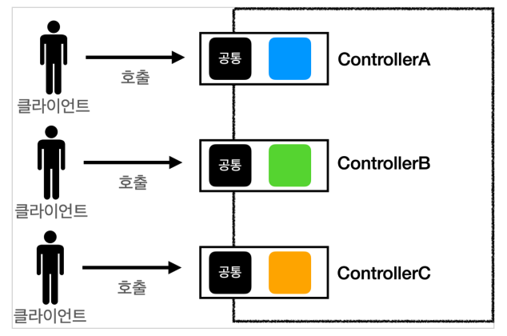
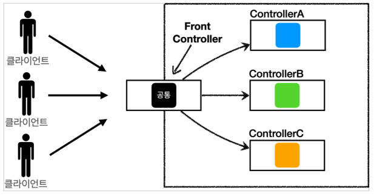
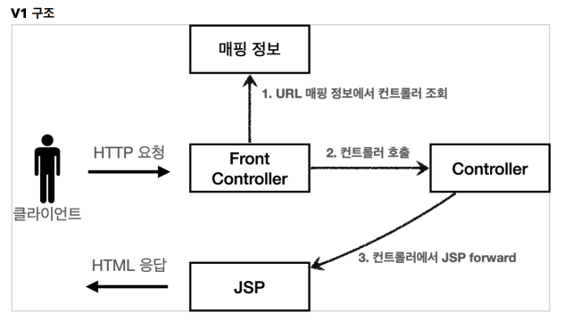
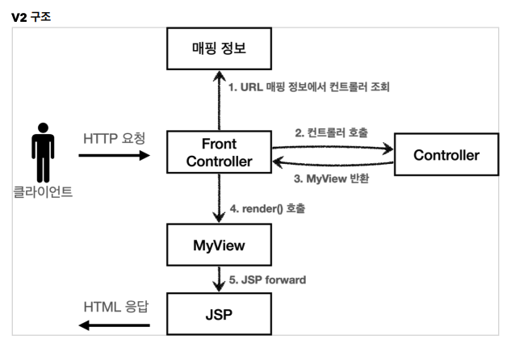
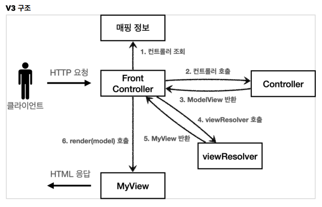
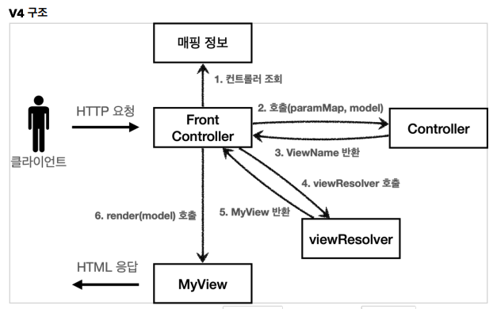
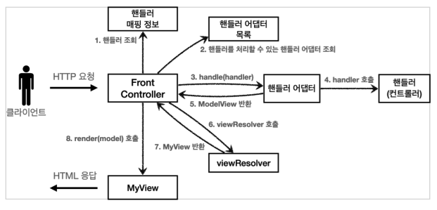

# 04. MVC 프레임워크 만들기

## 프론트 컨트롤러 패턴 소개

### 프론트 컨트롤러 도입 전




### 프론트 컨트롤러 도입 후 




### FrontController 패턴 특징

* 프론트 컨트롤러 서블릿 하나로 클라이언트의 요청을 받는다.
* 프론트 컨트롤러가 요청에 맞는 컨트롤러를 찾아서 호출한다.
* 공통 기능을 처리할 수 있다.
* 프론트 컨트롤러를 제외한 나머지 컨트롤러는 서블릿을 사용하지 않아도 된다.


### 스프링 웹 MVC와 프론트 컨트롤러

스프링 웹 MVC의 핵심도 바로 FrontController이다.

스프링 웹 MVC의 DispatcherServlet이 FrontController 패턴으로 구현되어 있다.


## 프론트 컨트롤러 도입 - v1




### ControllerV1

각 컨트롤러들은 이 인터페이스를 구현하면 된다.

프론트 컨트롤러는 이 인터페이스를 호출해서 구현과 관계없이 로직의 일관성을 가져갈 수 있다.

``` java
package hello.servlet.web.frontcontroller.v1;

import javax.servlet.ServletException;
import javax.servlet.http.HttpServletRequest;
import javax.servlet.http.HttpServletResponse;
import java.io.IOException;

public interface ControllerV1 {
    void process(HttpServletRequest request, HttpServletResponse response) throws ServletException, IOException;
}
```


### 각 Controller 구현

``` java
package hello.servlet.web.frontcontroller.v1.controller;

import hello.servlet.web.frontcontroller.v1.ControllerV1;

import javax.servlet.RequestDispatcher;
import javax.servlet.ServletException;
import javax.servlet.http.HttpServletRequest;
import javax.servlet.http.HttpServletResponse;
import java.io.IOException;

public class MemberFormControllerV1 implements ControllerV1 {

    @Override
    public void process(HttpServletRequest request, HttpServletResponse response) throws ServletException, IOException {
        String viewPath = "/WEB-INF/views/new-form.jsp";
        RequestDispatcher dispatcher = request.getRequestDispatcher(viewPath);
        dispatcher.forward(request, response);
    }
}
```

``` java
package hello.servlet.web.frontcontroller.v1.controller;

import hello.servlet.domain.member.Member;
import hello.servlet.domain.member.MemberRepository;
import hello.servlet.web.frontcontroller.v1.ControllerV1;

import javax.servlet.RequestDispatcher;
import javax.servlet.ServletException;
import javax.servlet.http.HttpServletRequest;
import javax.servlet.http.HttpServletResponse;
import java.io.IOException;

public class MemberSaveControllerV1 implements ControllerV1 {

    private MemberRepository memberRepository = MemberRepository.getInstance();

    @Override
    public void process(HttpServletRequest request, HttpServletResponse response) throws ServletException, IOException {
        String username = request.getParameter("username");
        int age = Integer.parseInt(request.getParameter("age"));

        Member member = new Member(username, age);
        memberRepository.save(member);

        request.setAttribute("member", member);

        String viewPath = "/WEB-INF/views/save-result.jsp";
        RequestDispatcher dispatcher = request.getRequestDispatcher(viewPath);
        dispatcher.forward(request, response);
    }
}
```

``` java
package hello.servlet.web.frontcontroller.v1.controller;

import hello.servlet.domain.member.Member;
import hello.servlet.domain.member.MemberRepository;
import hello.servlet.web.frontcontroller.v1.ControllerV1;

import javax.servlet.RequestDispatcher;
import javax.servlet.ServletException;
import javax.servlet.http.HttpServletRequest;
import javax.servlet.http.HttpServletResponse;
import java.io.IOException;
import java.util.List;

public class MemberListControllerV1 implements ControllerV1 {
    private MemberRepository memberRepository = MemberRepository.getInstance();
    @Override
    public void process(HttpServletRequest request, HttpServletResponse response) throws ServletException, IOException {
        List<Member> members = memberRepository.findAll();
        request.setAttribute("members", members);
        String viewPath = "/WEB-INF/views/members.jsp";
        RequestDispatcher dispatcher = request.getRequestDispatcher(viewPath);
        dispatcher.forward(request, response);
    }
}
```


### FrontController

``` java
package hello.servlet.web.frontcontroller.v1;

import hello.servlet.web.frontcontroller.v1.controller.MemberFormControllerV1;
import hello.servlet.web.frontcontroller.v1.controller.MemberListControllerV1;
import hello.servlet.web.frontcontroller.v1.controller.MemberSaveControllerV1;

import javax.servlet.ServletException;
import javax.servlet.annotation.WebServlet;
import javax.servlet.http.HttpServlet;
import javax.servlet.http.HttpServletRequest;
import javax.servlet.http.HttpServletResponse;
import java.io.IOException;
import java.util.HashMap;
import java.util.Map;

@WebServlet(name = "frontControllerServletV1", urlPatterns = "/front-controller/v1/*")
public class FrontControllerServletV1 extends HttpServlet {

    private Map<String, ControllerV1> controllerMap = new HashMap<>();

    public FrontControllerServletV1() {
        controllerMap.put("/front-controller/v1/members/new-form", new
                MemberFormControllerV1());
        controllerMap.put("/front-controller/v1/members/save", new
                MemberSaveControllerV1());
        controllerMap.put("/front-controller/v1/members", new
                MemberListControllerV1());
    }

    @Override
    protected void service(HttpServletRequest request, HttpServletResponse response) throws ServletException, IOException {
        String requestURI = request.getRequestURI();

        ControllerV1 controller = controllerMap.get(requestURI);
        if (controller == null) {
            response.setStatus(HttpServletResponse.SC_NOT_FOUND);
            return;
        }

        controller.process(request, response);
    }
}
```

* JSP는 이전에 사용했던 것을 그대로 사용한다.
* `urlPatterns = "/front-controller/v1/*"` : /front-controller/v1 를 포함한 하위 모든 요청은 이 서블릿에서 받아들인다.


## View 분리 - v2

모든 컨트롤러에서 뷰로 이동하는 부분에 중복이 있고 깔끔하지 않다.

``` java
String viewPath = "/WEB-INF/views/new-form.jsp";
RequestDispatcher dispatcher = request.getRequestDispatcher(viewPath);
dispatcher.forward(request, response);
```


이 부분을 처리하는 뷰 객체를 만들어 해결한다.




### MyView

``` java
package hello.servlet.web.frontcontroller;

import javax.servlet.RequestDispatcher;
import javax.servlet.ServletException;
import javax.servlet.http.HttpServletRequest;
import javax.servlet.http.HttpServletResponse;
import java.io.IOException;

public class MyView {
    private String viewPath;

    public MyView(String viewPath) {
        this.viewPath = viewPath;
    }

    public void render(HttpServletRequest request, HttpServletResponse response) throws ServletException, IOException {
        RequestDispatcher dispatcher = request.getRequestDispatcher(viewPath);
        dispatcher.forward(request, response);
    }
}
```


### ControllerV2

``` java
package hello.servlet.web.frontcontroller.v2;

import hello.servlet.web.frontcontroller.MyView;

import javax.servlet.ServletException;
import javax.servlet.http.HttpServletRequest;
import javax.servlet.http.HttpServletResponse;
import java.io.IOException;

public interface ControllerV2 {

    MyView process(HttpServletRequest request, HttpServletResponse response) throws ServletException, IOException;
}
```


### 각 Controller 구현

``` java
package hello.servlet.web.frontcontroller.v2.controller;

import hello.servlet.web.frontcontroller.MyView;
import hello.servlet.web.frontcontroller.v2.ControllerV2;

import javax.servlet.RequestDispatcher;
import javax.servlet.ServletException;
import javax.servlet.http.HttpServletRequest;
import javax.servlet.http.HttpServletResponse;
import java.io.IOException;

public class MemberFormControllerV2 implements ControllerV2 {
    @Override
    public MyView process(HttpServletRequest request, HttpServletResponse response) throws ServletException, IOException {
        return new MyView("/WEB-INF/views/new-form.jsp");
    }
}
```

``` java
package hello.servlet.web.frontcontroller.v2.controller;

import hello.servlet.domain.member.Member;
import hello.servlet.domain.member.MemberRepository;
import hello.servlet.web.frontcontroller.MyView;
import hello.servlet.web.frontcontroller.v2.ControllerV2;

import javax.servlet.RequestDispatcher;
import javax.servlet.ServletException;
import javax.servlet.http.HttpServletRequest;
import javax.servlet.http.HttpServletResponse;
import java.io.IOException;

public class MemberSaveControllerV2 implements ControllerV2 {

    private MemberRepository memberRepository = MemberRepository.getInstance();

    @Override
    public MyView process(HttpServletRequest request, HttpServletResponse response) throws ServletException, IOException {
        String username = request.getParameter("username");
        int age = Integer.parseInt(request.getParameter("age"));

        Member member = new Member(username, age);
        memberRepository.save(member);

        request.setAttribute("member", member);

        return new MyView("/WEB-INF/views/save-result.jsp");
    }
}
```

``` java
package hello.servlet.web.frontcontroller.v2.controller;

import hello.servlet.domain.member.Member;
import hello.servlet.domain.member.MemberRepository;
import hello.servlet.web.frontcontroller.MyView;
import hello.servlet.web.frontcontroller.v2.ControllerV2;

import javax.servlet.RequestDispatcher;
import javax.servlet.ServletException;
import javax.servlet.http.HttpServletRequest;
import javax.servlet.http.HttpServletResponse;
import java.io.IOException;
import java.util.List;

public class MemberListControllerV2 implements ControllerV2 {
    private MemberRepository memberRepository = MemberRepository.getInstance();

    @Override
    public MyView process(HttpServletRequest request, HttpServletResponse response) throws ServletException, IOException {
        List<Member> members = memberRepository.findAll();
        request.setAttribute("members", members);

        return new MyView("/WEB-INF/views/members.jsp");
    }
}
```


### FrontController

```  java
package hello.servlet.web.frontcontroller.v2;

import hello.servlet.web.frontcontroller.MyView;
import hello.servlet.web.frontcontroller.v1.ControllerV1;
import hello.servlet.web.frontcontroller.v1.controller.MemberFormControllerV1;
import hello.servlet.web.frontcontroller.v1.controller.MemberListControllerV1;
import hello.servlet.web.frontcontroller.v1.controller.MemberSaveControllerV1;
import hello.servlet.web.frontcontroller.v2.controller.MemberFormControllerV2;
import hello.servlet.web.frontcontroller.v2.controller.MemberListControllerV2;
import hello.servlet.web.frontcontroller.v2.controller.MemberSaveControllerV2;

import javax.servlet.ServletException;
import javax.servlet.annotation.WebServlet;
import javax.servlet.http.HttpServlet;
import javax.servlet.http.HttpServletRequest;
import javax.servlet.http.HttpServletResponse;
import java.io.IOException;
import java.util.HashMap;
import java.util.Map;

@WebServlet(name = "frontControllerServletV2", urlPatterns = "/front-controller/v2/*")
public class FrontControllerServletV2 extends HttpServlet {

    private Map<String, ControllerV2> controllerMap = new HashMap<>();

    public FrontControllerServletV2() {
        controllerMap.put("/front-controller/v2/members/new-form", new
                MemberFormControllerV2());
        controllerMap.put("/front-controller/v2/members/save", new
                MemberSaveControllerV2());
        controllerMap.put("/front-controller/v2/members", new
                MemberListControllerV2());
    }

    @Override
    protected void service(HttpServletRequest request, HttpServletResponse response) throws ServletException, IOException {
        String requestURI = request.getRequestURI();

        ControllerV2 controller = controllerMap.get(requestURI);
        if (controller == null) {
            response.setStatus(HttpServletResponse.SC_NOT_FOUND);
            return;
        }

        MyView myView = controller.process(request, response);
        myView.render(request, response);
    }
}
```


## Model 추가 - v3

### Model을 추가하는 이유

* 서블릿 종속성 제거 : 컨트롤러 입장에서 HttpServletRequest, HttpServletResponse이 꼭 필요할까? 요청 파라미터 정보는 자바의 Map으로 대신 넘기도록 하면 지금 구조에서는 컨트롤러가 서블릿 기술을 몰라도 동작할 수 있다. 이렇게 하면 구현 코드도 매우 단순해지고, 테스트 코드 작성이 쉽다.
* 뷰 이름 중복 제거 : 컨트롤러에서 지정하는 뷰 이름에 중복이 있는 것을 확인할 수 있다. 컨트롤러는 뷰의 논리 이름을 반환하고, 실제 물리 위치의 이름은 프론트 컨트롤러에서 처리하도록 단순화 하자. 이렇게 해두면 향후 뷰의 폴더 위치가 함께 이동해도 프론트 컨트롤러만 고치면 된다. 





### ModelView

```  java
package hello.servlet.web.frontcontroller;

import java.util.HashMap;
import java.util.Map;

public class ModelView {
    private String viewName;
    private Map<String, Object> model = new HashMap<>();

    public ModelView(String viewName) {
        this.viewName = viewName;
    }

    public String getViewName() {
        return viewName;
    }

    public void setViewName(String viewName) {
        this.viewName = viewName;
    }

    public Map<String, Object> getModel() {
        return model;
    }

    public void setModel(Map<String, Object> model) {
        this.model = model;
    }
}
```


### ControllerV3

``` java
package hello.servlet.web.frontcontroller.v3;

import hello.servlet.web.frontcontroller.ModelView;

import java.util.Map;

public interface ControllerV3 {
    ModelView process(Map<String, String> paramMap);
}
```

* 이 컨트롤러는 서블릿 기술을 전혀 사용하지 않는다. 따라서 구현이 매우 단순해지고, 테스트 코드 작성시 테스트 하기 쉽다.


### 각 Controller 구현

``` java
package hello.servlet.web.frontcontroller.v3.controller;

import hello.servlet.web.frontcontroller.ModelView;
import hello.servlet.web.frontcontroller.v3.ControllerV3;

import java.util.Map;

public class MemberFormControllerV3 implements ControllerV3 {
    @Override
    public ModelView process(Map<String, String> paramMap) {
        return new ModelView("new-form");
    }
}
```

``` java
package hello.servlet.web.frontcontroller.v3.controller;

import hello.servlet.domain.member.Member;
import hello.servlet.domain.member.MemberRepository;
import hello.servlet.web.frontcontroller.ModelView;
import hello.servlet.web.frontcontroller.v3.ControllerV3;

import java.util.Map;

public class MemberSaveControllerV3 implements ControllerV3 {
    private MemberRepository memberRepository = MemberRepository.getInstance();

    @Override
    public ModelView process(Map<String, String> paramMap) {
        String username = paramMap.get("username");
        int age = Integer.parseInt(paramMap.get("age"));

        Member member = new Member(username, age);
        memberRepository.save(member);

        ModelView modelView = new ModelView("save-result");
        modelView.getModel().put("member", member);
        return modelView;
    }
}
```

``` java
package hello.servlet.web.frontcontroller.v3.controller;

import hello.servlet.domain.member.Member;
import hello.servlet.domain.member.MemberRepository;
import hello.servlet.web.frontcontroller.ModelView;
import hello.servlet.web.frontcontroller.v3.ControllerV3;

import java.util.List;
import java.util.Map;

public class MemberListControllerV3 implements ControllerV3 {
    MemberRepository memberRepository = MemberRepository.getInstance();

    @Override
    public ModelView process(Map<String, String> paramMap) {
        List<Member> members = memberRepository.findAll();

        ModelView modelView = new ModelView("members");
        modelView.getModel().put("members", members);

        return modelView;
    }
}
```


### FrontControllerServletV3

``` java
package hello.servlet.web.frontcontroller.v3;

import hello.servlet.web.frontcontroller.ModelView;
import hello.servlet.web.frontcontroller.MyView;
import hello.servlet.web.frontcontroller.v3.controller.MemberFormControllerV3;
import hello.servlet.web.frontcontroller.v3.controller.MemberListControllerV3;
import hello.servlet.web.frontcontroller.v3.controller.MemberSaveControllerV3;

import javax.servlet.ServletException;
import javax.servlet.annotation.WebServlet;
import javax.servlet.http.HttpServlet;
import javax.servlet.http.HttpServletRequest;
import javax.servlet.http.HttpServletResponse;
import java.io.IOException;
import java.util.HashMap;
import java.util.Map;

@WebServlet(name = "frontControllerServiceV3", urlPatterns = "front-controller/v3/*")
public class FrontControllerServletV3 extends HttpServlet {

    private Map<String, ControllerV3> controllerMap = new HashMap<>();

    public FrontControllerServletV3() {
        controllerMap.put("/front-controller/v3/members/new-form", new MemberFormControllerV3());
        controllerMap.put("/front-controller/v3/members/save", new MemberSaveControllerV3());
        controllerMap.put("/front-controller/v3/members", new MemberListControllerV3());
    }

    @Override
    protected void service(HttpServletRequest request, HttpServletResponse response) throws ServletException, IOException {
        String requestURI = request.getRequestURI();

        ControllerV3 controller = controllerMap.get(requestURI);
        if (controller == null) {
            response.setStatus(HttpServletResponse.SC_NOT_FOUND);
            return;
        }

        Map<String, String> paramMap = createParamMap(request);
        ModelView mv = controller.process(paramMap);
        String viewName = mv.getViewName();
        MyView view = viewResolver(viewName);
        view.render(mv.getModel(), request, response);
    }

    private Map<String, String> createParamMap(HttpServletRequest request) {
        Map<String, String> paramMap = new HashMap<>();
        request.getParameterNames().asIterator()
                .forEachRemaining(paramName -> paramMap.put(paramName, request.getParameter(paramName)));

        return paramMap;

    }

    private MyView viewResolver(String viewName) {
        return new MyView("/WEB-INF/views/" + viewName + ".jsp");
    }
}
```


### MyView 수정

```  java
package hello.servlet.web.frontcontroller;

import javax.servlet.RequestDispatcher;
import javax.servlet.ServletException;
import javax.servlet.http.HttpServletRequest;
import javax.servlet.http.HttpServletResponse;
import java.io.IOException;
import java.util.Map;

public class MyView {
    private String viewPath;

    public MyView(String viewPath) {
        this.viewPath = viewPath;
    }

    public void render(HttpServletRequest request, HttpServletResponse response) throws ServletException, IOException {
        RequestDispatcher dispatcher = request.getRequestDispatcher(viewPath);
        dispatcher.forward(request, response);
    }

    public void render(Map<String, Object> model, HttpServletRequest request, HttpServletResponse response) throws ServletException, IOException {
        modelToRequestAttribute(model, request);
        RequestDispatcher dispatcher = request.getRequestDispatcher(viewPath);
        dispatcher.forward(request, response);
    }

    private void modelToRequestAttribute(Map<String, Object> model, HttpServletRequest request) {
        model.forEach((key, value) -> request.setAttribute(key, value));
    }

}
```


## 단순하고 실용적인 컨트롤러 - v4

v3는 잘 설계된 컨트롤러이지만 실제 컨트롤러 인터페이스를 구현하는 개발자 입장에서 보면 항상 ModelView 객체를 생성하고 반환해야 하는 부분이 번거롭다.




* v3과 전체적으로 유사하고 Controller가 반환하는 값이 ModelView에서  ViewName으로 변경된다.


### ControllerV4

``` java
package hello.servlet.web.frontcontroller.v4;

import java.util.Map;

public interface ControllerV4 {
    String process(Map<String, String> paramMap, Map<String, Object> model);
}

```


### 각 Controller 구현

``` java
package hello.servlet.web.frontcontroller.v4.controller;

import hello.servlet.web.frontcontroller.v4.ControllerV4;

import java.util.Map;

public class MemberFormControllerV4 implements ControllerV4 {
    @Override
    public String process(Map<String, String> paramMap, Map<String, Object> model) {
        return "new-form";
    }
}
```

``` java
package hello.servlet.web.frontcontroller.v4.controller;

import hello.servlet.domain.member.Member;
import hello.servlet.domain.member.MemberRepository;
import hello.servlet.web.frontcontroller.ModelView;
import hello.servlet.web.frontcontroller.v3.ControllerV3;
import hello.servlet.web.frontcontroller.v4.ControllerV4;

import java.util.Map;

public class MemberSaveControllerV4 implements ControllerV4 {
    private MemberRepository memberRepository = MemberRepository.getInstance();

    @Override
    public String process(Map<String, String> paramMap, Map<String, Object> model) {
        String username = paramMap.get("username");
        int age = Integer.parseInt(paramMap.get("age"));

        Member member = new Member(username, age);
        memberRepository.save(member);

        model.put("member", member);
        return "save-result";
    }
}
```

```java
package hello.servlet.web.frontcontroller.v4.controller;

import hello.servlet.domain.member.Member;
import hello.servlet.domain.member.MemberRepository;
import hello.servlet.web.frontcontroller.ModelView;
import hello.servlet.web.frontcontroller.v3.ControllerV3;
import hello.servlet.web.frontcontroller.v4.ControllerV4;

import java.util.List;
import java.util.Map;

public class MemberListControllerV4 implements ControllerV4 {
    MemberRepository memberRepository = MemberRepository.getInstance();

    @Override
    public String process(Map<String, String> paramMap, Map<String, Object> model) {
        List<Member> members = memberRepository.findAll();

        model.put("members", members);

        return "members";
    }
}
```


### FrontControllerServletV4

``` java
package hello.servlet.web.frontcontroller.v4;

import hello.servlet.web.frontcontroller.ModelView;
import hello.servlet.web.frontcontroller.MyView;
import hello.servlet.web.frontcontroller.v3.ControllerV3;
import hello.servlet.web.frontcontroller.v3.controller.MemberFormControllerV3;
import hello.servlet.web.frontcontroller.v3.controller.MemberListControllerV3;
import hello.servlet.web.frontcontroller.v3.controller.MemberSaveControllerV3;
import hello.servlet.web.frontcontroller.v4.controller.MemberFormControllerV4;
import hello.servlet.web.frontcontroller.v4.controller.MemberListControllerV4;
import hello.servlet.web.frontcontroller.v4.controller.MemberSaveControllerV4;

import javax.servlet.ServletException;
import javax.servlet.annotation.WebServlet;
import javax.servlet.http.HttpServlet;
import javax.servlet.http.HttpServletRequest;
import javax.servlet.http.HttpServletResponse;
import java.io.IOException;
import java.util.HashMap;
import java.util.Map;

@WebServlet(name = "frontControllerServiceV4", urlPatterns = "/front-controller/v4/*")
public class FrontControllerServletV4 extends HttpServlet {

    private Map<String, ControllerV4> controllerMap = new HashMap<>();

    public FrontControllerServletV4() {
        controllerMap.put("/front-controller/v4/members/new-form", new MemberFormControllerV4());
        controllerMap.put("/front-controller/v4/members/save", new MemberSaveControllerV4());
        controllerMap.put("/front-controller/v4/members", new MemberListControllerV4());
    }

    @Override
    protected void service(HttpServletRequest request, HttpServletResponse response) throws ServletException, IOException {
        String requestURI = request.getRequestURI();

        ControllerV4 controller = controllerMap.get(requestURI);
        if (controller == null) {
            response.setStatus(HttpServletResponse.SC_NOT_FOUND);
            return;
        }

        Map<String, String> paramMap = createParamMap(request);
        Map<String, Object> model = new HashMap<>();

        String viewName = controller.process(paramMap, model);

        MyView view = viewResolver(viewName);
        view.render(model, request, response);
    }

    private Map<String, String> createParamMap(HttpServletRequest request) {
        Map<String, String> paramMap = new HashMap<>();
        request.getParameterNames().asIterator()
                .forEachRemaining(paramName -> paramMap.put(paramName, request.getParameter(paramName)));

        return paramMap;

    }

    private MyView viewResolver(String viewName) {
        return new MyView("/WEB-INF/views/" + viewName + ".jsp");
    }
}
```


### 정리

기존 구조에서 모델을 파라미터로 넘기고, 뷰의 논리 이름을 반환한다는 작은 아이디어를 적용했을 뿐인데, 컨트롤러를 구현하는 개발자 입장에서 보면 이제 군더더기 없는 코드를 작성할 수 있다


## 유연한 컨트롤러1 - v5

어떤 개발자는 ControllerV3 방식으로 개발하고 싶고, 어떤 개발자는 ControllerV4 방식으로 개발하고 싶다면 어떻게 해야할까?

```  java
public interface ControllerV3 {
    ModelView process(Map<String, String> paramMap);
}
```

```  java
public interface ControllerV4 {
    String process(Map<String, String> paramMap, Map<String, Object> model);
}
```


### 어댑터 패턴

지금까지 우리가 개발한 프론트 컨트롤러는 한가지 방식의 컨트롤러 인터페이스만 사용할 수 있다

ControllerV3 , ControllerV4 는 완전히 다른 인터페이스이다. 따라서 호환이 불가능하다

어댑터 패턴을 사용해서 프론트 컨트롤러가 다양한 방식의 컨트롤러를 처리할 수 있도록 변경해보자




* 핸들러 어댑터: 중간에 어댑터 역할을 하는 어댑터가 추가되었는데 이름이 핸들러 어댑터이다. 여기서 어댑터 역할을 해주는 덕분에 다양한 종류의 컨트롤러를 호출할 수 있다. 
* 핸들러: 컨트롤러의 이름을 더 넓은 범위인 핸들러로 변경했다. 그 이유는 이제 어댑터가 있기 때문에 꼭 컨트롤러의 개념 뿐만 아니라 어떠한 것이든 해당하는 종류의 어댑터만 있으면 다 처리할 수 있기 때문이다.


### MyHandlerAdapter

``` java
package hello.servlet.web.frontcontroller.v5;

import hello.servlet.web.frontcontroller.ModelView;

import javax.servlet.ServletException;
import javax.servlet.http.HttpServletRequest;
import javax.servlet.http.HttpServletResponse;
import java.io.IOException;

public interface MyHandlerAdapter {

    boolean supports(Object handler);

    ModelView handle(HttpServletRequest request, HttpServletResponse response) throws ServletException, IOException;
}

```

* boolean supports(Object handler) 
  * handler는 컨트롤러를 말한다. 
  * 어댑터가 해당 컨트롤러를 처리할 수 있는지 판단하는 메서드다. 
* ModelView handle(HttpServletRequest request, HttpServletResponse response, Object handler) 
  * 어댑터는 실제 컨트롤러를 호출하고, 그 결과로 ModelView를 반환해야 한다. 
  * 실제 컨트롤러가 ModelView를 반환하지 못하면, 어댑터가 ModelView를 직접 생성해서라도 반환해야 한다. 
  * 이전에는 프론트 컨트롤러가 실제 컨트롤러를 호출했지만 이제는 이 어댑터를 통해서 실제 컨트롤러가 호출된다.


### ControllerV3HandlerAdapter

``` java
package hello.servlet.web.frontcontroller.v5.adapter;

import hello.servlet.web.frontcontroller.ModelView;
import hello.servlet.web.frontcontroller.v3.ControllerV3;
import hello.servlet.web.frontcontroller.v5.MyHandlerAdapter;

import javax.servlet.ServletException;
import javax.servlet.http.HttpServletRequest;
import javax.servlet.http.HttpServletResponse;
import java.io.IOException;
import java.util.HashMap;
import java.util.Map;

public class ControllerV3HandlerAdapter implements MyHandlerAdapter {
    @Override
    public boolean supports(Object handler) {
        return (handler instanceof ControllerV3);
    }

    @Override
    public ModelView handle(HttpServletRequest request, HttpServletResponse response, Object handler) throws ServletException, IOException {
        ControllerV3 controller = (ControllerV3) handler;

        Map<String, String> paramMap = createParamMap(request);

        ModelView mv = controller.process(paramMap);
        return mv;
    }
    
    private Map<String, String> createParamMap(HttpServletRequest request) {
        Map<String, String> paramMap = new HashMap<>();
        request.getParameterNames().asIterator()
                .forEachRemaining(paramName -> paramMap.put(paramName, request.getParameter(paramName)));

        return paramMap;
    }
}
```


### FrontControllerServletV5

``` java
package hello.servlet.web.frontcontroller.v5;

import hello.servlet.web.frontcontroller.ModelView;
import hello.servlet.web.frontcontroller.MyView;
import hello.servlet.web.frontcontroller.v3.controller.MemberFormControllerV3;
import hello.servlet.web.frontcontroller.v3.controller.MemberListControllerV3;
import hello.servlet.web.frontcontroller.v3.controller.MemberSaveControllerV3;
import hello.servlet.web.frontcontroller.v5.adapter.ControllerV3HandlerAdapter;

import javax.servlet.ServletException;
import javax.servlet.annotation.WebServlet;
import javax.servlet.http.HttpServlet;
import javax.servlet.http.HttpServletRequest;
import javax.servlet.http.HttpServletResponse;
import java.io.IOException;
import java.util.ArrayList;
import java.util.HashMap;
import java.util.List;
import java.util.Map;

@WebServlet(name = "frontControllerServletV5", urlPatterns = "/front-controller/v5/*")
public class FrontControllerServletV5 extends HttpServlet {
    private final Map<String, Object> handlerMappingMap = new HashMap<>();
    private final List<MyHandlerAdapter> handlerAdapters = new ArrayList<>();

    public FrontControllerServletV5() {
        initHandlerMappingMap();
        initHandlerAdapters();
    }

    private void initHandlerMappingMap() {
        handlerMappingMap.put("/front-controller/v5/v3/members/new-form", new MemberFormControllerV3());
        handlerMappingMap.put("/front-controller/v5/v3/members/save", new MemberSaveControllerV3());
        handlerMappingMap.put("/front-controller/v5/v3/members", new MemberListControllerV3());
    }

    private void initHandlerAdapters() {
        handlerAdapters.add(new ControllerV3HandlerAdapter());
    }

    @Override
    protected void service(HttpServletRequest request, HttpServletResponse response) throws ServletException, IOException {
        Object handler = getHandler(request);

        if (handler == null) {
            response.setStatus(HttpServletResponse.SC_NOT_FOUND);
            return;
        }

        MyHandlerAdapter adapter = getHandlerAdapter(handler);
        ModelView mv = adapter.handle(request, response, handler);

        MyView view = viewResolver(mv.getViewName());
        view.render(mv.getModel(), request, response);
    }

    private Object getHandler(HttpServletRequest request) {
        String requestURI = request.getRequestURI();
        Object handler = handlerMappingMap.get(requestURI);
        return handler;
    }

    private MyHandlerAdapter getHandlerAdapter(Object handler) {
        for (MyHandlerAdapter adapter : handlerAdapters) {
            if (adapter.supports(handler)){
                return adapter;
            }
        }

        throw new IllegalArgumentException("handler adapter를 찾을 수 없습니다. handler=" + handler);
    }

    private MyView viewResolver(String viewName) {
        return new MyView("/WEB-INF/views/" + viewName + ".jsp");
    }
}

```


## 유연한 컨트롤러2 - v5

### FrontControllerServletV5

FrontControllerServletV5에 ControllerV4 기능을 추가해보자.

``` java
    public FrontControllerServletV5() {
        initHandlerMappingMap();
        initHandlerAdapters();
    }

    private void initHandlerMappingMap() {
        handlerMappingMap.put("/front-controller/v5/v3/members/new-form", new MemberFormControllerV3());
        handlerMappingMap.put("/front-controller/v5/v3/members/save", new MemberSaveControllerV3());
        handlerMappingMap.put("/front-controller/v5/v3/members", new MemberListControllerV3());

        handlerMappingMap.put("/front-controller/v5/v4/members/new-form", new MemberFormControllerV4());
        handlerMappingMap.put("/front-controller/v5/v4/members/save", new MemberSaveControllerV4());
        handlerMappingMap.put("/front-controller/v5/v4/members", new MemberListControllerV4());
    }

    private void initHandlerAdapters() {
        handlerAdapters.add(new ControllerV3HandlerAdapter());
        handlerAdapters.add(new ControllerV4HandlerAdapter());
    }
```


### ControllerV4HandlerAdapter

``` java
package hello.servlet.web.frontcontroller.v5.adapter;

import hello.servlet.web.frontcontroller.ModelView;
import hello.servlet.web.frontcontroller.MyView;
import hello.servlet.web.frontcontroller.v4.ControllerV4;
import hello.servlet.web.frontcontroller.v5.MyHandlerAdapter;

import javax.servlet.ServletException;
import javax.servlet.http.HttpServletRequest;
import javax.servlet.http.HttpServletResponse;
import java.io.IOException;
import java.util.HashMap;
import java.util.Map;

public class ControllerV4HandlerAdapter implements MyHandlerAdapter {
    @Override
    public boolean supports(Object handler) {
        return (handler instanceof ControllerV4);
    }

    @Override
    public ModelView handle(HttpServletRequest request, HttpServletResponse response, Object handler) throws ServletException, IOException {
        ControllerV4 controller = (ControllerV4) handler;

        Map<String, String> paramMap = createParamMap(request);
        Map<String, Object> model = new HashMap<>();

        String viewName = controller.process(paramMap, model);

        ModelView modelView = new ModelView(viewName);
        modelView.setModel(model);

        return modelView;
    }

    private Map<String, String> createParamMap(HttpServletRequest request) {
        Map<String, String> paramMap = new HashMap<>();
        request.getParameterNames().asIterator()
                .forEachRemaining(paramName -> paramMap.put(paramName, request.getParameter(paramName)));

        return paramMap;

    }

    private MyView viewResolver(String viewName) {
        return new MyView("/WEB-INF/views/" + viewName + ".jsp");
    }
}

```


### 어댑터 변환

어댑터가 있기 때문에 아래와 같이 modelView를 반환하는 형식을 맞춰 줄 수 있다.

```  java
ModelView modelView = new ModelView(viewName);
modelView.setModel(model);

return modelView;
```

