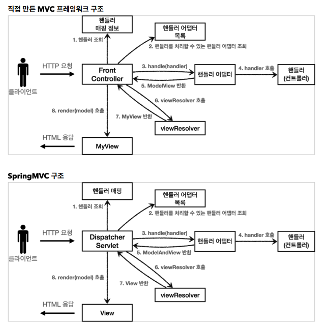
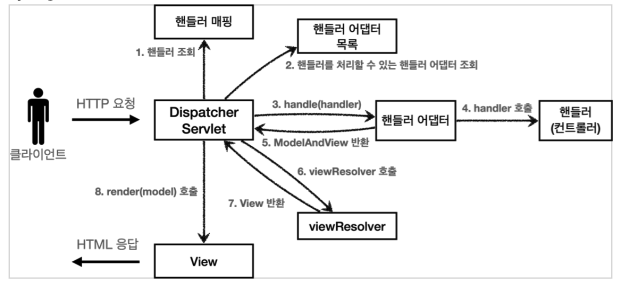
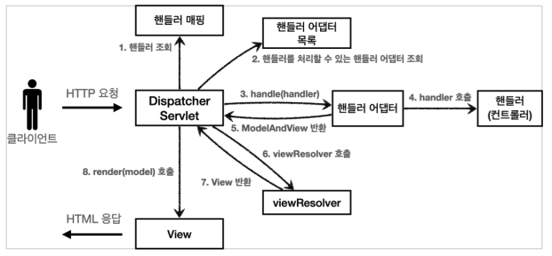

# 05. 스프링 MVC 구조 이해

## 스프링 MVC 전체 구조

### 직접 만든 MVC 프레임워크 구조 VS SpringMVC 구조



* FrontController -> DispatcherServlet
* handlerMappingMap -> HandlerMapping
* MyHandlerAdapter -> HandlerAdapter 
* ModelView -> ModelAndView 
* viewResolver -> ViewResolver 
* MyView -> View 


### DispatcherServlet 구조 살펴보기

스프링 MVC도 프론트 컨트롤러 패턴으로 구현되어 있다. 

스프링 MVC의 프론트 컨트롤러가 바로 DispatcherServlet

``` 
org.springframework.web.servlet.DispatcherServlet
```


#### DispacherServlet 서블릿 등록

* DispacherServlet 도 부모 클래스에서 HttpServlet 을 상속 받아서 사용
  * DispatcherServlet -> FrameworkServlet -> HttpServletBean -> HttpServlet
* 스프링 부트는 DispacherServlet 을 서블릿으로 자동으로 등록하면서 모든 경로( urlPatterns="/" )에 대해서 매핑한다.


#### 요청 흐름

* 서블릿이 호출되면 HttpServlet 이 제공하는 serivce() 가 호출된다.
* 스프링 MVC는 DispatcherServlet 의 부모인 FrameworkServlet 에서 service() 를 오버라이드 해두었다.
* FrameworkServlet.service() 를 시작으로 여러 메서드가 호출되면서 DispacherServlet.doDispatch() 가 호출된다.


``` java
protected void doDispatch(HttpServletRequest request, HttpServletResponse
response) throws Exception {
	HttpServletRequest processedRequest = request;
	HandlerExecutionChain mappedHandler = null;
	ModelAndView mv = null;
	
  // 1. 핸들러 조회
	mappedHandler = getHandler(processedRequest);
	if (mappedHandler == null) {
		noHandlerFound(processedRequest, response);
		return;
	}
	
  // 2. 핸들러 어댑터 조회 - 핸들러를 처리할 수 있는 어댑터
	HandlerAdapter ha = getHandlerAdapter(mappedHandler.getHandler());
	
  // 3. 핸들러 어댑터 실행 -> 4. 핸들러 어댑터를 통해 핸들러 실행 -> 5. ModelAndView 반환
	mv = ha.handle(processedRequest, response, mappedHandler.getHandler());
	processDispatchResult(processedRequest, response, mappedHandler, mv, dispatchException);
}

private void processDispatchResult(HttpServletRequest request,
HttpServletResponse response, HandlerExecutionChain mappedHandler, ModelAndView
mv, Exception exception) throws Exception {
	// 뷰 렌더링 호출
	render(mv, request, response);
}
	
protected void render(ModelAndView mv, HttpServletRequest request,
HttpServletResponse response) throws Exception {
	View view;
	String viewName = mv.getViewName();
	
  // 6. 뷰 리졸버를 통해서 뷰 찾기, 7. View 반환
	view = resolveViewName(viewName, mv.getModelInternal(), locale, request);
	
  // 8. 뷰 렌더링
	view.render(mv.getModelInternal(), request, response);
}
```




### 동작순서

1. 핸들러 조회: 핸들러 매핑을 통해 요청 URL에 매핑된 핸들러(컨트롤러)를 조회한다. 
2. 핸들러 어댑터 조회: 핸들러를 실행할 수 있는 핸들러 어댑터를 조회한다.
3. 핸들러 어댑터 실행: 핸들러 어댑터를 실행한다. 
4. 핸들러 실행: 핸들러 어댑터가 실제 핸들러를 실행한다. 
5. ModelAndView 반환: 핸들러 어댑터는 핸들러가 반환하는 정보를 ModelAndView로 변환해서 반환한다. 
6. viewResolver 호출: 뷰 리졸버를 찾고 실행한다. JSP의 경우: InternalResourceViewResolver 가 자동 등록되고, 사용된다. 
7. View 반환: 뷰 리졸버는 뷰의 논리 이름을 물리 이름으로 바꾸고, 렌더링 역할을 담당하는 뷰 객체를 반환한다. JSP의 경우 InternalResourceView(JstlView) 를 반환하는데, 내부에 forward() 로직이 있다. 
8. 뷰 렌더링: 뷰를 통해서 뷰를 렌더링 한다.


### 인터페이스 살펴보기 

스프링 MVC의 큰 강점은 DispatcherServlet 코드의 변경 없이, 원하는 기능을 변경하거나 확장할 수 있다는 점이다. 

지금까지 설명한 대부분을 확장 가능할 수 있게 인터페이스로 제공한다. 

이 인터페이스들만 구현해서 DispatcherServlet 에 등록하면 여러분만의 컨트롤러를 만들 수도 있다.


## 핸들러 매핑과 핸들러 어댑터

지금은 전혀 사용하지 않지만 과거에 주로 사용했던 스프링이 제공하는 간단한 컨트롤러로 핸드러 매핑과 어댑터를 이해하자.

### 과거 버전 스프링 컨트롤러

`org.springframework.web.servlet.mvc.Controller`

``` java
public interface Controller {
	@Nullable
	ModelAndView handleRequest(HttpServletRequest request, HttpServletResponse response) throws Exception;

}
```


### OldController

``` java
package hello.servlet.web.springmvc.old;

import org.springframework.stereotype.Component;
import org.springframework.web.servlet.ModelAndView;
import org.springframework.web.servlet.mvc.Controller;

import javax.servlet.http.HttpServletRequest;
import javax.servlet.http.HttpServletResponse;

@Component("/springmvc/old-controller")
public class OldController implements Controller {

    public ModelAndView handleRequest(HttpServletRequest request, HttpServletResponse response) throws Exception {
        System.out.println("OldController.handleRequest");
        return null;
    }
}
```

* `/springmvc/old-controller` 라는 이름으로 빈이 등록되었다.
* 빈의 이름으로 URL을 매핑한다.
* http://localhost:8080/springmvc/old-controller 접속 시 handleRequest 실행


### 어떻게 호출되는가



이 컨트롤러가 호출되려면 아래 2가지가 필요하다.

* HandlerMapping
  * 핸들러 매핑에서 이 컨트롤러를 찾을 수 있어야 한다.
* HandlerAdapter
  * 핸들러 매핑을 통해서 찾은 핸들러를 실행할 수 있는 핸들러 어댑터가 필요하다.


> 스프링은 이미 필요한 핸들러 매핑과 핸들러 어댑터를 대부분 구현해두었다. 개발자가 직접 핸들러 매핑과 핸들러 어댑터를 만드는 일은 거의 없다


### 스프링 부트가 자동 등록하는 핸들러 매핑과 핸들러 어댑터

우선순위대로 찾고 만약 없으면 다음 순서로 넘어간다.

#### HandlerMapping

```
0 = RequestMappingHandlerMapping : 애노테이션 기반의 컨트롤러인 @RequestMapping에서 사용
1 = BeanNameUrlHandlerMapping : 스프링 빈의 이름으로 핸들러를 찾는다.
```


#### HandlerAdapter

``` java
0 = RequestMappingHandlerAdapter : 애노테이션 기반의 컨트롤러인 @RequestMapping에서 사용
1 = HttpRequestHandlerAdapter : HttpRequestHandler 처리
2 = SimpleControllerHandlerAdapter : Controller 인터페이스(애노테이션X, 과거에 사용) 처리
```


1. 핸들러 매핑으로 핸들러 조회
   1. HandlerMapping을 순서대로 실행해서, 핸들러를 찾는다.
   2. 이 경우 빈 이름으로 핸들러를 찾아야 하기 때문에 이름 그대로 빈 이름으로 핸들러를 찾아주는 BeanNameUrlHandlerMapping가 실행에 성공하고 핸들러인 OldController를 반환한다.
2. 핸들러 어댑터 조회
   1. HandlerAdapter 의 supports() 를 순서대로 호출한다.
   2. SimpleControllerHandlerAdapter 가 Controller 인터페이스를 지원하므로 대상이 된다.
3. 핸들러 어댑터 실행
   1. 디스패처 서블릿이 조회한 SimpleControllerHandlerAdapter 를 실행하면서 핸들러 정보도 함께 넘겨준다.
   2. SimpleControllerHandlerAdapter 는 핸들러인 OldController 를 내부에서 실행하고, 그 결과를 반환한다.


### HttpRequestHandler

핸들러 매핑과, 어댑터를 더 잘 이해하기 위해 Controller 인터페이스가 아닌 다른 핸들러를 알아보자. HttpRequestHandler 핸들러(컨트롤러)는 서블릿과 가장 유사한 형태의 핸들러이다.

``` java
public interface HttpRequestHandler {
void handleRequest(HttpServletRequest request, HttpServletResponse response) throws ServletException, IOException;
}
```


### MyHttpRequestHandler

``` java
package hello.servlet.web.springmvc.old;

import org.springframework.stereotype.Component;
import org.springframework.web.HttpRequestHandler;

import javax.servlet.ServletException;
import javax.servlet.http.HttpServletRequest;
import javax.servlet.http.HttpServletResponse;
import java.io.IOException;

@Component("/springmvc/request-handler")
public class MyHttpRequestHandler implements HttpRequestHandler {


    @Override
    public void handleRequest(HttpServletRequest request, HttpServletResponse response) throws ServletException, IOException {
        System.out.println("MyHttpRequestHandler.handleRequest");
    }
}
```

1. 핸들러 매핑으로 핸들러 조회 
   1. HandlerMapping 을 순서대로 실행해서, 핸들러를 찾는다. 
   2. 이 경우 빈 이름으로 핸들러를 찾아야 하기 때문에 이름 그대로 빈 이름으로 핸들러를 찾아주는BeanNameUrlHandlerMapping 가 실행에 성공하고 핸들러인 MyHttpRequestHandler 를 반환한다. 
2. 핸들러 어댑터 조회 
   1. HandlerAdapter 의 supports() 를 순서대로 호출한다.
   2. HttpRequestHandlerAdapter 가 HttpRequestHandler 인터페이스를 지원하므로 대상이 된다.
3. 핸들러 어댑터 실행
   1. 디스패처 서블릿이 조회한 HttpRequestHandlerAdapter 를 실행하면서 핸들러 정보도 함께 넘겨준다.
   2.  HttpRequestHandlerAdapter는 핸들러인 MyHttpRequestHandler를 내부에서 실행하고, 그 결과를 반환한다.


### @RequestMapping 

조금 뒤에서 설명하겠지만, 가장 우선순위가 높은 핸들러 매핑과 핸들러 어댑터는 RequestMappingHandlerMapping , RequestMappingHandlerAdapter 이다.

 @RequestMapping 의 앞글자를 따서 만든 이름인데, 이것이 바로 지금 스프링에서 주로 사용하는 애노테이션 기반의 컨트롤러를 지원하는 매핑과 어댑터이다. 

실무에서는 99.9% 이 방식의 컨트롤러를 사용한다.


## 뷰 리졸버

### OldController - View 조회할 수 있도록 변경

``` java
package hello.servlet.web.springmvc.old;

import org.springframework.stereotype.Component;
import org.springframework.web.HttpRequestHandler;
import org.springframework.web.servlet.ModelAndView;

import javax.servlet.ServletException;
import javax.servlet.http.HttpServletRequest;
import javax.servlet.http.HttpServletResponse;
import java.io.IOException;

@Component("/springmvc/request-handler")
public class MyHttpRequestHandler implements HttpRequestHandler {


    @Override
    public ModelAndView handleRequest(HttpServletRequest request, HttpServletResponse response) throws ServletException, IOException {
        System.out.println("MyHttpRequestHandler.handleRequest");
        return new ModelAndView("new-form");
    }
}
```


`application.properties`

```
spring.mvc.view.prefix=/WEB-INF/views/
spring.mvc.view.suffix=.jsp
```


#### 뷰 리졸버 - InternalResourceViewResolver

스프링 부트는 InternalResourceViewResolver 라는 뷰 리졸버를 자동으로 등록하는데, 이때 application.properties 에 등록한 spring.mvc.view.prefix , spring.mvc.view.suffix 설정 정보를 사용해서 등록한다.


### 뷰 리졸버 동작 방식


### 스프링 부트가 자동 등록하는 뷰 리졸버

``` 
1 = BeanNameViewResolver : 빈 이름으로 뷰를 찾아서 반환한다. (예: 엑셀 파일 생성
기능에 사용)
2 = InternalResourceViewResolver : JSP를 처리할 수 있는 뷰를 반환한다.
```


1. 핸들러 어댑터 호출 : 핸들러 어댑터를 통해 new-form 이라는 논리 뷰 이름을 획득한다. 
2. ViewResolver 호출 
   * new-form 이라는 뷰 이름으로 viewResolver를 순서대로 호출한다. 
   * BeanNameViewResolver 는 new-form 이라는 이름의 스프링 빈으로 등록된 뷰를 찾아야 하는데 없다.
   * InternalResourceViewResolver 가 호출된다.
3. InternalResourceViewResolver : 이 뷰 리졸버는 InternalResourceView 를 반환한다. 
4. 뷰 - InternalResourceView : InternalResourceView 는 JSP처럼 포워드 forward() 를 호출해서 처리할 수 있는 경우에 사용한다. 
5. view.render() : view.render() 가 호출되고 InternalResourceView 는 forward() 를 사용해서 JSP를 실행한다.


## 스프링 MVC - 시작하기

스프링이 제공하는 컨트롤러는 애노테이션 기반으로 동작해서 매우 유연하고 실용적이다.

### @RequestMapping

가장 우선순위가 높은 핸들러 매핑과 핸들러 어댑터는 아래와 같다.

* RequestMappingHandlerMapping
* RequestMappingHandlerAdapter


`@RequestMapping` 기반의 스프링 MVC 컨트롤러로 변경해보자.

### SpringMemberFormControllerV1 - 회원 등록 폼

``` java
package hello.servlet.web.springmvc.v1;

import org.springframework.stereotype.Controller;
import org.springframework.web.bind.annotation.RequestMapping;
import org.springframework.web.servlet.ModelAndView;

@Controller
public class SpringMemberFormControllerV1 {

    @RequestMapping("/springmvc/v1/members/new-form")
    public ModelAndView process() {
        return new ModelAndView("new-form");
    }
}
```

* @Controller
    * 스프링이 자동으로 스프링 빈으로 등록한다. (내부에 @Component 애노테이션이 있어서 컴포넌트 스캔의 대상이 됨) 
    * 스프링 MVC에서 애노테이션 기반 컨트롤러로 인식한다. 
* @RequestMapping : 요청 정보를 매핑한다. 해당 URL이 호출되면 이 메서드가 호출된다. 애노테이션을 기반으로 동작하기 때문에, 메서드의 이름은 임의로 지으면 된다. 
* ModelAndView : 모델과 뷰 정보를 담아서 반환하면 된다.


`RequestMappingHandlerMapping` 은 스프링 빈 중에서 @RequestMapping 또는 @Controller 가 클래스 레벨에 붙어 있는 경우에 매핑 정보로 인식한다.

따라서 @Controller 대신 @RequestMapping와 @Component를 사용해도 동일하게 동작한다.


### SpringMemberSaveControllerV1 - 회원 저장

``` java
package hello.servlet.web.springmvc.v1;

import hello.servlet.domain.member.Member;
import hello.servlet.domain.member.MemberRepository;
import org.springframework.stereotype.Controller;
import org.springframework.web.bind.annotation.RequestMapping;
import org.springframework.web.servlet.ModelAndView;

import javax.servlet.http.HttpServletRequest;
import javax.servlet.http.HttpServletResponse;

@Controller
public class SpringMemberSaveControllerV1 {

    private MemberRepository memberRepository = MemberRepository.getInstance();

    @RequestMapping("/springmvc/v1/members/save")
    ModelAndView process(HttpServletRequest request, HttpServletResponse response) {
        String username = request.getParameter("username");
        int age = Integer.parseInt(request.getParameter("age"));

        Member member = new Member(username, age);
        memberRepository.save(member);

        ModelAndView modelAndView = new ModelAndView("save-result");
        modelAndView.addObject("member", member);
        return modelAndView;
    }
}
```


### SpringMemberListControllerV1 - 회원 목록

``` java
package hello.servlet.web.springmvc.v1;

import hello.servlet.domain.member.Member;
import hello.servlet.domain.member.MemberRepository;
import org.springframework.stereotype.Controller;
import org.springframework.web.bind.annotation.RequestMapping;
import org.springframework.web.servlet.ModelAndView;

import java.util.List;

@Controller
public class SpringMemberListControllerV1 {
    private MemberRepository memberRepository = MemberRepository.getInstance();

    @RequestMapping("/springmvc/v1/members")
    public ModelAndView process() {

        List<Member> members = memberRepository.findAll();

        ModelAndView mv = new ModelAndView("members");
        mv.addObject("members", members);
        return mv;
    }
}
```


## 스프링 MVC - 컨트롤러 통합

``` java
package hello.servlet.web.springmvc.v2;

import java.util.List;

import javax.servlet.http.HttpServletRequest;
import javax.servlet.http.HttpServletResponse;

import org.springframework.stereotype.Controller;
import org.springframework.web.bind.annotation.RequestMapping;
import org.springframework.web.servlet.ModelAndView;

import hello.servlet.domain.member.Member;
import hello.servlet.domain.member.MemberRepository;

@Controller
@RequestMapping("/springmvc/v2/members")
public class SpringMemberControllerV2 {
    private MemberRepository memberRepository = MemberRepository.getInstance();

    @RequestMapping("/new-form")
    public ModelAndView newForm() {
        return new ModelAndView("new-form");
    }

    @RequestMapping("/save")
    ModelAndView save(HttpServletRequest request, HttpServletResponse response) {
        String username = request.getParameter("username");
        int age = Integer.parseInt(request.getParameter("age"));

        Member member = new Member(username, age);
        memberRepository.save(member);

        ModelAndView modelAndView = new ModelAndView("save-result");
        modelAndView.addObject("member", member);
        return modelAndView;
    }

    public ModelAndView members() {

        List<Member> members = memberRepository.findAll();

        ModelAndView mv = new ModelAndView("members");
        mv.addObject("members", members);
        return mv;
    }
}
```

* 클래스 레벨에 다음과 같이 @RequestMapping 을 두면 메서드 레벨과 조합이 된다.
