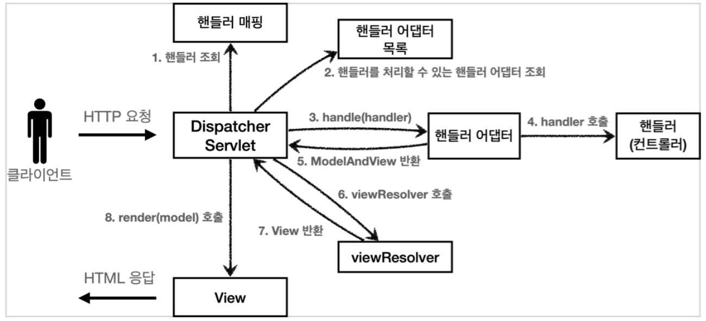

# 06. 스프링 MVC 기본 기능

## 프로젝트 생성

https://start.spring.io 에서 스프링 프로젝트를 생성한다.

* 프로젝트 선택 
    * Project: Gradle Project 
    * Language: Java 
    * Spring Boot: 2.4.x 
* Project Metadata 
    * Group: hello 
    * Artifact: springmvc 
    * Name: springmvc 
    * Package name: hello.springmvc 
    * Packaging: Jar (주의!) 
    * Java: 11


### Jar를 선택하는 이유

Packaging는 War가 아니라 Jar를 한다. JSP를 사용하지 않기 때문에 Jar를 사용하는 것이 좋다. Jar를 사용하면 항상 내장 서버(톰캣등)을 사용하고, webapp 경로도 사용하지 않는다. 내장 서버 사용에 최적화 되어 있는 기능이다. War를 사용하면 내장 서버도 사용가능 하지만, 주로 외부 서버에 배포하는 목적으로 사용한다.


### Welcome 페이지 만들기

`/resources/static/index.hml` 

``` html
<!DOCTYPE html>
<html>
<head>
  <meta charset="UTF-8">
  <title>Title</title>
</head>
<body>
<ul>
  <li>로그 출력
    <ul>
      <li><a href="/log-test">로그 테스트</a></li>
    </ul>
  </li>
  <!-- -->
  <li>요청 매핑
    <ul>
      <li><a href="/hello-basic">hello-basic</a></li>
      <li><a href="/mapping-get-v1">HTTP 메서드 매핑</a></li>
      <li><a href="/mapping-get-v2">HTTP 메서드 매핑 축약</a></li>
      <li><a href="/mapping/userA">경로 변수</a></li>
      <li><a href="/mapping/users/userA/orders/100">경로 변수 다중</a></li>
      <li><a href="/mapping-param?mode=debug">특정 파라미터 조건 매핑</a></li>
      <li><a href="/mapping-header">특정 헤더 조건 매핑(POST MAN 필요)</a></
      li>
      <li><a href="/mapping-consume">미디어 타입 조건 매핑 Content-Type(POST
        MAN 필요)</a></li>
      <li><a href="/mapping-produce">미디어 타입 조건 매핑 Accept(POST MAN
        필요)</a></li>
    </ul>
  </li>
  <li>요청 매핑 - API 예시
    <ul>
      <li>POST MAN 필요</li>
    </ul>
  </li>
  <li>HTTP 요청 기본
    <ul>
      <li><a href="/headers">기본, 헤더 조회</a></li>
    </ul>
  </li>
  <li>HTTP 요청 파라미터
    <ul>
      <li><a href="/request-param-v1?username=hello&age=20">요청 파라미터
        v1</a></li>
      <li><a href="/request-param-v2?username=hello&age=20">요청 파라미터
        v2</a></li>
      <li><a href="/request-param-v3?username=hello&age=20">요청 파라미터
        v3</a></li>
      <li><a href="/request-param-v4?username=hello&age=20">요청 파라미터
        v4</a></li>
      <li><a href="/request-param-required?username=hello&age=20">요청
        파라미터 필수</a></li>
      <li><a href="/request-param-default?username=hello&age=20">요청
        파라미터 기본 값</a></li>
      <li><a href="/request-param-map?username=hello&age=20">요청 파라미터
        MAP</a></li>
      <li><a href="/model-attribute-v1?username=hello&age=20">요청 파라미터
        @ModelAttribute v1</a></li>
      <li><a href="/model-attribute-v2?username=hello&age=20">요청 파라미터
        @ModelAttribute v2</a></li>
    </ul>
  </li>
  <li>HTTP 요청 메시지
    <ul>
      <li>POST MAN</li>
    </ul>
  </li>
  <li>HTTP 응답 - 정적 리소스, 뷰 템플릿
    <ul>
      <li><a href="/basic/hello-form.html">정적 리소스</a></li>
      <li><a href="/response-view-v1">뷰 템플릿 v1</a></li>
      <li><a href="/response-view-v2">뷰 템플릿 v2</a></li>
    </ul>
  </li>
  <li>HTTP 응답 - HTTP API, 메시지 바디에 직접 입력
    <ul>
      <li><a href="/response-body-string-v1">HTTP API String v1</a></li>
      <li><a href="/response-body-string-v2">HTTP API String v2</a></li>
      <li><a href="/response-body-string-v3">HTTP API String v3</a></li>
      <li><a href="/response-body-json-v1">HTTP API Json v1</a></li>
      <li><a href="/response-body-json-v2">HTTP API Json v2</a></li>
    </ul>
  </li>
</ul>
</body>
</html>
```


## 로깅 간단히 알아보기

### 로깅 라이브러리

스프링 부트 라이브러리를 사용하면 스프링 부트 로깅 라이브러리( spring-boot-starter-logging )가 함께 포함된다. 스프링 부트 로깅 라이브러리는 기본으로 다음 로깅 라이브러리를 사용한다.

* SLF4J - http://www.slf4j.org 
* Logback - http://logback.qos.ch


로그 라이브러리는 Logback, Log4J, Log4J2 등등 수 많은 라이브러리가 있는데, 그것을 통합해서 인터페이스로 제공하는 것이 바로 SLF4J 라이브러리다. 

쉽게 이야기해서 SLF4J는 인터페이스이고, 그 구현체로 Logback 같은 로그 라이브러리를 선택하면 된다. 실무에서는 스프링 부트가 기본으로 제공하는 Logback을 대부분 사용한다.


### 로그 선언

```java
// 1.
private Logger log = LoggerFactory.getLogger(getClass()); 

// 2.
private static final Logger log = LoggerFactory.getLogger(Xxx.class);

// 3.
@Slf4j // 롬복 사용 가능
```


### 로그 LEVEL

로그 LEVEL은 다음과 같은 순서로 5가지가 존재한다.

```
TRACE > DEBUG > INFO > WARN > ERROR
```


기본 로그 LEVEL은 info이기 때문에 TRACE 와DEBUG는 남지않는다.

로그 LEVEL을 설정할 수 있다.

`application.properties`

``` properties
#전체 로그 레벨 설정(기본 info)
logging.level.root=info
#hello.springmvc 패키지와 그 하위 로그 레벨 설정
logging.level.hello.springmvc=debug
```


### 올바른 로그 사용법

``` java
// 로그 출력 레벨을 info로 설정해도 해당 코드에 있는 "data="+data가 실제 실행이 되어 버린다. 결과적으로 문자 더하기 연산이 발생한다.
log.debug("data="+data);

// 로그 출력 레벨을 info로 설정하면 아무일도 발생하지 않는다. 따라서 앞과 같은 의미없는 연산이 발생하지 않는다.
log.debug("data={}", data);
```


## 요청 매핑

### 기본 매핑

``` java
package hello.springmvc.basic.requestmapping;

import org.springframework.web.bind.annotation.RequestMapping;
import org.springframework.web.bind.annotation.RestController;

@RestController
public class MappingController {

    /**
     * 기본 요청
     * 둘다 허용 /hello-basic, /hello-basic/
     * HTTP 메서드 모두 허용 GET, HEAD, POST, PUT, PATCH, DELETE
     */
    @RequestMapping("/hello-basic")
    public String helloBasic() {
        return "ok";
    }
}
```

* @RestController
    * @Controller 는 반환 값이 String 이면 뷰 이름으로 인식된다. 그래서 뷰를 찾고 뷰가 랜더링 된다
    * @RestController 는 반환 값으로 뷰를 찾는 것이 아니라, HTTP 메시지 바디에 바로 입력한다. 
* @RequestMapping("/hello-basic")
    * /hello-basic URL 호출이 오면 이 메서드가 실행되도록 매핑한다. 이 때 스프링이 /hello-basic/도 같이 매핑한다.
    * method 속성으로 HTTP 메서드를 지정하지 않으면 HTTP 메서드와 무관하게 호출된다.
    * method 속성 대신 메서드 매핑 축약 애노테이션이 존재한다.
        * @GetMapping, @PostMapping


### PathVariable

``` java
@GetMapping("/mapping/{userId}")
public String mappingPath(@PathVariable("userId") String userId) {
    return "ok";
}
```

* 이 때 @PathVariable 의 이름과 파라미터 이름이 같으면 @PathVariable의 매개변수는 생략할 수 있다. :  `@PathVariable String userId`


### 특별한 매핑

특정한 조건에 맞춰 매핑 할 수 있다.

* query parameter 매핑

    ``` java
    @GetMapping(value = "/mapping-param", params = "mode=debug")
    public String mappingParam() {
    log.info("mappingParam");
        return "ok";
    }
    ```

    http://localhost:8080/mapping-param?mode=debug에 매핑된다.

* 특정 헤더 조건 매핑

    ``` java
    @GetMapping(value = "/mapping-header", headers = "mode=debug")
    public String mappingHeader() {
        log.info("mappingHeader");
        return "ok";
    }
    ```

* HTTP 요청 Content-Type 매핑

    ```java
    @PostMapping(value = "/mapping-consume", consumes = "application/json")
    public String mappingConsumes() {
        log.info("mappingConsumes");
        return "ok";
    }
    ```

* HTTP 요청 Accept 매핑

    ``` java
    @PostMapping(value = "/mapping-produce", produces = "text/html")
    public String mappingProduces() {
        log.info("mappingProduces");
        return "ok";
    }
    ```

    


## 요청 매핑 - API 예시

### 회원 관리 API 회원 

* 목록 조회: GET /users 
* 회원 등록: POST /users 
* 회원 조회: GET /users/{userId} 
* 회원 수정: PATCH /users/{userId} 
* 회원 삭제: DELETE /users/{userId}


### MappingClassController

``` java
package hello.springmvc.basic.requestmapping;
import org.springframework.web.bind.annotation.*;
@RestController
@RequestMapping("/mapping/users")
public class MappingClassController {
    /**
     * GET /mapping/users
     */
    @GetMapping
    public String users() {
        return "get users";
    }

    /**
     * POST /mapping/users
     */
    @PostMapping
    public String addUser() {
        return "post user";
    }

    /**
     * GET /mapping/users/{userId}
     */
    @GetMapping("/{userId}")
    public String findUser(@PathVariable String userId) {
        return "get userId=" + userId;
    }

    /**
     * PATCH /mapping/users/{userId}
     */
    @PatchMapping("/{userId}")
    public String updateUser(@PathVariable String userId) {
        return "update userId=" + userId;
    }
    
    /**
     * DELETE /mapping/users/{userId}
     */
    @DeleteMapping("/{userId}")
    public String deleteUser(@PathVariable String userId) {
        return "delete userId=" + userId;
    }
}
```


## HTTP 요청 - 기본, 헤더 조회

애노테이션 기반의 스프링 컨트롤러는 다양한 파라미터를 지원한다.


### RequestHeaderController

``` java
package hello.springmvc.basic.request;
import lombok.extern.slf4j.Slf4j;
import org.springframework.http.HttpMethod;
import org.springframework.util.MultiValueMap;
import org.springframework.web.bind.annotation.*;
import javax.servlet.http.HttpServletRequest;
import javax.servlet.http.HttpServletResponse;
import java.util.Locale;

@Slf4j
@RestController
public class RequestHeaderController {
    @RequestMapping("/headers")
    public String headers(HttpServletRequest request,
                          HttpServletResponse response,
                          HttpMethod httpMethod,
                          Locale locale,
                          @RequestHeader MultiValueMap<String, String> headerMap,
                          @RequestHeader("host") String host,
                          @CookieValue(value = "myCookie", required = false) String cookie) {
        log.info("request={}", request);
        log.info("response={}", response);
        log.info("httpMethod={}", httpMethod);
        log.info("locale={}", locale);
        log.info("headerMap={}", headerMap);
        log.info("header host={}", host);
        log.info("myCookie={}", cookie);
        return "ok";
    }
}
```

``` 
request=org.apache.catalina.connector.RequestFacade@9291f8b
response=org.apache.catalina.connector.ResponseFacade@299bfa93
httpMethod=GET
locale=ko_KR
headerMap={host=[localhost:8080], connection=[keep-alive], sec-ch-ua=[" Not A;Brand";v="99", "Chromium";v="99", "Google Chrome";v="99"], sec-ch-ua-mobile=[?0], sec-ch-ua-platform=["macOS"], upgrade-insecure-requests=[1], user-agent=[Mozilla/5.0 (Macintosh; Intel Mac OS X 10_15_7) AppleWebKit/537.36 (KHTML, like Gecko) Chrome/99.0.4844.51 Safari/537.36], accept =[text/html,application/xhtml+xml,application/xml;q=0.9,image/avif,image/webp,image/apng,*/*;q=0.8,application/signed-exchange;v=b3;q=0.9], sec-fetch-site=[none], sec-fetch-mode=[navigate], sec-fetch-user=[?1], sec-fetch-dest=[document], accept-encoding=[gzip, deflate, br], accept-language=[ko-KR,ko;q=0.9,en-US;q=0.8,en;q=0.7], cookie=[JSESSIONID=ED20D788FDAC62BA7B51EDA117AB631F]}
header host=localhost:8080
myCookie=null
```

* MultiValueMap : Map과 유사하며 하나의 키에 여러 값을 받을 수 있다.


## HTTP 요청 파라미터 - 쿼리 파라미터, HTML Form

GET 쿼리 파라미터나 POST HTML Form 모두 HttpServletRequest가 제공하는 `getParameter` 를 통해서 값을 받을 수 있다.

``` java
package hello.springmvc.basic.request;
import lombok.extern.slf4j.Slf4j;
import org.springframework.stereotype.Controller;
import org.springframework.web.bind.annotation.*;
import javax.servlet.http.HttpServletRequest;
import javax.servlet.http.HttpServletResponse;
import java.io.IOException;

@Slf4j
@Controller
public class RequestParamController {
    /**
     * 반환 타입이 없으면서 이렇게 응답에 값을 직접 집어넣으면, view 조회X
     */
    @RequestMapping("/request-param-v1")
    public void requestParamV1(HttpServletRequest request, HttpServletResponse response) throws IOException {
        String username = request.getParameter("username");
        int age = Integer.parseInt(request.getParameter("age"));
        log.info("username={}, age={}", username, age);
        
        response.getWriter().write("ok");
    }
}
```


## HTTP 요청 파라미터 - @RequestParam

@RequestParam을 사용하면 요청 파라미터를 편리하게 사용할 수 있다.

``` java
@ResponseBody
@RequestMapping("/request-param-v2")
public String requestParamV2(
    @RequestParam("username") String memberName,
    @RequestParam("age") int memberAge) {
    log.info("username={}, age={}", memberName, memberAge);
    return "ok";
}
```

* @ResponseBody : View 조회를 무시하고 HTTP message body에 직접 해당 내용 입력


``` java
@ResponseBody
@RequestMapping("/request-param-v3")
public String requestParamV3(
    @RequestParam String username,
    @RequestParam int age) {
    log.info("username={}, age={}", username, age);
    return "ok";
}
```

* HTTP 파라미터 이름이 변수 이름과 같으면 @RequestParam(name="xx") 생략 가능
* 이 때 String, int, Integer 등의 단순 타입이면 @RequestParam도 생략 가능


### 파라미터 필수 여부 

```java
@ResponseBody
@RequestMapping("/request-param-required")
public String requestParamRequired(
    @RequestParam(required = true) String username,
    @RequestParam(required = false) Integer age) {
    log.info("username={}, age={}", username, age);
    return "ok";
}
```

* required = true가 default
* 파라미터가 없으면 400 예외가 발생
* `/request-param?username=` 와 같이 이름만 있고 값이 없는 경우 빈문자 ""로 통과
* required = false인 경우, 값이 넘어오지 않으면 null 입력
    * 만약 int 등의 기본 자료형이면 null이 들어갈 수 없으므로 500 예외 발생


### 기본 값 설정

``` java
@ResponseBody
@RequestMapping("/request-param-default")
public String requestParamDefault(
    @RequestParam(required = true, defaultValue = "guest") String username,
    @RequestParam(required = false, defaultValue = "-1") int age) {
    log.info("username={}, age={}", username, age);
    return "ok";
}
```

* 파라미터 값이 없는 경우 defaultValue를 사용하면 기본 값을 적용
* required는 의미가 없다.


### 파라미터를 Map으로 조회하기 - requestParamMap

``` java
@ResponseBody
@RequestMapping("/request-param-map")
public String requestParamMap(@RequestParam Map<String, Object> paramMap) {
    log.info("username={}, age={}", paramMap.get("username"), paramMap.get("age"));
    return "ok";
}
```


## HTTP 요청 파라미터 - @ModelAttribute

### HelloData

``` java
package hello.springmvc.basic;
import lombok.Data;

@Data
public class HelloData {
    private String username;
    private int age;
}
```


### RequestParamController

``` java
@ResponseBody
@RequestMapping("/model-attribute-v1")
public String modelAttributeV1(@ModelAttribute HelloData helloData) {
    log.info("username={}, age={}", helloData.getUsername(),
             helloData.getAge());
    return "ok";
}
```

* @ModelAttribute가 있으면 HelloData 객체를 생성하고 요청 파라미터의 이름으로 객체의 프로퍼티를 찾아 setter를 호출한다.

* age=abc 처럼 숫자가 들어가야 할 곳에 문자를 넣으면 BindException이 발생


### @ModelAttribute 생략 - modelAttributeV2

``` java
@ResponseBody
@RequestMapping("/model-attribute-v2")
public String modelAttributeV2(HelloData helloData) {
    log.info("username={}, age={}", helloData.getUsername(),
             helloData.getAge());
    return "ok";
}
```

* @ModelAttribute는 생략할 수 있다.
* @RequestParam 도 생략할 수 있으니 혼란이 발생할 수 있다.
    * String , int , Integer 같은 단순 타입 = @RequestParam 
    * 나머지 = @ModelAttribute (argument resolver 로 지정해둔 타입 외)


## HTTP 요청 메시지 - 단순 텍스트

### RequestBodyStringController

``` java
package hello.springmvc.basic.request;

import java.io.IOException;
import java.nio.charset.StandardCharsets;

import javax.servlet.ServletInputStream;
import javax.servlet.http.HttpServletRequest;
import javax.servlet.http.HttpServletResponse;

import org.springframework.stereotype.Controller;
import org.springframework.util.StreamUtils;
import org.springframework.web.bind.annotation.PostMapping;

import lombok.extern.slf4j.Slf4j;

@Slf4j
@Controller
public class RequestBodyStringController {
    @PostMapping("/request-body-string-v1")
    public void requestBodyString(HttpServletRequest request,
                                  HttpServletResponse response) throws IOException {
        ServletInputStream inputStream = request.getInputStream();
        String messageBody = StreamUtils.copyToString(inputStream,
                                                      StandardCharsets.UTF_8);
        log.info("messageBody={}", messageBody);
        response.getWriter().write("ok");
    }
}
```

* HttpServletRequest에서 ServletInputStream을 사용하여 직접 읽을 수 있다.


``` java
@PostMapping("/request-body-string-v2")
public void requestBodyStringV2(InputStream inputStream, Writer responseWriter) throws IOException {
    String messageBody = StreamUtils.copyToString(inputStream, StandardCharsets.UTF_8);
    log.info("messageBody={}", messageBody);
    responseWriter.write("ok");
}
```

* inputStream을 직접 받을 수 있다.


``` java
@PostMapping("/request-body-string-v3")
public HttpEntity<String> requestBodyStringV3(HttpEntity<String> httpEntity) {
    String messageBody = httpEntity.getBody();
    log.info("messageBody={}", messageBody);
    return new HttpEntity<>("ok");
}
```

* HttpEntity로 HTTP header, body 정보를 편리하게 조회 
* HttpEntity는 응답에도 사용 가능 
    * 메시지 바디 정보 직접 반환 
    * 헤더 정보 포함 가능 
    * view 조회 X


``` java
@ResponseBody
@PostMapping("/request-body-string-v4")
public String requestBodyStringV4(@RequestBody String messageBody) {
    log.info("messageBody={}", messageBody);
    return "ok";
}
```

* @RequestBody 
    * HTTP 메시지 바디 정보를 편리하게 조회
    * 참고로 헤더 정보가 필요하다면 HttpEntity 를 사용하거나 @RequestHeader 를 사용하면 된다. 


## HTTP 요청 메시지 - JSON

``` java
package hello.springmvc.basic.request;
import com.fasterxml.jackson.databind.ObjectMapper;
import hello.springmvc.basic.HelloData;
import lombok.extern.slf4j.Slf4j;

import org.springframework.stereotype.Controller;
import org.springframework.util.StreamUtils;
import org.springframework.web.bind.annotation.PostMapping;
import org.springframework.web.bind.annotation.RequestBody;
import org.springframework.web.bind.annotation.ResponseBody;

import javax.servlet.ServletInputStream;
import javax.servlet.http.HttpServletRequest;
import javax.servlet.http.HttpServletResponse;
import java.io.IOException;
import java.nio.charset.StandardCharsets;
/**
 * {"username":"hello", "age":20}
 * content-type: application/json
 */
@Slf4j
@Controller
public class RequestBodyJsonController {

    private ObjectMapper objectMapper = new ObjectMapper();

    @PostMapping("/request-body-json-v1")
    public void requestBodyJsonV1(HttpServletRequest request, HttpServletResponse response) throws IOException {
        ServletInputStream inputStream = request.getInputStream();
        String messageBody = StreamUtils.copyToString(inputStream, StandardCharsets.UTF_8);
        log.info("messageBody={}", messageBody);
        
        HelloData data = objectMapper.readValue(messageBody, HelloData.class);
        log.info("username={}, age={}", data.getUsername(), data.getAge());
        response.getWriter().write("ok");
    }
}
```

* HttpServletRequest에서 직접 HTTP 메시지 바디에서 데이터를 읽어와서 문자로 변환
* Jackson 라이브러리인 objectMapper를 사용해서 자바 객체로 변환


``` java
@ResponseBody
@PostMapping("/request-body-json-v2")
public String requestBodyJsonV2(@RequestBody String messageBody) throws IOException {
    HelloData data = objectMapper.readValue(messageBody, HelloData.class);
    log.info("username={}, age={}", data.getUsername(), data.getAge());
    return "ok";
}
```

* @RequestBody 를 사용해서 HTTP 메시지에서 데이터를 꺼내고 messageBody에 저장
* 문자로 된 JSON 데이터인 messageBody 를 objectMapper 를 통해서 자바 객체로 변환


``` java
@ResponseBody
@PostMapping("/request-body-json-v3")
public String requestBodyJsonV3(@RequestBody HelloData data) {
    log.info("username={}, age={}", data.getUsername(), data.getAge());
    return "ok";
}
```

* @RequestBody에 직접 만든 객체를 지정할 수 있다.
* HttpEntity , @RequestBody 를 사용하면 HTTP 메시지 컨버터가 HTTP 메시지 바디의 내용을 우리가 원하는 문자나 객체 등으로 변환해준다.
* @RequestBody는 생략 불가능
    * 생략 시 @ModelAttribute가 적용되어버린다.


``` java
@ResponseBody
@PostMapping("/request-body-json-v5")
public HelloData requestBodyJsonV5(@RequestBody HelloData data) {
    log.info("username={}, age={}", data.getUsername(), data.getAge());
    return data;
}
```

* 응답의 경우에도 @ResponseBody 를 사용하면 해당 객체를 HTTP 메시지 바디에 직접 넣어줄 수 있다.


## 응답 - 정적 리소스, 뷰 템플릿

### 응답 데이터

응답 데이터를 만드는 방법은 크게 3가지이다.

* 정적 리소스 : 웹 브라우저에 정적인 HTML, css, js을 제공할 때는, 정적 리소스를 사용한다. 
* 뷰 템플릿 사용 : 웹 브라우저에 동적인 HTML을 제공할 때는 뷰 템플릿을 사용한다. 
* HTTP 메시지 사용 : HTTP API를 제공하는 경우에는 HTML이 아니라 데이터를 전달해야 하므로, HTTP 메시지 바디에 JSON 같은 형식으로 데이터를 실어 보낸다.


### 정적 리소스

src/main/resources 는 리소스를 보관하는 곳이고, 또 클래스패스의 시작 경로이다. 

따라서 다음 디렉토리에 리소스를 넣어두면 스프링 부트가 정적 리소스로 서비스를 제공한다


### 뷰 템플릿

뷰 템플릿을 거쳐서 HTML이 생성되고, 뷰가 응답을 만들어서 전달한다. 

일반적으로 HTML을 동적으로 생성하는 용도로 사용하지만, 다른 것들도 가능하다

뷰 템플릿 경로 : `src/main/resources/templates`


`src/main/resources/templates/response/hello.html`

``` html
<!DOCTYPE html>
<html xmlns:th="http://www.thymeleaf.org">
<head>
 <meta charset="UTF-8">
 <title>Title</title>
</head>
<body>
<p th:text="${data}">empty</p>
</body>
</html>
```


#### ResponseViewController

``` java
package hello.springmvc.basic.response;

import org.springframework.stereotype.Controller;
import org.springframework.ui.Model;
import org.springframework.web.bind.annotation.RequestMapping;
import org.springframework.web.servlet.ModelAndView;

@Controller
public class ResponseViewController {
    @RequestMapping("/response-view-v1")
    public ModelAndView responseViewV1() {
        ModelAndView mav = new ModelAndView("response/hello")
                .addObject("data", "hello!");
        return mav;
    }

    @RequestMapping("/response-view-v2")
    public String responseViewV2(Model model) {
        model.addAttribute("data", "hello!!");
        return "response/hello";
    }
    
    @RequestMapping("/response/hello")
    public void responseViewV3(Model model) {
        model.addAttribute("data", "hello!!");
    }
}
```

* String을 반환하면 뷰 리졸버가 실행되어서 뷰를 찾고, 렌더링 한다.
* Void를 반환하면 요청 URL을 참고해서 논리 뷰 이름으로 사용한다.


## HTTP 응답 - HTTP API, 메시지 바디에 직접 입력

``` java
package hello.springmvc.basic.response;
import hello.springmvc.basic.HelloData;
import lombok.extern.slf4j.Slf4j;

import org.springframework.http.HttpStatus;
import org.springframework.http.ResponseEntity;
import org.springframework.stereotype.Controller;
import org.springframework.web.bind.annotation.*;

import javax.servlet.http.HttpServletResponse;
import java.io.IOException;

@Slf4j
@Controller
//@RestController
public class ResponseBodyController {

    @GetMapping("/response-body-string-v1")
    public void responseBodyV1(HttpServletResponse response) throws IOException {
        response.getWriter().write("ok");
    }

    /**
     * HttpEntity, ResponseEntity(Http Status 추가)
     * @return
     */
    @GetMapping("/response-body-string-v2")
    public ResponseEntity<String> responseBodyV2() {
        return new ResponseEntity<>("ok", HttpStatus.OK);
    }

    @ResponseBody
    @GetMapping("/response-body-string-v3")
    public String responseBodyV3() {
        return "ok";
    }

    @GetMapping("/response-body-json-v1")
    public ResponseEntity<HelloData> responseBodyJsonV1() {
        HelloData helloData = new HelloData();
        helloData.setUsername("userA");
        helloData.setAge(20);
        return new ResponseEntity<>(helloData, HttpStatus.OK);
    }
    
    @ResponseStatus(HttpStatus.OK)
    @ResponseBody
    @GetMapping("/response-body-json-v2")
    public HelloData responseBodyJsonV2() {
        HelloData helloData = new HelloData();
        helloData.setUsername("userA");
        helloData.setAge(20);
        return helloData;
    }
}
```


### @RestController

@RestController는 @Controller와 @ResponseBody를 둘 다 가지고 있다.

class에 @RestController를 추가하면 뷰 템플릿을 사용하는 것이 아니라 HTTP 메시지 바디에 직접 데이터를 입력한다.

``` java
@Controller
@ResponseBody
public @interface RestController {
```


## HTTP 메시지 컨버터

스프링 MVC는 다음의 경우에 HTTP 메시지 컨버터를 적용한다. 

* HTTP 요청: @RequestBody , HttpEntity(RequestEntity) 
* HTTP 응답: @ResponseBody , HttpEntity(ResponseEntity) 


### HttpMessageConverter

`org.springframework.http.converter.HttpMessageConverter` 

``` java
package org.springframework.http.converter;
public interface HttpMessageConverter<T> {
    boolean canRead(Class<?> clazz, @Nullable MediaType mediaType);
    boolean canWrite(Class<?> clazz, @Nullable MediaType mediaType);
    List<MediaType> getSupportedMediaTypes();
    T read(Class<? extends T> clazz, HttpInputMessage inputMessage)throws IOException, HttpMessageNotReadableException;
    void write(T t, @Nullable MediaType contentType, HttpOutputMessage outputMessage) throws IOException, HttpMessageNotWritableException;
}
```

* HTTP 메시지 컨버터는 HTTP 요청, HTTP 응답 둘 다 사용된다.
* canRead() , canWrite() : 메시지 컨버터가 해당 클래스, 미디어타입을 지원하는지 체크 
* read() , write() : 메시지 컨버터를 통해서 메시지를 읽고 쓰는 기능


### 스프링 부트 기본 메시지 컨버터

``` java
0 = ByteArrayHttpMessageConverter
1 = StringHttpMessageConverter
2 = MappingJackson2HttpMessageConverter
```

* 대상 클래스 타입과 미디어 타입 둘을 체크해서 어느 메시지  컨버터를 사용할 지 결정한다.
* 우선순위는 0 - 1 - 2


|             | ByteArrayHttpMessageConverter | StringHttpMessageConverter | MappingJackson2HttpMessageConverter |
| ----------- | ----------------------------- | -------------------------- | ----------------------------------- |
| 클래스 타입 | byte[]                        | String                     | 객체 or HashMap                     |
| 미디어 타입 | `*/*`                         | `*/*`                      | application/json                    |
| 요청 예     | @RequestBody byte[] data      | @RequestBody String data   | @RequestBody HelloData data         |
| 응답 예     | @ResponseBody return byte[]   | @ResponseBody return "ok"  | @ResponseBody return helloData      |


## 요청 매핑 헨들러 어뎁터 구조

HTTP 메시지 컨버터는 스프링 MVC 어디에서 사용되는지 알아보자.




애노테이션 기반의 컨트롤러, @RequestMapping을 처리하는 핸들러 어댑터인 `RequestMappingHandlerAdapter` 가 HTTP 메시지 컨버터를 사용한다.


### ArgumentResolver

ArgumentResolver를 통해 매우 다양한 파라미터를 사용할 수 있다.

RequestMappingHandlerAdapter는 ArgumentResolver를 호출해서 컨트롤러(핸들러)가 필요로 하는 다양한 파라미터의 값을 생성한다.

``` java
public interface HandlerMethodArgumentResolver {
    boolean supportsParameter(MethodParameter parameter);
    
    @Nullable
    Object resolveArgument(MethodParameter parameter, @Nullable ModelAndViewContainer mavContainer, NativeWebRequest webRequest, @Nullable WebDataBinderFactory binderFactory) throws Exception;
}
```

* supportsParameter를 호출하여 해당 파라미터를 지원하는지 체크하고, 지원하면 resolveArgument를 호출해서 실제 객체를 생성한다. 이 개체가 컨트롤러 호출 시 넘어간다.


### ReturnValueHandler

ArgumentResolver와 유사하게 응답 값을 변환하고 처리한다.


### HTTP 메시지 컨버터


* ArgumentResolver와 ReturnValueHandler가 HTTP 메시지 컨버터를 호출하여 사용한다.