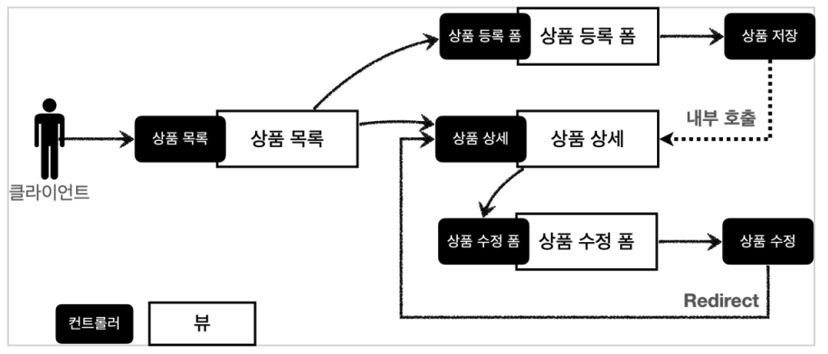
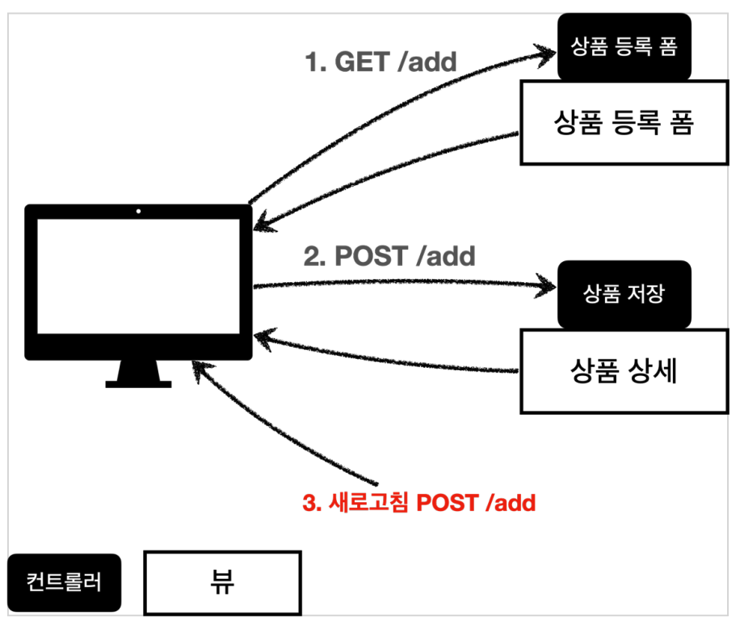
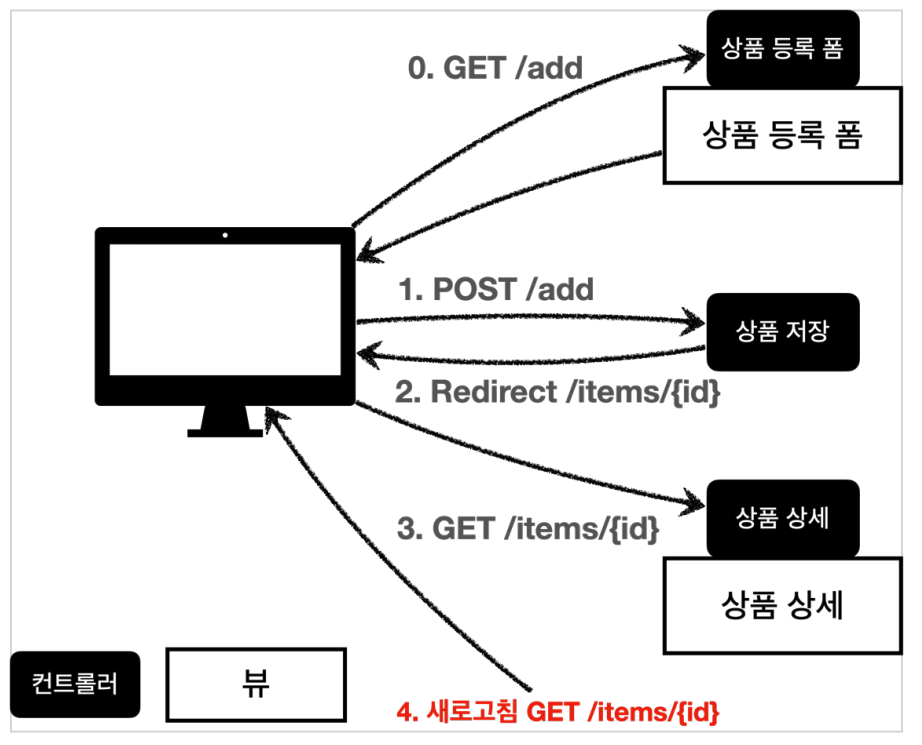

# 07. 스프링 MVC 웹 페이지 만들기

## 프로젝트 생성

https://start.spring.io 에서 스프링 프로젝트를 생성한다.

* 프로젝트 선택 
    * Project: Gradle Project 
    * Language: Java 
    * Spring Boot: 2.4.x 
* Project Metadata 
    * Group: hello 
    * Artifact: item-service 
    * Name: item-service
    * Package name: hello.item-service
    * Packaging: Jar (주의!) 
    * Java: 11
* Dependencies : Spring Web, Thymeleaf, Lombok


### Welcome 페이지 추가

`/resources/static/index.html`

``` html
<!DOCTYPE html>
<html>
<head>
  <meta charset="UTF-8">
  <title>Title</title>
</head>
<body>
<ul>
  <li>상품 관리
    <ul>
      <li><a href="/basic/items">상품 관리 - 기본</a></li>
    </ul>
  </li>
</ul>
</body>
</html>
```


## 요구사항 분석

상품을 관리할 수 있는 서비스를 만든다.

* 상품 도메인 모델 
    * 상품 ID 
    * 상품명 
    * 가격 
    * 수량 
* 상품 관리 기능 
    * 상품 목록 
    * 상품 상세 
    * 상품 등록 
    * 상품 수정




## 상품 서비스 HTML

### 부트스트랩

https://getbootstrap.com/docs/5.0/getting-started/download/ Compiled CSS and JS 항목을 다운로드하고 bootstrap.min.css 를 복사해서 `resources/static/css/bootstrap.min.css` 에 추가


### 상품 목록

`resources/static/html/items.html`

``` html
<!DOCTYPE HTML>
<html>
<head>
  <meta charset="utf-8">
  <link href="../css/bootstrap.min.css" rel="stylesheet">
</head>
<body>
<div class="container" style="max-width: 600px">
  <div class="py-5 text-center">
    <h2>상품 목록</h2>
  </div>
  <div class="row">
    <div class="col">
      <button class="btn btn-primary float-end"
              onclick="location.href='addForm.html'" type="button">상품
        등록</button>
    </div>
  </div>
  <hr class="my-4">
  <div>
    <table class="table">
      <thead>
      <tr>
        <th>ID</th>
        <th>상품명</th>
        <th>가격</th>
        <th>수량</th>
      </tr>
      </thead>
      <tbody>
      <tr>
        <td><a href="item.html">1</a></td>
        <td><a href="item.html">테스트 상품1</a></td>
        <td>10000</td>
        <td>10</td>
      </tr>
      <tr>
        <td><a href="item.html">2</a></td>
        <td><a href="item.html">테스트 상품2</a></td>
        <td>20000</td>
        <td>20</td>
      </tr>
      </tbody>
    </table>
  </div>
</div> <!-- /container -->
</body>
</html>
```


### 상품 상세

`resources/static/html/item.html`

``` html
<!DOCTYPE HTML>
<html>
<head>
  <meta charset="utf-8">
  <link href="../css/bootstrap.min.css" rel="stylesheet">
  <style>
    .container {
      max-width: 560px;
    }
  </style>
</head>
<body>
<div class="container">
  <div class="py-5 text-center">
    <h2>상품 상세</h2>
  </div>
  <div>
    <label for="itemId">상품 ID</label>
    <input type="text" id="itemId" name="itemId" class="form-control"
           value="1" readonly>
  </div>
  <div>
    <label for="itemName">상품명</label>
    <input type="text" id="itemName" name="itemName" class="form-control"
           value="상품A" readonly>
  </div>
  <div>
    <label for="price">가격</label>
    <input type="text" id="price" name="price" class="form-control"
           value="10000" readonly>
  </div>
  <div>
    <label for="quantity">수량</label>
    <input type="text" id="quantity" name="quantity" class="form-control"
           value="10" readonly>
  </div>
  <hr class="my-4">
  <div class="row">
    <div class="col">
      <button class="w-100 btn btn-primary btn-lg"
              onclick="location.href='editForm.html'" type="button">상품 수정</button>
    </div>
    <div class="col">
      <button class="w-100 btn btn-secondary btn-lg"
              onclick="location.href='items.html'" type="button">목록으로</button>
    </div>
  </div>
</div> <!-- /container -->
</body>
</html>
```


### 상품 등록 폼

`resources/static/html/addForm.html`

``` html
<!DOCTYPE HTML>
<html>
<head>
  <meta charset="utf-8">
  <link href="../css/bootstrap.min.css" rel="stylesheet">
  <style>
    .container {
      max-width: 560px;
    }
  </style>
</head>
<body>
<div class="container">
  <div class="py-5 text-center">
    <h2>상품 등록 폼</h2>
  </div>
  <h4 class="mb-3">상품 입력</h4>
  <form action="item.html" method="post">
    <div>
      <label for="itemName">상품명</label>
      <input type="text" id="itemName" name="itemName" class="formcontrol" placeholder="이름을 입력하세요">
    </div>
    <div>
      <label for="price">가격</label>
      <input type="text" id="price" name="price" class="form-control"
             placeholder="가격을 입력하세요">
    </div>
    <div>
      <label for="quantity">수량</label>
      <input type="text" id="quantity" name="quantity" class="formcontrol" placeholder="수량을 입력하세요">
    </div>
    <hr class="my-4">
    <div class="row">
      <div class="col">
        <button class="w-100 btn btn-primary btn-lg" type="submit">상품
          등록</button>
      </div>
      <div class="col">
        <button class="w-100 btn btn-secondary btn-lg"
                onclick="location.href='items.html'" type="button">취소</button>
      </div>
    </div>
  </form>
</div> <!-- /container -->
</body>
</html>
```


### 상품 수정 폼

`resources/static/html/editForm.html`

``` html
<!DOCTYPE HTML>
<html>
<head>
  <meta charset="utf-8">
  <link href="../css/bootstrap.min.css" rel="stylesheet">
  <style>
    .container {
      max-width: 560px;
    }
  </style>
</head>
<body>
<div class="container">
  <div class="py-5 text-center">
    <h2>상품 수정 폼</h2>
  </div>
  <form action="item.html" method="post">
    <div>
      <label for="id">상품 ID</label>
      <input type="text" id="id" name="id" class="form-control" value="1"
             readonly>
    </div>
    <div>
      <label for="itemName">상품명</label>
      <input type="text" id="itemName" name="itemName" class="formcontrol" value="상품A">
    </div>
    <div>
      <label for="price">가격</label>
      <input type="text" id="price" name="price" class="form-control"
             value="10000">
    </div>
    <div>
      <label for="quantity">수량</label>
      <input type="text" id="quantity" name="quantity" class="formcontrol" value="10">
    </div>
    <hr class="my-4">
    <div class="row">
      <div class="col">
        <button class="w-100 btn btn-primary btn-lg" type="submit">저장
        </button>
      </div>
      <div class="col">
        <button class="w-100 btn btn-secondary btn-lg"
                onclick="location.href='item.html'" type="button">취소</button>
      </div>
    </div>
  </form>
</div> <!-- /container -->
</body>
</html>
```


## 상품 목록 - 타임리프

### BasicItemController

``` java
package hello.itemservice.web.basic;

import java.util.List;

import javax.annotation.PostConstruct;

import org.springframework.stereotype.Controller;
import org.springframework.ui.Model;
import org.springframework.web.bind.annotation.GetMapping;
import org.springframework.web.bind.annotation.RequestMapping;

import hello.itemservice.domain.item.Item;
import hello.itemservice.domain.item.ItemRepository;
import lombok.RequiredArgsConstructor;

@Controller
@RequestMapping("basic/items")
@RequiredArgsConstructor
public class BasicItemController {
    private final ItemRepository itemRepository;

    @GetMapping
    public String items(Model model) {
        List<Item> items = itemRepository.findAll();
        model.addAttribute("items", items);
        return "basic/items";
    }

//    테스트용 데이터 추가
    @PostConstruct
    public void init() {
        itemRepository.save(new Item("testA", 10000, 10));
        itemRepository.save(new Item("testB", 20000, 20));
    }
}
```


### 상품 목록

`/resources/templates/basic/items.html`

``` html
<!DOCTYPE HTML>
<html xmlns:th="http://www.thymeleaf.org">
<head>
  <meta charset="utf-8">
  <link href="../css/bootstrap.min.css"
        th:href="@{/css/bootstrap.min.css}" rel="stylesheet">
</head>
<body>
<div class="container" style="max-width: 600px">
  <div class="py-5 text-center">
    <h2>상품 목록</h2>
  </div>
  <div class="row">
    <div class="col">
      <button class="btn btn-primary float-end"
              onclick="location.href='addForm.html'"
              th:onclick="|location.href='@{/basic/items/add}'|"
              type="button">상품 등록</button>
    </div>
  </div>
  <hr class="my-4">
  <div>
    <table class="table">
      <thead>
      <tr>
        <th>ID</th>
        <th>상품명</th>
        <th>가격</th>
        <th>수량</th>
      </tr>
      </thead>
      <tbody>
      <tr th:each="item : ${items}">
        <td><a href="item.html" th:href="@{/basic/items/{itemId}
(itemId=${item.id})}" th:text="${item.id}">회원id</a></td>
        <td><a href="item.html" th:href="@{|/basic/items/${item.id}|}"
               th:text="${item.itemName}">상품명</a></td>
        <td th:text="${item.price}">10000</td>
        <td th:text="${item.quantity}">10</td>
      </tr>
      </tbody>
    </table>
  </div>
</div> <!-- /container -->
</body>
</html>
```


## 상품 상세

### BasicItemController에 추가

``` java
@GetMapping("/{itemId}")
public String item(@PathVariable long itemId, Model model) {
    Item item = itemRepository.findById(itemId);
    model.addAttribute("item", item);
    return "basic/item";
}
```


### 상품 상세 뷰

`/resources/templates/basic/item.html`

``` html
<!DOCTYPE HTML>
<html xmlns:th="http://www.thymeleaf.org">
<head>
  <meta charset="utf-8">
  <link href="../css/bootstrap.min.css"
        th:href="@{/css/bootstrap.min.css}" rel="stylesheet">
  <style>
    .container {
      max-width: 560px;
    }
  </style>
</head>
<body>
<div class="container">
  <div class="py-5 text-center">
    <h2>상품 상세</h2>
  </div>
  <div>
    <label for="itemId">상품 ID</label>
    <input type="text" id="itemId" name="itemId" class="form-control"
           value="1" th:value="${item.id}" readonly>
  </div>
  <div>
    <label for="itemName">상품명</label>
    <input type="text" id="itemName" name="itemName" class="form-control"
           value="상품A" th:value="${item.itemName}" readonly>
  </div>
  <div>
    <label for="price">가격</label>
    <input type="text" id="price" name="price" class="form-control"
           value="10000" th:value="${item.price}" readonly>
  </div>
  <div>
    <label for="quantity">수량</label>
    <input type="text" id="quantity" name="quantity" class="form-control"
           value="10" th:value="${item.quantity}" readonly>
  </div>
  <hr class="my-4">
  <div class="row">
    <div class="col">
      <button class="w-100 btn btn-primary btn-lg"
              onclick="location.href='editForm.html'"
              th:onclick="|location.href='@{/basic/items/{itemId}/
edit(itemId=${item.id})}'|" type="button">상품 수정</button>
    </div>
    <div class="col">
      <button class="w-100 btn btn-secondary btn-lg"
              onclick="location.href='items.html'"
              th:onclick="|location.href='@{/basic/items}'|"
              type="button">목록으로</button>
    </div>
  </div>
</div> <!-- /container -->
</body>
</html>
```


## 상품 등록 폼

### BasicItemController에 추가

``` java
@GetMapping("/add")
public String addForm() {
    return "basic/addForm";
}
```


### 상품 등록 폼 뷰

`/resources/templates/basic/addForm.html`

``` html
<!DOCTYPE HTML>
<html xmlns:th="http://www.thymeleaf.org">
<head>
  <meta charset="utf-8">
  <link href="../css/bootstrap.min.css"
        th:href="@{/css/bootstrap.min.css}" rel="stylesheet">
  <style>
    .container {
      max-width: 560px;
    }
  </style>
</head>
<body>
<div class="container">
  <div class="py-5 text-center">
    <h2>상품 등록 폼</h2>
  </div>
  <h4 class="mb-3">상품 입력</h4>
  <form action="item.html" th:action method="post">
    <div>
      <label for="itemName">상품명</label>
      <input type="text" id="itemName" name="itemName" class="form-control" placeholder="이름을 입력하세요">
    </div>
    <div>
      <label for="price">가격</label>
      <input type="text" id="price" name="price" class="form-control"
             placeholder="가격을 입력하세요">
    </div>
    <div>
      <label for="quantity">수량</label>
      <input type="text" id="quantity" name="quantity" class="form-control" placeholder="수량을 입력하세요">
    </div>
    <hr class="my-4">
    <div class="row">
      <div class="col">
        <button class="w-100 btn btn-primary btn-lg" type="submit">상품
          등록</button>
      </div>
      <div class="col">
        <button class="w-100 btn btn-secondary btn-lg"
                onclick="location.href='items.html'"
                th:onclick="|location.href='@{/basic/items}'|"
                type="button">취소</button>
      </div>
    </div>
  </form>
</div> <!-- /container -->
</body>
</html>
```


## 상품 등록 처리 - @ModelAttribute

### 상품 등록 폼

상품 등록 폼에서 데이터가 어떻게 넘어오는지 확인한다.

* content-type: application/x-www-form-urlencoded 
* 메시지 바디에 쿼리 파리미터 형식으로 전달 
    * itemName=itemA&price=10000&quantity=10


### 상품 등록 처리 - @RequestParam

``` java
@PostMapping("add")
public String addItemV1(@RequestParam String itemName,
                        @RequestParam int price,
                        @RequestParam Integer quantity,
                        Model model) {
    Item item = new Item();
    item.setItemName(itemName);
    item.setPrice(price);
    item.setQuantity(quantity);
    
    itemRepository.save(item);
    
    model.addAttribute("item", item);
    return "basic/item";
}
```


### 상품 등록 처리 - @ModelAttribute

``` java
@PostMapping("add")
public String addItemV2(@ModelAttribute Item item) {
    itemRepository.save(item);
    return "basic/item";
}
```

* @ModelAttribute을 사용하면 크게 2가지 역할을 한다.
    * Item 객체를 생성하고 요청 파라미터의 값을 setXxx로 입력
    * model에 객체를 추가 : model.addAttribute("item", item);


## 상품 수정

### 상품 수정 처리

``` java
@GetMapping("/{itemId}/edit")
public String editForm(@PathVariable Long itemId, Model model) {
    Item item = itemRepository.findById(itemId);
    model.addAttribute("item", item);
    return "basic/editForm";
}

@PostMapping("/{itemId}/edit")
public String edit(@PathVariable Long itemId, @ModelAttribute Item item) {
    itemRepository.update(itemId, item);
    return "redirect:/basic/items/{itemId}";
}
```

* redirect : redirect:/basic/items/{itemId}
    * 이 때 @PathVariable의 값을 사용할 수 있다.


### 상품 수정 폼

`/resources/templates/basic/editForm.html`

``` html
<!DOCTYPE HTML>
<html xmlns:th="http://www.thymeleaf.org">
<head>
  <meta charset="utf-8">
  <link href="../css/bootstrap.min.css"
        th:href="@{/css/bootstrap.min.css}" rel="stylesheet">
  <style>
    .container {
      max-width: 560px;
    }
  </style>
</head>
<body>
<div class="container">
  <div class="py-5 text-center">
    <h2>상품 수정 폼</h2>
  </div>
  <form action="item.html" th:action method="post">
    <div>
      <label for="id">상품 ID</label>
      <input type="text" id="id" name="id" class="form-control" value="1"
             th:value="${item.id}" readonly>
    </div>
    <div>
      <label for="itemName">상품명</label>
      <input type="text" id="itemName" name="itemName" class="form-control" value="상품A" th:value="${item.itemName}">
    </div>
    <div>
      <label for="price">가격</label>
      <input type="text" id="price" name="price" class="form-control"
             th:value="${item.price}">
    </div>
    <div>
      <label for="quantity">수량</label>
      <input type="text" id="quantity" name="quantity" class="form-control" th:value="${item.quantity}">
    </div>
    <hr class="my-4">
    <div class="row">
      <div class="col">
        <button class="w-100 btn btn-primary btn-lg" type="submit">저장
        </button>
      </div>
      <div class="col">
        <button class="w-100 btn btn-secondary btn-lg"
                onclick="location.href='item.html'"
                th:onclick="|location.href='@{/basic/items/{itemId}(itemId=${item.id})}'|"
                type="button">취소</button>
      </div>
    </div>
  </form>
</div> <!-- /container -->
</body>
</html>
```


## PRG Post/Redirect/Get

### 문제점

상품 등록을 완료하고 웹 브라우저의 새로고침 버튼을 클릭해보자. 

상품이 계속해서 중복 등록되는 것을 확인할 수 있다




위 이미지와 같이 새로고침 시 POST /add가 반복되서 호출되기 때문에 문제가 발생한다.


### PRG

새로고침 시 GET으로 전송하도록 수정하자.



```java
@PostMapping("add")
public String addItemV2(@ModelAttribute Item item) {
    itemRepository.save(item);
    return "redirect:/basic/item/" + item.getId();
}
```


## RedirectAttributes

``` java
@PostMapping("add")
public String addItemV3(@ModelAttribute Item item, RedirectAttributes redirectAttributes) {
    Item savedItem = itemRepository.save(item);
    redirectAttributes.addAttribute("itemId", savedItem.getId());
    redirectAttributes.addAttribute("status", true);
    return "redirect:/basic/item/{itemId}";
}
```

* RedirectAttributes 를 사용하면 URL 인코딩도 해주고, pathVarible , 쿼리 파라미터까지 처리해준다.
    * itemId는 사용했으므로 pathVariable에 바인딩된다.
    * status는 사용하지 않았으므로 쿼리 파라미터로 처리된다.


### 뷰 템플릿 메시지 추가

`resources/templates/basic/item.html`

``` html
<h2 th:if="${param.status}" th:text="'저장 완료!'"></h2>
```

