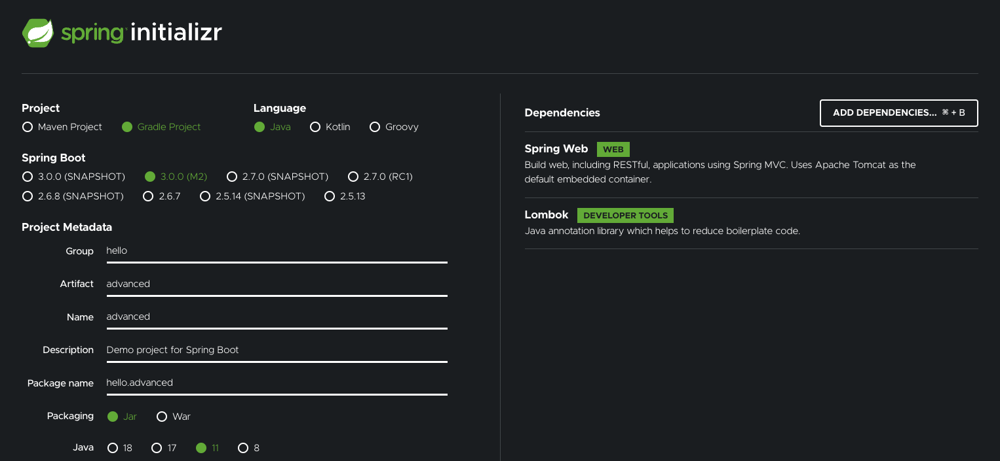

# 01. 프로젝트 생성




# 02. 예제 프로젝트 만들기 - V0

### OrderRepositoryV0

``` java
package hello.advanced.app.v0;

import org.springframework.stereotype.Repository;

import lombok.RequiredArgsConstructor;

@Repository
@RequiredArgsConstructor
public class OrderRepositoryV0 {

    public void save(String itemId) {
        if (itemId.equals("ex")) {
            throw new IllegalStateException("예외 발생!");
        }
        sleep(1000);
    }

    private void sleep(int millis) {
        try {
            Thread.sleep(millis);
        } catch (InterruptedException e) {
            e.printStackTrace();
        }
    }
}
```

* sleep(1000) : 리포지토리는 상품을 저장하는데 약 1초 정도 걸리는 것으로 가정하기 위해 1초 지연을 주었다.


### OrderServiceV0

```java
package hello.advanced.app.v0;

import org.springframework.stereotype.Service;

import lombok.RequiredArgsConstructor;

@Service
@RequiredArgsConstructor
public class OrderServiceV0 {

    private final OrderRepositoryV0 orderRepository;

    public void orderItem(String itemId) {
        orderRepository.save(itemId);
    }
}
```


### OrderControllerV0

```java
package hello.advanced.app.v0;

import org.springframework.web.bind.annotation.GetMapping;
import org.springframework.web.bind.annotation.RestController;

import lombok.RequiredArgsConstructor;

@RestController
@RequiredArgsConstructor
public class OrderControllerV0 {
    private final OrderServiceV0 orderService;

    @GetMapping("/v0/request")
    public String request(String itemId) {
        orderService.orderItem(itemId);
        return "ok";
    }
}
```

* http://localhost:8080/v0/request?itemId=abc


# 03. 로그 추적기 - 요구사항 분석

### 요구사항 

* 모든 PUBLIC 메서드의 호출과 응답 정보를 로그로 출력 
* 애플리케이션의 흐름을 변경하면 안됨
    * 로그를 남긴다고 해서 비즈니스 로직의 동작에 영향을 주면 안됨 
* 메서드 호출에 걸린 시간
* 정상 흐름과 예외 흐름 구분
    * 예외 발생시 예외 정보가 남아야 함
* 메서드 호출의 깊이 표현 
* HTTP 요청을 구분
    * HTTP 요청 단위로 특정 ID를 남겨서 어떤 HTTP 요청에서 시작된 것인지 명확하게 구분이 가능해야 함
    * 트랜잭션 ID (DB 트랜잭션X), 여기서는 하나의 HTTP 요청이 시작해서 끝날 때 까지를 하나의 트랜잭션이라 함


### 예시

``` 
정상 요청
[796bccd9] OrderController.request()
[796bccd9] |-->OrderService.orderItem()
[796bccd9] |   |-->OrderRepository.save()
[796bccd9] |   |<--OrderRepository.save() time=1004ms
[796bccd9] |<--OrderService.orderItem() time=1014ms
[796bccd9] OrderController.request() time=1016ms

예외 발생
[b7119f27] OrderController.request()
[b7119f27] |-->OrderService.orderItem()
[b7119f27] | |-->OrderRepository.save() 
[b7119f27] | |<X-OrderRepository.save() time=0ms ex=java.lang.IllegalStateException: 예외 발생! 
[b7119f27] |<X-OrderService.orderItem() time=10ms ex=java.lang.IllegalStateException: 예외 발생! 
[b7119f27] OrderController.request() time=11ms ex=java.lang.IllegalStateException: 예외 발생!
```

> 모니터링 툴을 도입하면 많은 부분이 해결되지만 그렇지 못하는 상황이라는 전제로 시작한다.


# 04. 로그 추적기 V1 - 프로토타입 개발

### TraceId

``` java
package hello.advanced.trace;

import java.util.UUID;

public class TraceId {

    private String id;
    private int level;

    public TraceId() {
        this.id = createId();
        this.level = 0;
    }

    private TraceId(String id, int level) {
        this.id = id;
        this.level = level;
    }

    private String createId() {
        // 생성된 UUID의 앞 8자리만 사용
        return UUID.randomUUID().toString().substring(0, 8);
    }

    public TraceId createNextId() {
        return new TraceId( id, level + 1);
    }

    public TraceId createPreviousId() {
        return new TraceId( id, level - 1);
    }

    public boolean isFirstLevel() {
        return level == 0;
    }

    public String getId() {
        return id;
    }
  
    public int getLevel() {
        return level;

    }
}
```

* TraceId를 통해 트랜잭션 ID와 깊이를 표현한다.


### TraceStatus

``` java
package hello.advanced.trace;

public class TraceStatus {

    private TraceId traceId;
    private Long startTimeMs;
    private String message;

    public TraceStatus(TraceId traceId, Long startTimeMs, String message) {
        this.traceId = traceId;
        this.startTimeMs = startTimeMs;
        this.message = message;
    }

    public TraceId getTraceId() {
        return traceId;
    }

    public Long getStartTimeMs() {
        return startTimeMs;
    }

    public String getMessage() {
        return message;
    }
}
```

* traceId : 내부에 트랜잭션ID와 level을 가지고 있다.

* startTimeMs : 로그 시작시간이다. 로그 종료시 이 시작 시간을 기준으로 시작~종료까지 전체 수행 시간을 구할 수 있다.

* message : 시작시 사용한 메시지이다. 이후 로그 종료시에도 이 메시지를 사용해서 출력한다.


### HelloTraceV1

``` java
package hello.advanced.trace.hellotrace;

import org.springframework.stereotype.Component;

import hello.advanced.trace.TraceId;
import hello.advanced.trace.TraceStatus;
import lombok.extern.slf4j.Slf4j;

@Slf4j
@Component
public class HelloTraceV1 {

    private static final String START_PREFIX = "-->";
    private static final String COMPLETE_PREFIX = "<--";
    private static final String EX_PREFIX = "<X-";

    public TraceStatus begin(String message) {
        TraceId traceId = new TraceId();
        Long startTimeMs = System.currentTimeMillis();
        log.info("[{}] {}{}", traceId.getId(), addSpace(START_PREFIX, traceId.getLevel()), message);

        return new TraceStatus(traceId, startTimeMs, message);
    }

    public void end(TraceStatus status) {
        complete(status, null);
    }

    public void exception(TraceStatus status, Exception e) {
        complete(status, e);
    }

    private void complete(TraceStatus status, Exception e) {
        Long stopTimeMs = System.currentTimeMillis();
        long resultTimeMs = stopTimeMs - status.getStartTimeMs();
        TraceId traceId = status.getTraceId();

        if (e == null) {
            log.info("[{}] {}{} time={}ms", traceId.getId(),
                     addSpace(COMPLETE_PREFIX, traceId.getLevel()), status.getMessage(), resultTimeMs);
        } else {
            log.info("[{}] {}{} time={}ms ex={}", traceId.getId(),
                     addSpace(EX_PREFIX, traceId.getLevel()), status.getMessage(), resultTimeMs, e.toString());
        }
    }

    /*
    prefix: -->
        level 0:
        level 1: |-->
        level 2: | |-->
    prefix: <--
        level 0:
        level 1: |<--
        level 2: | |<--
    prefix: <X-
        level 0:
        level 1: |<X-
        level 2: | |<X-
    * */
    private static String addSpace(String prefix, int level) {
        StringBuilder sb = new StringBuilder();
        for (int i = 0; i < level; i++) {
            sb.append( (i == level - 1) ? "|" + prefix : "|   ");
        }
        return sb.toString();
    }
}
```


### HelloTraceV1Test

``` java
package hello.advanced.trace.hellotrace;

import org.junit.jupiter.api.Test;

import hello.advanced.trace.TraceStatus;

class HelloTraceV1Test {
    @Test
    void begin_end() {
        HelloTraceV1 trace = new HelloTraceV1();
        TraceStatus status = trace.begin("hello");
        trace.end(status);
    }

    @Test
    void begin_exception() {
        HelloTraceV1 trace = new HelloTraceV1();
        TraceStatus status = trace.begin("hello");
        trace.exception(status, new IllegalStateException());
    }
}
```

> 이것은 온전한 테스트 코드가 아니다. 일반적으로 테스트라고 하면 자동으로 검증하는 과정이 필요하다.


# 05. 로그 추적기 V1 - 적용

우선 v0을 v1으로 복사한다.


### OrderControllerV1

``` java
package hello.advanced.app.v1;

import org.springframework.web.bind.annotation.GetMapping;
import org.springframework.web.bind.annotation.RestController;

import hello.advanced.trace.TraceStatus;
import hello.advanced.trace.hellotrace.HelloTraceV1;
import lombok.RequiredArgsConstructor;

@RestController
@RequiredArgsConstructor
public class OrderControllerV1 {
    private final OrderServiceV1 orderService;
    private final HelloTraceV1 trace;

    @GetMapping("/v1/request")
    public String request(String itemId) {
        TraceStatus status = null;

        try {
            status = trace.begin("OrderController.request()");
            orderService.orderItem(itemId);
            trace.end(status);
            return "ok";
        } catch (Exception e) {
            trace.exception(status, e);
            throw e; // 예외를 다시 던져주어야 한다.
        }
    }
}
```


### OrderServiceV1

``` java
package hello.advanced.app.v1;

import org.springframework.stereotype.Service;

import hello.advanced.trace.TraceStatus;
import hello.advanced.trace.hellotrace.HelloTraceV1;
import lombok.RequiredArgsConstructor;

@Service
@RequiredArgsConstructor
public class OrderServiceV1 {

    private final OrderRepositoryV1 orderRepository;
    private final HelloTraceV1 trace;

    public void orderItem(String itemId) {
        TraceStatus status = null;

        try {
            status = trace.begin("OrderService.orderItem()");
            orderRepository.save(itemId);
            trace.end(status);
        } catch (Exception e) {
            trace.exception(status, e);
            throw e;
        }
    }
}
```


### OrderRepositoryV1

``` java
package hello.advanced.app.v1;

import org.springframework.stereotype.Repository;

import hello.advanced.trace.TraceStatus;
import hello.advanced.trace.hellotrace.HelloTraceV1;
import lombok.RequiredArgsConstructor;

@Repository
@RequiredArgsConstructor
public class OrderRepositoryV1 {

    private final HelloTraceV1 trace;

    public void save(String itemId) {
        TraceStatus status = null;

        try {
            status = trace.begin("OrderRepository.save()");

            if (itemId.equals("ex")) {
                throw new IllegalStateException("예외 발생!");
            }
            sleep(1000);

            trace.end(status);
        } catch (Exception e) {
            trace.exception(status, e);
            throw e;
        }
    }

    private void sleep(int millis) {
        try {
            Thread.sleep(millis);
        } catch (InterruptedException e) {
            e.printStackTrace();
        }
    }
}
```


### 남은 문제

* 로그를 남기기 위한 코드가 생각보다 너무 복잡하다.
* 메서드 호출의 깊이 표현 
* HTTP 요청을 구분
    * HTTP 요청 단위로 특정 ID를 남겨서 어떤 HTTP 요청에서 시작된 것인지 명확하게 구분이 가능해야 함
    * 트랜잭션 ID (DB 트랜잭션X)


# 06. 로그 추적기 V2 - 파라미터로 동기화 개발

트랜잭션ID와 메서드 호출의 깊이를 표현하는 하는 가장 단순한 방법은 첫 로그에서 사용한 트랜잭션ID 와 level 을 다음 로그에 넘겨주면 된다.


### HelloTraceV2

``` java
package hello.advanced.trace.hellotrace;

import org.springframework.stereotype.Component;

import hello.advanced.trace.TraceId;
import hello.advanced.trace.TraceStatus;
import lombok.extern.slf4j.Slf4j;

@Slf4j
@Component
public class HelloTraceV2 {

    private static final String START_PREFIX = "-->";
    private static final String COMPLETE_PREFIX = "<--";
    private static final String EX_PREFIX = "<X-";

    public TraceStatus begin(String message) {
        TraceId traceId = new TraceId();
        Long startTimeMs = System.currentTimeMillis();
        log.info("[{}] {}{}", traceId.getId(), addSpace(START_PREFIX, traceId.getLevel()), message);

        return new TraceStatus(traceId, startTimeMs, message);
    }

    public TraceStatus beginSync(TraceId beforeTraceId, String message) {
        TraceId nextId = beforeTraceId.createNextId();
        Long startTimeMs = System.currentTimeMillis();
        log.info("[{}] {}{}", nextId.getId(), addSpace(START_PREFIX, nextId.getLevel()), message);

        return new TraceStatus(nextId, startTimeMs, message);
    }

    public void end(TraceStatus status) {
        complete(status, null);
    }

    public void exception(TraceStatus status, Exception e) {
        complete(status, e);
    }

    private void complete(TraceStatus status, Exception e) {
        Long stopTimeMs = System.currentTimeMillis();
        long resultTimeMs = stopTimeMs - status.getStartTimeMs();
        TraceId traceId = status.getTraceId();

        if (e == null) {
            log.info("[{}] {}{} time={}ms", traceId.getId(),
                     addSpace(COMPLETE_PREFIX, traceId.getLevel()), status.getMessage(), resultTimeMs);
        } else {
            log.info("[{}] {}{} time={}ms ex={}", traceId.getId(),
                     addSpace(EX_PREFIX, traceId.getLevel()), status.getMessage(), resultTimeMs, e.toString());
        }
    }

    /*
    prefix: -->
        level 0:
        level 1: |-->
        level 2: | |-->
    prefix: <--
        level 0:
        level 1: |<--
        level 2: | |<--
    prefix: <X-
        level 0:
        level 1: |<X-
        level 2: | |<X-
    * */
    private static String addSpace(String prefix, int level) {
        StringBuilder sb = new StringBuilder();
        for (int i = 0; i < level; i++) {
            sb.append( (i == level - 1) ? "|" + prefix : "|   ");
        }
        return sb.toString();
    }
}
```


# 07. 로그 추적기 V2 - 적용

로그 추적기 V2를 적용하기 전에 먼저 기존 코드를 복사하여 V2를 만든다.

traceId를 넘기도록 V2 전체 코드를 수정한다.


### OrderControllerV2


``` java
package hello.advanced.app.v2;

import org.springframework.web.bind.annotation.GetMapping;
import org.springframework.web.bind.annotation.RestController;

import hello.advanced.trace.TraceStatus;
import hello.advanced.trace.hellotrace.HelloTraceV1;
import hello.advanced.trace.hellotrace.HelloTraceV2;
import lombok.RequiredArgsConstructor;

@RestController
@RequiredArgsConstructor
public class OrderControllerV2 {
    private final OrderServiceV2 orderService;
    private final HelloTraceV2 trace;

    @GetMapping("/v2/request")
    public String request(String itemId) {
        TraceStatus status = null;

        try {
            status = trace.begin("OrderController.request()");
            orderService.orderItem(status.getTraceId(), itemId);
            trace.end(status);
            return "ok";
        } catch (Exception e) {
            trace.exception(status, e);
            throw e; // 예외를 다시 던져주어야 한다.
        }
    }
}
```


### OrderServiceV2

``` java
package hello.advanced.app.v2;

import org.springframework.stereotype.Service;

import hello.advanced.trace.TraceId;
import hello.advanced.trace.TraceStatus;
import hello.advanced.trace.hellotrace.HelloTraceV1;
import hello.advanced.trace.hellotrace.HelloTraceV2;
import lombok.RequiredArgsConstructor;

@Service
@RequiredArgsConstructor
public class OrderServiceV2 {

    private final OrderRepositoryV2 orderRepository;
    private final HelloTraceV2 trace;

    public void orderItem(TraceId traceId, String itemId) {
        TraceStatus status = null;

        try {
            status = trace.beginSync(traceId, "OrderService.orderItem()");
            orderRepository.save(status.getTraceId(), itemId);
            trace.end(status);
        } catch (Exception e) {
            trace.exception(status, e);
            throw e;
        }
    }
}
```


### OrderRepositoryV2

``` java
package hello.advanced.app.v2;

import org.springframework.stereotype.Repository;

import hello.advanced.trace.TraceId;
import hello.advanced.trace.TraceStatus;
import hello.advanced.trace.hellotrace.HelloTraceV1;
import hello.advanced.trace.hellotrace.HelloTraceV2;
import lombok.RequiredArgsConstructor;

@Repository
@RequiredArgsConstructor
public class OrderRepositoryV2 {

    private final HelloTraceV2 trace;

    public void save(TraceId traceId, String itemId) {
        TraceStatus status = null;

        try {
            status = trace.beginSync(traceId, "OrderRepository.save()");

            if (itemId.equals("ex")) {
                throw new IllegalStateException("예외 발생!");
            }
            sleep(1000);

            trace.end(status);
        } catch (Exception e) {
            trace.exception(status, e);
            throw e;
        }
    }

    private void sleep(int millis) {
        try {
            Thread.sleep(millis);
        } catch (InterruptedException e) {
            e.printStackTrace();
        }
    }
}
```


이제 실행로그를 보면 같은 HTTP 요청에 대해서 트랜잭션 ID가 유지되고, level도 잘 표현되는 것을 확인할 수 있다.


# 08. 정리

### 남은 문제

* HTTP 요청을 구분하고 깊이를 표현하기 위해서 TraceId 동기화가 필요하다. 
* TraceId 의 동기화를 위해서 관련 메서드의 모든 파라미터를 수정해야 한다.
    * 만약 인터페이스가 있다면 인터페이스까지 모두 고쳐야 하는 상황이다.
* 로그를 처음 시작할 때는 begin() 을 호출하고, 처음이 아닐때는 beginSync() 를 호출해야 한다.
    * 만약에 컨트롤러를 통해서 서비스를 호출하는 것이 아니라, 다른 곳에서 서비스를 처음으로 호출하는 상황이라면 파리미터로 넘길 TraceId 가 없다.

HTTP 요청을 구분하고 깊이를 표현하기 위해서 TraceId 를 파라미터로 넘기는 것 말고 다른 대안은 없을까?


