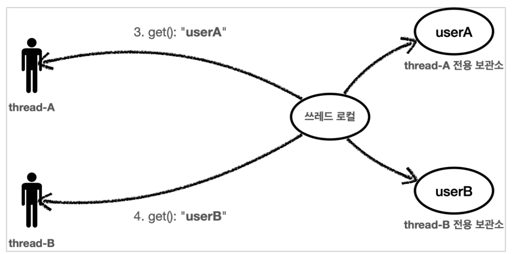
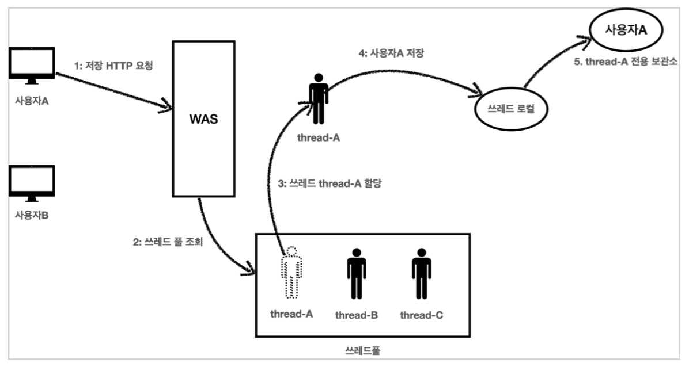
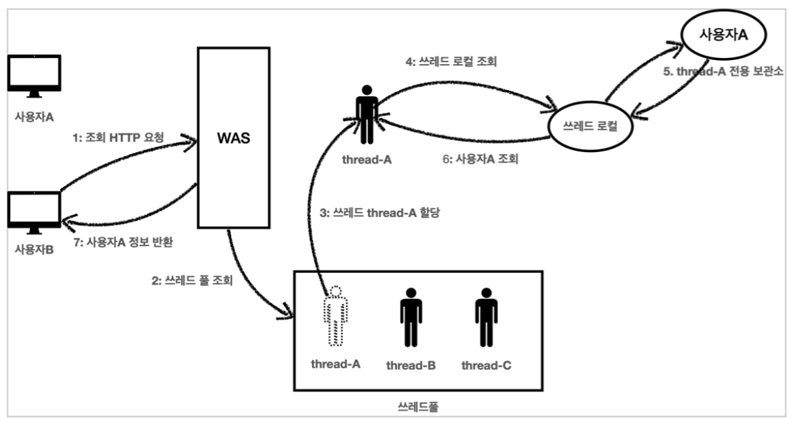

# 01. 필드 동기화 - 개발

TraceId를 파라미터로 넘기지 않고 이 문제를 해결할 수 있는 방법은 없을까?

### LogTrace 인터페이스

향후 다양한 구현체로 변경할 수 있도록 LogTrace 인터페이스를 먼저 만든다.

``` java
package hello.advanced.trace.logtrace;

import hello.advanced.trace.TraceStatus;

public interface LogTrace {
    TraceStatus begin(String message);
    void end(TraceStatus status);
    void exception(TraceStatus status, Exception e);
}
```


### FieldLogTrace

``` java
package hello.advanced.trace.logtrace;

import hello.advanced.trace.TraceId;
import hello.advanced.trace.TraceStatus;
import lombok.extern.slf4j.Slf4j;

@Slf4j
public class FieldLogTrace implements LogTrace {
    private static final String START_PREFIX = "-->";
    private static final String COMPLETE_PREFIX = "<--";
    private static final String EX_PREFIX = "<X-";

    private TraceId traceIdHolder; // traceId 동기화, 동시성 이슈 발생

    @Override
    public TraceStatus begin(String message) {
        syncTraceId();
        TraceId traceId = traceIdHolder;
        Long startTimeMs = System.currentTimeMillis();
        log.info("[{}] {}{}", traceId.getId(), addSpace(START_PREFIX, traceId.getLevel()), message);

        return new TraceStatus(traceId, startTimeMs, message);
    }

    @Override
    public void end(TraceStatus status) {
        complete(status, null);
    }

    @Override
    public void exception(TraceStatus status, Exception e) {
        complete(status, e);
    }

    private void complete(TraceStatus status, Exception e) {
        Long stopTimeMs = System.currentTimeMillis();
        long resultTimeMs = stopTimeMs - status.getStartTimeMs();
        TraceId traceId = status.getTraceId();

        if (e == null) {
            log.info("[{}] {}{} time={}ms", traceId.getId(),
                     addSpace(COMPLETE_PREFIX, traceId.getLevel()), status.getMessage(), resultTimeMs);
        } else {
            log.info("[{}] {}{} time={}ms ex={}", traceId.getId(),
                     addSpace(EX_PREFIX, traceId.getLevel()), status.getMessage(), resultTimeMs, e.toString());
        }

        releaseTraceId();
    }

    private void syncTraceId() {
        if (traceIdHolder == null) {
            traceIdHolder = new TraceId();
        } else {
            traceIdHolder = traceIdHolder.createNextId();
        }
    }

    private void releaseTraceId() {
        if (traceIdHolder.isFirstLevel()) {
            traceIdHolder = null;
        } else {
            traceIdHolder = traceIdHolder.createPreviousId();
        }
    }

    private static String addSpace(String prefix, int level) {
        StringBuilder sb = new StringBuilder();
        for (int i = 0; i < level; i++) {
            sb.append( (i == level - 1) ? "|" + prefix : "|   ");
        }
        return sb.toString();
    }
}
```

* traceIdHolder : 이제 직전 로그의 TraceId 는 파라미터로 전달되는 것이 아니라 FieldLogTrace 의 필드인 traceIdHolder 에 저장된다

* syncTraceId 

    * TraceId 를 새로 만들거나 앞선 로그의 TraceId 를 참고해서 동기화하고, level 도 증가한다.
    * 최초 호출이면 TraceId 를 새로 만든다.
    * 직전 로그가 있으면 해당 로그의 TraceId 를 참고해서 동기화하고, level 도 하나 증가한다. 
    * 결과를 traceIdHolder 에 보관한다.

* releaseTraceId

    * 메서드를 추가로 호출할 때는 level 이 하나 증가해야 하지만, 메서드 호출이 끝나면 level 이 하나 감소해야 한다.

    * releaseTraceId() 는 level 을 하나 감소한다.
    * 만약 최초 호출( level==0 )이면 내부에서 관리하는 traceId 를 제거한다.


### FieldLogTraceTest

``` java
package hello.advanced.trace.logtrace;

import org.junit.jupiter.api.Test;

import hello.advanced.trace.TraceStatus;

class FieldLogTraceTest {

    FieldLogTrace trace = new FieldLogTrace();

    @Test
    void begin_and_level2() {
        TraceStatus status1 = trace.begin("hello1");
        TraceStatus status2 = trace.begin("hello2");
        trace.end(status2);
        trace.end(status1);
    }

    @Test
    void begin_exception_level2() {
        TraceStatus status1 = trace.begin("hello1");
        TraceStatus status2 = trace.begin("hello2");
        trace.exception(status2, new IllegalStateException());
        trace.exception(status1, new IllegalStateException());
    }
}
```


# 02. 필드 동기화 - 적용

### LogTrace 스프링 빈 등록

``` java
package hello.advanced;

import org.springframework.context.annotation.Bean;
import org.springframework.context.annotation.Configuration;

import hello.advanced.trace.logtrace.FieldLogTrace;
import hello.advanced.trace.logtrace.LogTrace;

@Configuration
public class LogTraceConfig {

    @Bean
    public LogTrace logTrace() {
        return new FieldLogTrace();
    }
}
```


v2를 기반으로 v3를 만든다.


### OrderControllerV3

``` java
package hello.advanced.app.v3;

import org.springframework.web.bind.annotation.GetMapping;
import org.springframework.web.bind.annotation.RestController;

import hello.advanced.trace.TraceStatus;
import hello.advanced.trace.hellotrace.HelloTraceV2;
import hello.advanced.trace.logtrace.LogTrace;
import lombok.RequiredArgsConstructor;

@RestController
@RequiredArgsConstructor
public class OrderControllerV3 {
    private final OrderServiceV2 orderService;
    private final LogTrace trace;

    @GetMapping("/v3/request")
    public String request(String itemId) {
        TraceStatus status = null;

        try {
            status = trace.begin("OrderController.request()");
            orderService.orderItem(itemId);
            trace.end(status);
            return "ok";
        } catch (Exception e) {
            trace.exception(status, e);
            throw e; // 예외를 다시 던져주어야 한다.
        }
    }
}
```


### OrderServiceV2

``` java
package hello.advanced.app.v3;

import org.springframework.stereotype.Service;

import hello.advanced.trace.TraceId;
import hello.advanced.trace.TraceStatus;
import hello.advanced.trace.hellotrace.HelloTraceV2;
import hello.advanced.trace.logtrace.LogTrace;
import lombok.RequiredArgsConstructor;

@Service
@RequiredArgsConstructor
public class OrderServiceV2 {

    private final OrderRepositoryV2 orderRepository;
    private final LogTrace trace;

    public void orderItem(String itemId) {
        TraceStatus status = null;

        try {
            status = trace.begin("OrderService.orderItem()");
            orderRepository.save(itemId);
            trace.end(status);
        } catch (Exception e) {
            trace.exception(status, e);
            throw e;
        }
    }
}
```


### OrderRepositoryV3

``` java
package hello.advanced.app.v3;

import org.springframework.stereotype.Repository;

import hello.advanced.trace.TraceId;
import hello.advanced.trace.TraceStatus;
import hello.advanced.trace.hellotrace.HelloTraceV2;
import lombok.RequiredArgsConstructor;

@Repository
@RequiredArgsConstructor
public class OrderRepositoryV2 {

    private final HelloTraceV2 trace;

    public void save(String itemId) {
        TraceStatus status = null;

        try {
            status = trace.begin("OrderRepository.save()");

            if (itemId.equals("ex")) {
                throw new IllegalStateException("예외 발생!");
            }
            sleep(1000);

            trace.end(status);
        } catch (Exception e) {
            trace.exception(status, e);
            throw e;
        }
    }

    private void sleep(int millis) {
        try {
            Thread.sleep(millis);
        } catch (InterruptedException e) {
            e.printStackTrace();
        }
    }
}
```


traceIdHolder 필드를 사용한 덕분에 파라미터 추가 없는 깔끔한 로그 추적기를 완성했다. 이제 실제 서비스에 배포한다고 가정해보자.


# 03. 필드 동기화 - 동시성 문제

사실 직전에 만든 FieldLogTrace 는 심각한 동시성 문제를 가지고 있다. 

동시성 문제를 확인하려면 다음과 같이 동시에 여러번 호출해보면 된다.


### 기대하는 결과

``` 
 [nio-8080-exec-3] [52808e46] OrderController.request()
 [nio-8080-exec-3] [52808e46] |-->OrderService.orderItem()
 [nio-8080-exec-3] [52808e46] |   |-->OrderRepository.save()
 [nio-8080-exec-4] [4568423c] OrderController.request()
 [nio-8080-exec-4] [4568423c] |-->OrderService.orderItem()
 [nio-8080-exec-4] [4568423c] |   |-->OrderRepository.save()
 [nio-8080-exec-3] [52808e46] |   |<--OrderRepository.save() time=1001ms
 [nio-8080-exec-3] [52808e46] |<--OrderService.orderItem() time=1001ms
 [nio-8080-exec-3] [52808e46] OrderController.request() time=1003ms
 [nio-8080-exec-4] [4568423c] |   |<--OrderRepository.save() time=1000ms
 [nio-8080-exec-4] [4568423c] |<--OrderService.orderItem() time=1001ms
 [nio-8080-exec-4] [4568423c] OrderController.request() time=1001ms
```


### 실제 결과

```
[nio-8080-exec-3] [aaaaaaaa] OrderController.request()
[nio-8080-exec-3] [aaaaaaaa] |-->OrderService.orderItem()
[nio-8080-exec-3] [aaaaaaaa] |   |-->OrderRepository.save()
[nio-8080-exec-4] [aaaaaaaa] |   |   |-->OrderController.request()
[nio-8080-exec-4] [aaaaaaaa] |   |   |   |-->OrderService.orderItem()
[nio-8080-exec-4] [aaaaaaaa] |   |   |   |   |-->OrderRepository.save()
[nio-8080-exec-3] [aaaaaaaa] |   |<--OrderRepository.save() time=1005ms
[nio-8080-exec-3] [aaaaaaaa] |<--OrderService.orderItem() time=1005ms
[nio-8080-exec-3] [aaaaaaaa] OrderController.request() time=1005ms
[nio-8080-exec-4] [aaaaaaaa] |    |   |   |   |<--OrderRepository.save() time=1005ms
[nio-8080-exec-4] [aaaaaaaa] |    |   |   |<--OrderService.orderItem() time=1005ms
[nio-8080-exec-4] [aaaaaaaa] |    |   |<--OrderController.request() time=1005ms
```


### 동시성 문제

사실 이 문제는 동시성 문제이다.
FieldLogTrace 는 싱글톤으로 등록된 스프링 빈이다. 이 객체의 인스턴스가 애플리케이션에 딱 1 존재한다는 뜻이다. 이렇게 하나만 있는 인스턴스의 FieldLogTrace.traceIdHolder 필드를 여러 쓰레드가 동시에 접근하기 때문에 문제가 발생한다.


# 04. 동시성 문제 - 예제 코드

테스트에서도 lombok을 사용하기 위해 다음 코드를 추가한다.

### build.gradle

```gradle
dependencies {
	implementation 'org.springframework.boot:spring-boot-starter-web'
	compileOnly 'org.projectlombok:lombok'
	annotationProcessor 'org.projectlombok:lombok'
	testImplementation 'org.springframework.boot:spring-boot-starter-test'

	// 테스트에서 lombok 사용
	testCompileOnly 'org.projectlombok:lombok'
	testAnnotationProcessor 'org.projectlombok:lombok'
}

```


### FieldService

```java
package hello.advanced.trace.threadlocal.code;

import lombok.extern.slf4j.Slf4j;

@Slf4j
public class FieldService {
    private String nameStore;

    public String logic(String name) {
        log.info("저장 name={} -> nameStore={}", name, nameStore); 
        nameStore = name;
        sleep(1000);
        log.info("조회 nameStore={}",nameStore);
        return nameStore;
    }
    
    private void sleep(int millis) {
        try {
            Thread.sleep(millis);
        } catch (InterruptedException e) {
            e.printStackTrace();
        }
    }
}
```


### FieldServiceTest

``` java
package hello.advanced.trace.threadlocal;

import org.junit.jupiter.api.Test;

import hello.advanced.trace.threadlocal.code.FieldService;
import lombok.extern.slf4j.Slf4j;

@Slf4j
public class FieldServiceTest {
    private FieldService fieldService = new FieldService();

    @Test
    void field() {
        log.info("main start");
        Runnable userA = () -> {
            fieldService.logic("userA");
        };
        Runnable userB = () -> {
            fieldService.logic("userB");
        };
        
        Thread threadA = new Thread(userA);
        threadA.setName("thread-A");
        Thread threadB = new Thread(userB);
        threadB.setName("thread-B");
        threadA.start(); // A실행

        // sleep(2000); //동시성 문제 발생X
        sleep(100); //동시성 문제 발생O
        threadB.start(); //B실행
        sleep(3000); //메인 쓰레드 종료 대기
        log.info("main exit");
    }

    private void sleep(int millis) {
        try {
            Thread.sleep(millis);
        } catch (InterruptedException e) {
            e.printStackTrace();
        }
    }
}
```

```
[thread-A] INFO hello.advanced.trace.threadlocal.code.FieldService - 저장 name=userA -> nameStore=null
[thread-B] INFO hello.advanced.trace.threadlocal.code.FieldService - 저장 name=userB -> nameStore=userA
[thread-A] INFO hello.advanced.trace.threadlocal.code.FieldService - 조회 nameStore=userB
[thread-B] INFO hello.advanced.trace.threadlocal.code.FieldService - 조회 nameStore=userB
```


### 동시성 문제

결과적으로 Thread-A 입장에서는 저장한 데이터와 조회한 데이터가 다른 문제가 발생한다. 이처럼 여러 쓰레드가 동시에 같은 인스턴스의 필드 값을 변경하면서 발생하는 문제를 동시성 문제라 한다. 이런 동시성 문제는 여러 쓰레드가 같은 인스턴스의 필드에 접근해야 하기 때문에 트래픽이 적은 상황에서는 확률상 잘 나타나지 않고, 트래픽이 점점 많아질수록 자주 발생한다.

특히 스프링 빈 처럼 싱글톤 객체의 필드를 변경하며 사용할 때 이러한 동시성 문제를 조심해야 한다.

이런 동시성 문제는 지역 변수에서는 발생하지 않는다. 지역 변수는 쓰레드마다 각각 다른 메모리 영역이 할당된다.

동시성 문제가 발생하는 곳은 같은 인스턴스의 필드(주로 싱글톤에서 자주 발생), 또는 static 같은 공용 필드에 접근할 때 발생한다.

동시성 문제는 값을 읽기만 하면 발생하지 않는다. 어디선가 값을 변경하기 때문에 발생한다.


# 05. ThreadLocal - 소개

### 쓰레드 로컬

쓰레드 로컬을 사용하면 각 쓰레드마다 별도의 내부 저장소를 제공한다. 따라서 같은 인스턴스의 쓰레드 로컬 필드에 접근해도 문제 없다.




자바는 언어차원에서 쓰레드 로컬을 지원하기 위한 java.lang.ThreadLocal 클래스를 제공한다.


# 06. ThreadLocal - 예제 코드

### ThreadLocalService

``` java
package hello.advanced.trace.threadlocal.code;

import lombok.extern.slf4j.Slf4j;

@Slf4j
public class ThreadLocalService {
    private ThreadLocal<String> nameStore = new ThreadLocal<>();

    public String logic(String name) {
        log.info("저장 name={} -> nameStore={}", name, nameStore.get());
        nameStore.set(name);
        sleep(1000);
        log.info("조회 nameStore={}",nameStore.get());
        return nameStore.get();
    }

    private void sleep(int millis) {
        try {
            Thread.sleep(millis);
        } catch (InterruptedException e) {
            e.printStackTrace();
        }
    }
}
```


### ThreadLocalServiceTest

``` java
package hello.advanced.trace.threadlocal;

import org.junit.jupiter.api.Test;

import hello.advanced.trace.threadlocal.code.ThreadLocalService;
import lombok.extern.slf4j.Slf4j;

@Slf4j
public class ThreadLocalServiceTest {
    private ThreadLocalService service = new ThreadLocalService();

    @Test
    void field() {
        log.info("main start");
        Runnable userA = () -> {
            service.logic("userA");
        };
        Runnable userB = () -> {
            service.logic("userB");
        };
        Thread threadA = new Thread(userA);
        threadA.setName("thread-A");
        Thread threadB = new Thread(userB);
        threadB.setName("thread-B");
        threadA.start(); // A실행

        // sleep(2000); //동시성 문제 발생X
        sleep(100); //동시성 문제 발생O
        threadB.start(); //B실행
        sleep(3000); //메인 쓰레드 종료 대기
        log.info("main exit");
    }

    private void sleep(int millis) {
        try {
            Thread.sleep(millis);
        } catch (InterruptedException e) {
            e.printStackTrace();
        }
    }
}
```


쓰레드 로컬을 통해 각각 별도의 데이터 저장소를 가지게 되어 동시성 문제를 해결하였다.


# 07. 쓰레드 로컬 동기화 - 개발

필드 대신에 쓰레드 로컬을 사용해서 데이터를 동기화하는 ThreadLocalLogTrace를 만든다.

### ThreadLocalLogTrace

``` java
package hello.advanced.trace.logtrace;

import hello.advanced.trace.TraceId;
import hello.advanced.trace.TraceStatus;
import lombok.extern.slf4j.Slf4j;

@Slf4j
public class ThreadLocalLogTrace implements LogTrace {
    private static final String START_PREFIX = "-->";
    private static final String COMPLETE_PREFIX = "<--";
    private static final String EX_PREFIX = "<X-";

    private ThreadLocal<TraceId> traceIdHolder = new ThreadLocal<>();

    @Override
    public TraceStatus begin(String message) {
        syncTraceId();
        TraceId traceId = traceIdHolder.get();
        Long startTimeMs = System.currentTimeMillis();
        log.info("[{}] {}{}", traceId.getId(), addSpace(START_PREFIX, traceId.getLevel()), message);

        return new TraceStatus(traceId, startTimeMs, message);
    }

    @Override
    public void end(TraceStatus status) {
        complete(status, null);
    }

    @Override
    public void exception(TraceStatus status, Exception e) {
        complete(status, e);
    }

    private void complete(TraceStatus status, Exception e) {
        Long stopTimeMs = System.currentTimeMillis();
        long resultTimeMs = stopTimeMs - status.getStartTimeMs();
        TraceId traceId = status.getTraceId();

        if (e == null) {
            log.info("[{}] {}{} time={}ms", traceId.getId(),
                     addSpace(COMPLETE_PREFIX, traceId.getLevel()), status.getMessage(), resultTimeMs);
        } else {
            log.info("[{}] {}{} time={}ms ex={}", traceId.getId(),
                     addSpace(EX_PREFIX, traceId.getLevel()), status.getMessage(), resultTimeMs, e.toString());
        }

        releaseTraceId();
    }

    private void syncTraceId() {
        TraceId traceId = traceIdHolder.get();
        if (traceId == null) {
            traceIdHolder.set(new TraceId());
        } else {
            traceIdHolder.set(traceId.createNextId());
        }
    }

    private void releaseTraceId() {
        TraceId traceId = traceIdHolder.get();
        if (traceId.isFirstLevel()) {
            traceIdHolder.remove();
        } else {
            traceIdHolder.set(traceId.createPreviousId());
        }
    }

    private static String addSpace(String prefix, int level) {
        StringBuilder sb = new StringBuilder();
        for (int i = 0; i < level; i++) {
            sb.append( (i == level - 1) ? "|" + prefix : "|   ");
        }
        return sb.toString();
    }
}
```

* ThreadLocal.remove() : 쓰레드 로컬을 모두 사용하고 나면 꼭 remove를 호출해서 쓰레드 로컬에 저장된 값을 제거해주어야 한다.


### ThreadLocalLogTraceTest

``` java
package hello.advanced.trace.logtrace;

import org.junit.jupiter.api.Test;

import hello.advanced.trace.TraceStatus;

class ThreadLocalLogTraceTest {

    ThreadLocalLogTrace trace = new ThreadLocalLogTrace();

    @Test
    void begin_and_level2() {
        TraceStatus status1 = trace.begin("hello1");
        TraceStatus status2 = trace.begin("hello2");
        trace.end(status2);
        trace.end(status1);
    }

    @Test
    void begin_exception_level2() {
        TraceStatus status1 = trace.begin("hello1");
        TraceStatus status2 = trace.begin("hello2");
        trace.exception(status2, new IllegalStateException());
        trace.exception(status1, new IllegalStateException());
    }
}
```


# 08. 쓰레드 로컬 동기화 - 적용

### LogTraceConfig - 수정

```java
package hello.advanced;

import org.springframework.context.annotation.Bean;
import org.springframework.context.annotation.Configuration;

import hello.advanced.trace.logtrace.FieldLogTrace;
import hello.advanced.trace.logtrace.LogTrace;
import hello.advanced.trace.logtrace.ThreadLocalLogTrace;

@Configuration
public class LogTraceConfig {

    @Bean
    public LogTrace logTrace() {
        return new ThreadLocalLogTrace();
    }
}
```


# 09. 쓰레드 로컬 - 주의사항

쓰레드 로컬의 값을 사용 후 제거하지 않고 그냥 두면 WAS(톰캣)처럼 쓰레드 풀을 사용하는 경우에 심각한 문제가 발생할 수 있다.


### 사용자A 저장 요청




### 사용자 B 조회 요청



우연하게 사용자 A가 사용했던 thread-A가 할당되면 기존에 남아있던 쓰레드 로컬에 데이터를 조회하게 된다.


### 결론

결과적으로 사용자B는 사용자A의 데이터를 확인하게 되는 심각한 문제가 발생하게 된다.
이런 문제를 예방하려면 사용자A의 요청이 끝날 때 쓰레드 로컬의 값을 ThreadLocal.remove() 를 통해서 꼭 제거해야 한다.